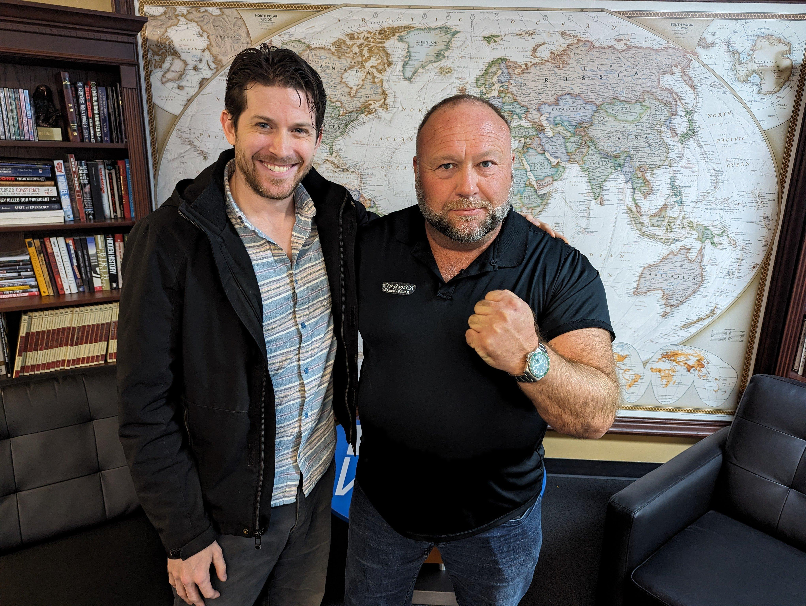
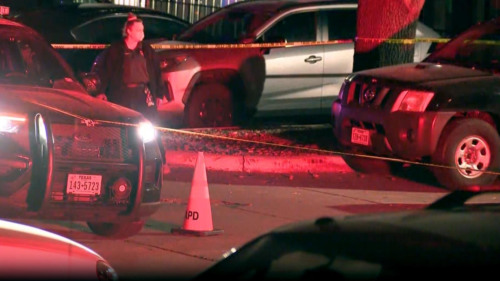
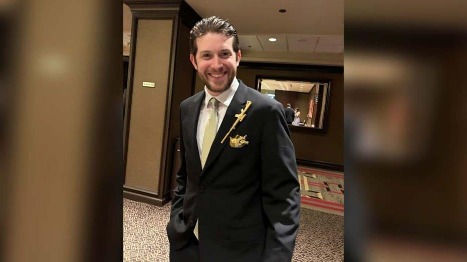
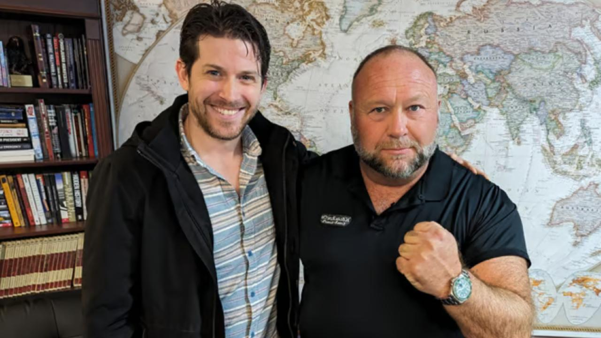

## Claim
Claim: "After InfoWars reporter Jamie White was shot dead on March 10, 2025 in Austin, Texas, it was revelaed that he was on a Ukranian enemies hit list."

## Actions
```
image_search("Jamie White InfoWars")
image_search("Jamie White shot Austin Texas")
```

## Evidence
### Evidence from `image_search`
KVUE.com ([https://www.kvue.com/article/news/crime/jamie-white-murder-arrests-infowars/269-aa20c169-085c-4827-8e8c-ce8755a4b715](https://www.kvue.com/article/news/crime/jamie-white-murder-arrests-infowars/269-aa20c169-085c-4827-8e8c-ce8755a4b715)) contains images related to a crime scene with police tape and two individuals . Global News ([https://globalnews.ca/news/11076668/infowars-reporter-shot-jamie-white-texas-austin/](https://globalnews.ca/news/11076668/infowars-reporter-shot-jamie-white-texas-austin/)) contains an image of Jamie White with Alex Jones .

ABC News ([https://abcnews.go.com/US/infowars-reporter-shot-dead-apartment-after-possibly-interrupting/story?id=119677965](https://abcnews.go.com/US/infowars-reporter-shot-dead-apartment-after-possibly-interrupting/story?id=119677965)) reports that an InfoWars reporter was shot dead in Austin, Texas .


### Evidence from `image_search`
The search results include articles from Fox 7 Austin ([Source](https://www.fox7austin.com/news/infowars-writer-killed-south-austin-homicide-douglas-street)), Fox News ([Source](https://www.foxnews.com/us/police-release-more-details-murder-infowars-reporter-jamie-white-search-suspects-continues)), and The Independent ([Source](https://www.independent.co.uk/news/world/americas/crime/jamie-white-infowars-murder-alex-jones-b2712630.html)). Each source contains an image of Jamie White , , .


## Elaboration
The evidence confirms that Jamie White, an InfoWars reporter, was shot dead in Austin, Texas. However, the provided evidence does not contain any information about a Ukrainian enemies hit list.

Therefore, the claim cannot be fully verified due to the lack of evidence regarding the alleged hit list.


## Actions
```
image_search("Jamie White Ukrainian enemies hit list")
```

## Evidence
No new evidence found.

## Elaboration
The evidence confirms that Jamie White, an InfoWars reporter, was shot dead in Austin, Texas. However, the evidence does not contain any information about a Ukrainian enemies hit list. Further search did not yield any relevant results.

Therefore, the claim cannot be verified due to the lack of evidence regarding the alleged hit list.


## Final Judgement
The evidence confirms that Jamie White, an InfoWars reporter, was shot dead in Austin, Texas. However, there is no evidence to support the claim that he was on a Ukrainian enemies hit list. Further searches did not yield any relevant results.

The claim is not fully verifiable due to the lack of evidence regarding the alleged hit list. `false`

### Verdict: FALSE

### Justification
The claim that Jamie White was on a Ukrainian enemies hit list after being shot dead in Austin, Texas, cannot be verified. While evidence confirms that White, an InfoWars reporter, was indeed shot dead in Austin, Texas, there is no supporting evidence for the alleged hit list, and further searches yielded no relevant results.
