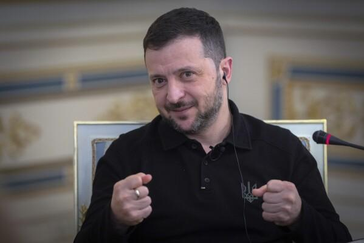
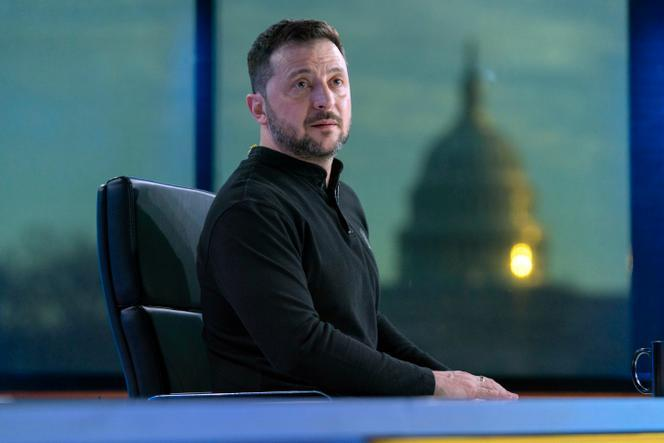
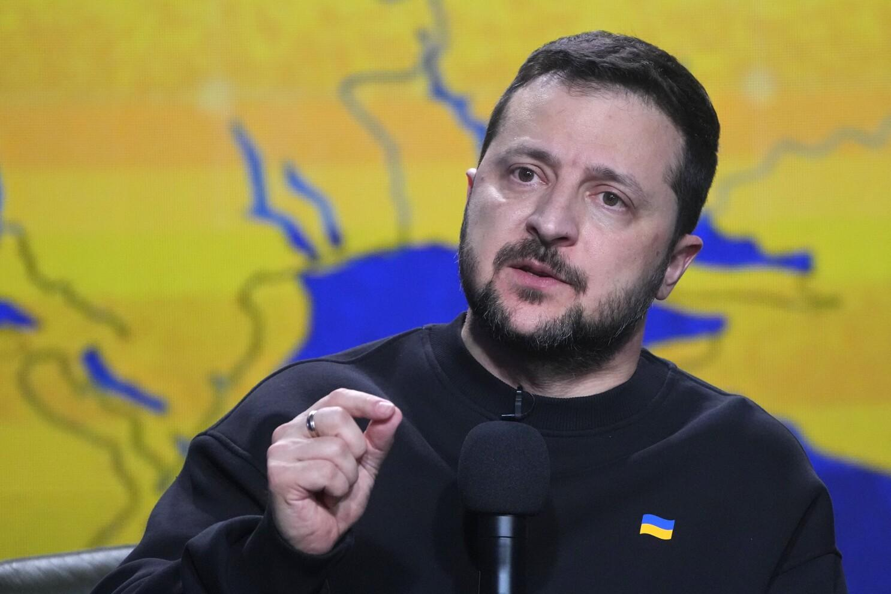
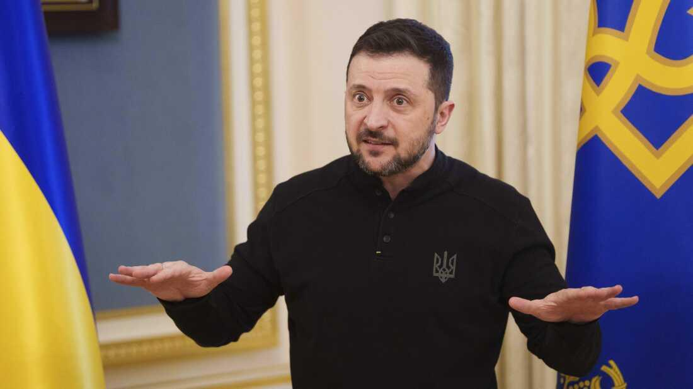
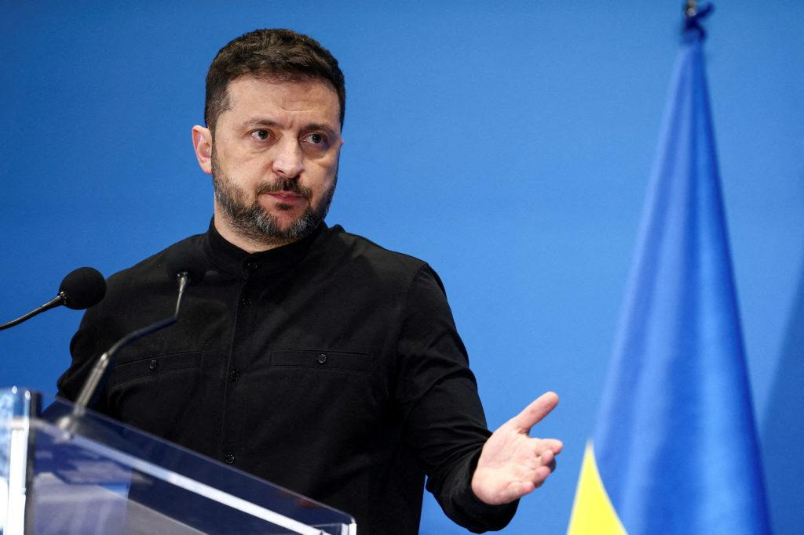
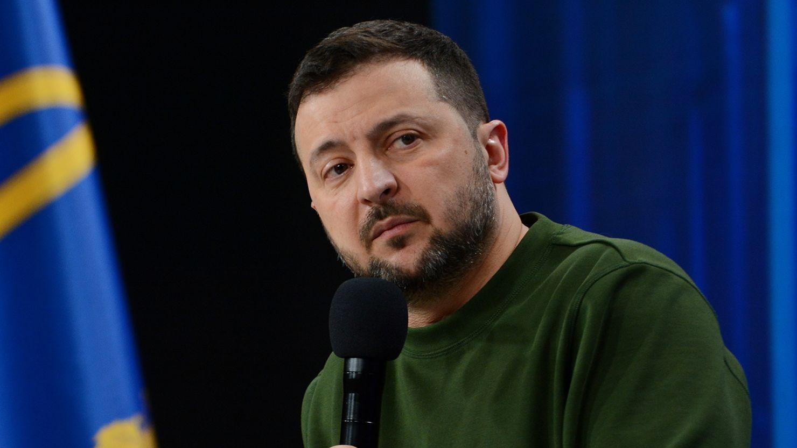
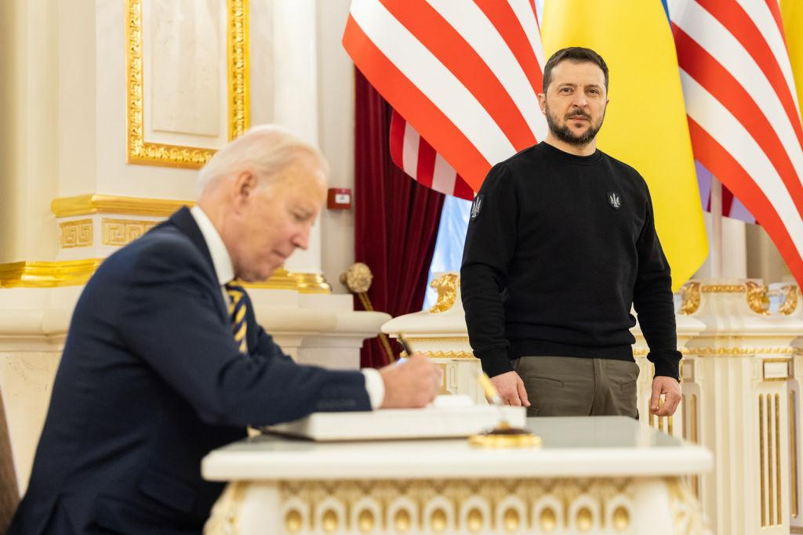
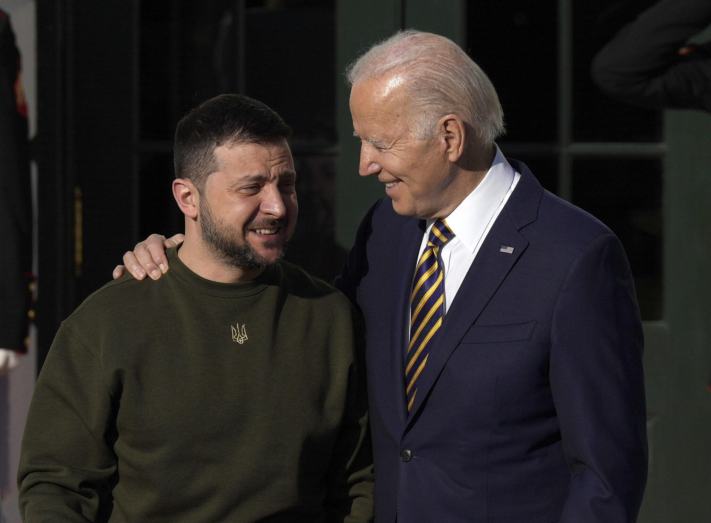

## Claim
Claim: "Ukrainian President Volodymyr Zelenskyy's statement in an AP news interview from February 1, 2025 that his country's military has received only a portion of the more than 175 billion in U.S. aid confirms that the US aid is a money laundering operation."

## Actions
```
image_search("AP news interview Volodymyr Zelenskyy February 1 2025 aid")
```

## Evidence
### Evidence from `image_search`
The AP News article ([Source](https://apnews.com/article/russia-ukraine-war-trump-talks-ceasefire-00af5f61f1faf41e78a3b4e072c21a14)) contains an image of Volodymyr Zelenskyy .

The Le Monde article ([Source](https://www.lemonde.fr/en/united-states/article/2025/02/28/trump-and-zelensky-openly-clash-in-heated-white-house-exchange_6738686_133.html)) also contains an image of Volodymyr Zelenskyy .


## Elaboration
The evidence includes two images of Volodymyr Zelenskyy, one from an AP News article ([Source](https://apnews.com/article/russia-ukraine-war-trump-talks-ceasefire-00af5f61f1faf41e78a3b4e072c21a14)) and another from a Le Monde article ([Source](https://www.lemonde.fr/en/united-states/article/2025/02/28/trump-and-zelensky-openly-clash-in-heated-white-house-exchange_6738686_133.html)). However, neither article provides information about Zelenskyy's statement regarding U.S. aid or confirms the claim that the aid is a money laundering operation.

The claim cannot be verified with the provided evidence. More information is needed to confirm the veracity of the claim.


## Actions
```
image_search("Volodymyr Zelenskyy AP news interview February 1 2025 US aid")
```

## Evidence
### Evidence from `image_search`
The search results include articles from AP News ([Source](https://apnews.com/article/russian-ukraine-war-zelenskyy-news-conference-5440b3d3034a34461d93d0740e0c1ae6)), NPR ([Source](https://www.npr.org/2025/02/28/g-s1-51205/up-first-newsletter-ukraine-us-mineral-deal-andrew-tate-aoc)), and PBS ([Source](https://www.pbs.org/newshour/world/zelenskyy-to-meet-trump-on-monday-after-u-s-russia-summit-secured-no-halt-to-war-in-ukraine)). Each article contains an image of Volodymyr Zelenskyy , , . However, none of the provided summaries mention Zelenskyy's statement about U.S. aid or the claim that it is a money laundering operation.


## Elaboration
The new evidence, which includes articles from AP News ([Source](https://apnews.com/article/russian-ukraine-war-zelenskyy-news-conference-5440b3d3034a34461d93d0740e0c1ae6)), NPR ([Source](https://www.npr.org/2025/02/28/g-s1-51205/up-first-newsletter-ukraine-us-mineral-deal-andrew-tate-aoc)), and PBS ([Source](https://www.pbs.org/newshour/world/zelenskyy-to-meet-trump-on-monday-after-u-s-russia-summit-secured-no-halt-to-war-in-ukraine)), does not support the claim. These articles feature images of Zelenskyy but do not contain any information about his statements regarding U.S. aid or the assertion that it is a money laundering operation.

The claim remains unverified due to the lack of supporting evidence.


## Actions
```
image_search("Zelenskyy US aid money laundering")
```

## Evidence
### Evidence from `image_search`
The search results include articles from CNN ([Source](https://www.cnn.com/2024/02/26/politics/republicans-trump-ukraine-aid)), coloradonewsline.com, and SourceNM ([Source](https://sourcenm.com/2023/02/27/white-house-unveils-2b-in-weapons-for-ukraine-on-one-year-anniversary-of-russian-invasion/)). Each article contains an image of Volodymyr Zelenskyy , , . However, none of the provided summaries mention Zelenskyy's statement about U.S. aid or the claim that it is a money laundering operation.


## Elaboration
The latest search results, including articles from CNN ([Source](https://www.cnn.com/2024/02/26/politics/republicans-trump-ukraine-aid)), coloradonewsline.com, and SourceNM ([Source](https://sourcenm.com/2023/02/27/white-house-unveils-2b-in-weapons-for-ukraine-on-one-year-anniversary-of-russian-invasion/)), do not provide any information to support the claim. The articles feature images of Zelenskyy but do not contain any statements from him regarding U.S. aid being a money laundering operation.

The claim remains unsupported by the available evidence.


## Final Judgement
The search results did not provide any evidence to support the claim that Volodymyr Zelenskyy stated in an AP news interview on February 1, 2025, that U.S. aid is a money laundering operation. The evidence consists of articles and images of Zelenskyy, but none of them contain the specific statement or support the claim.

`false`


### Verdict: FALSE

### Justification
The claim is unsupported. Multiple searches for the alleged statement by Volodymyr Zelenskyy in an AP News interview from February 1, 2025, regarding U.S. aid being a money laundering operation yielded no evidence to support the claim. The search results included articles from AP News, CNN, and others ([Source](https://apnews.com/article/russian-ukraine-war-zelenskyy-news-conference-5440b3d3034a34461d93d0740e0c1ae6), [Source](https://www.cnn.com/2024/02/26/politics/republicans-trump-ukraine-aid)), but none contained the specific statement or supported the assertion.
