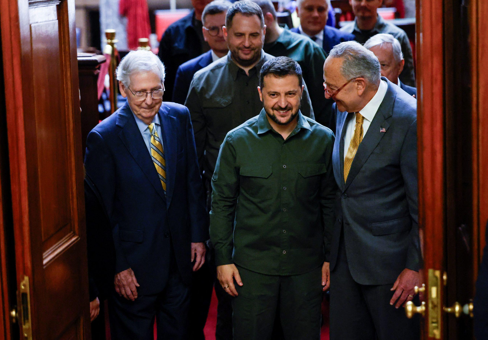
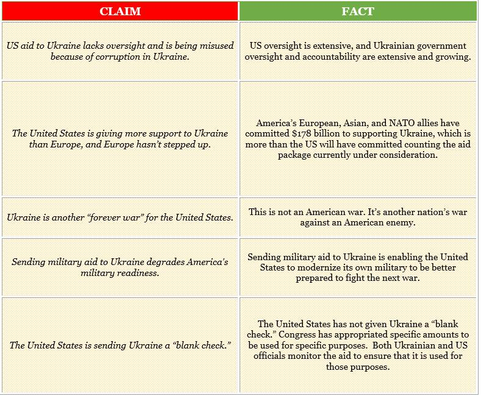

## Claim
Claim: "Half of all US aid to Ukraine was laundered and sent back to Democrat candidates for re-election."

## Actions
```
image_search("US aid Ukraine laundered Democrat candidates")
```

## Evidence
### Evidence from `image_search`
From [Source](https://www.reuters.com/world/us/us-house-vote-long-awaited-95-billion-ukraine-israel-aid-package-2024-04-20/): 
Content: Reuters published an article on April 20, 2024, about the US House vote on a Ukraine aid package. The article includes an image of the US and Ukrainian flags in front of the Capitol Building. 


## Elaboration
The evidence does not contain any information about the claim. The provided article from Reuters ([Source](https://www.reuters.com/world/us/us-house-vote-long-awaited-95-billion-ukraine-israel-aid-package-2024-04-20/)) discusses the US House vote on a Ukraine aid package but does not mention any laundering or diversion of funds to Democrat candidates.

Therefore, the claim cannot be verified with the available evidence. More information is needed to assess the veracity of the claim.


## Actions
```
image_search("US aid to Ukraine laundering Democrat candidates")
image_search("Ukraine aid corruption allegations")
```

## Evidence
### Evidence from `image_search`
ABC News published an article about Robert F. Kennedy Jr. as a presidential candidate ([https://abcnews.go.com/Politics/rfk-jr-now-presidential-candidate-ukraine-vaccines-economy/story?id=100247005](https://abcnews.go.com/Politics/rfk-jr-now-presidential-candidate-ukraine-vaccines-economy/story?id=100247005)).  Politico has an article about what Johnson wants for Ukraine and Israel funding ([https://www.politico.com/live-updates/2023/11/01/congress/what-johnson-wants-ukraine-israel-funding-00124806](https://www.politico.com/live-updates/2023/11/01/congress/what-johnson-wants-ukraine-israel-funding-00124806)). The Center for European Policy Analysis (CEPA) published an article that includes an image of Mitch McConnell, Volodymyr Zelenskyy, and Chuck Schumer ([https://cepa.org/article/ignore-the-noise-congress-can-still-pass-ukraine-aid/](https://cepa.org/article/ignore-the-noise-congress-can-still-pass-ukraine-aid/)). 


### Evidence from `image_search`
Bloomberg published an article on May 3, 2024, about Ukraine tightening military procurement after a corruption shakeup (). The Policy Practice published an article about Ukraine's anti-corruption efforts (). The Institute for the Study of War published a fact sheet about US assistance to Ukraine, which states that US oversight is extensive, and Ukrainian government oversight and accountability are extensive and growing ().

The provided sources discuss corruption and oversight related to aid to Ukraine but do not mention any laundering or diversion of funds to Democrat candidates.


## Elaboration
The evidence reveals discussions about US aid to Ukraine, including articles on corruption and oversight. However, none of the provided sources support the claim that half of the US aid was laundered and sent to Democrat candidates. The Institute for the Study of War fact sheet ([https://www.understandingwar.org/backgrounder/us-assistance-ukraine-fact-sheet](https://www.understandingwar.org/backgrounder/us-assistance-ukraine-fact-sheet)) indicates extensive US and Ukrainian government oversight.

Therefore, based on the available evidence, the claim remains unsubstantiated.


## Final Judgement
The fact-check reveals that while there are discussions about US aid to Ukraine and related corruption concerns, there is no evidence to support the claim that half of the aid was laundered and sent to Democrat candidates. The provided sources do not mention any such activity. Therefore, the claim is not supported by the available evidence. `false`

### Verdict: FALSE

### Justification
The fact-check found no evidence to support the claim that half of US aid to Ukraine was laundered and sent to Democrat candidates. While there are reports about corruption and oversight related to the aid, none of the sources, including articles from Reuters, ABC News, Politico, Bloomberg, and the Institute for the Study of War ([https://www.understandingwar.org/backgrounder/us-assistance-ukraine-fact-sheet](https://www.understandingwar.org/backgrounder/us-assistance-ukraine-fact-sheet)), mention any such activity.
