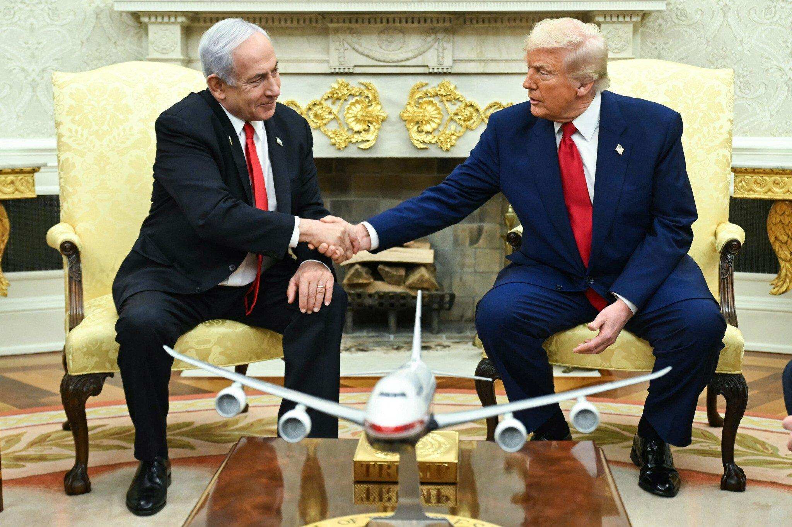
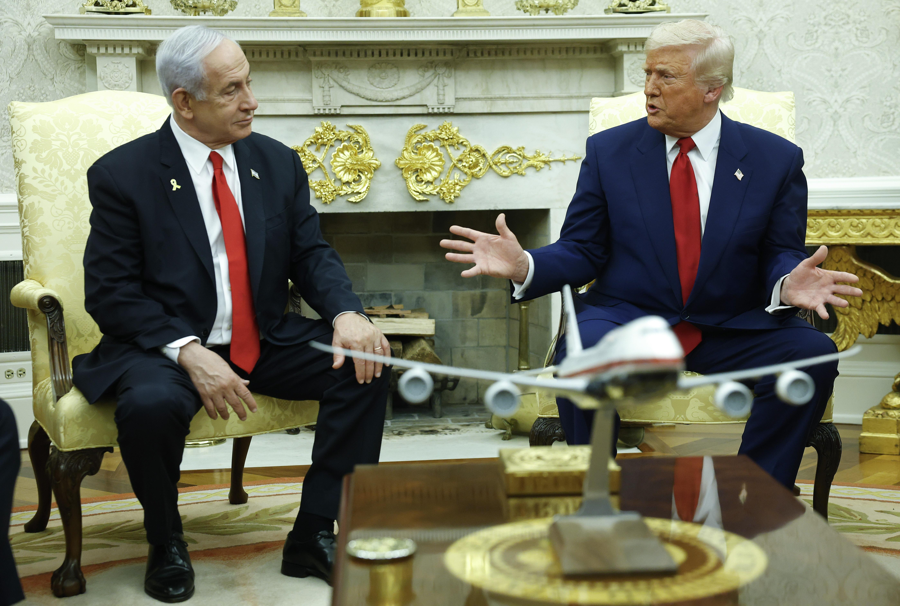
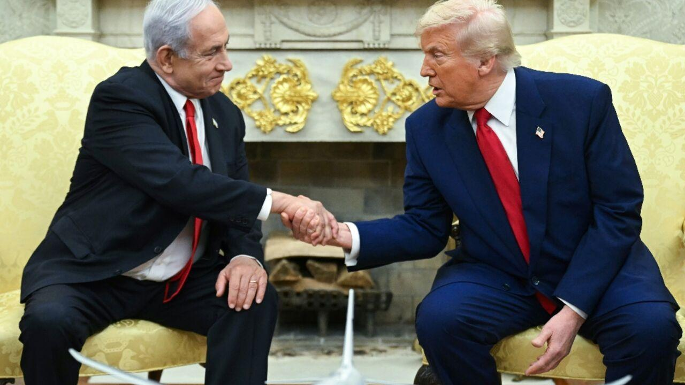
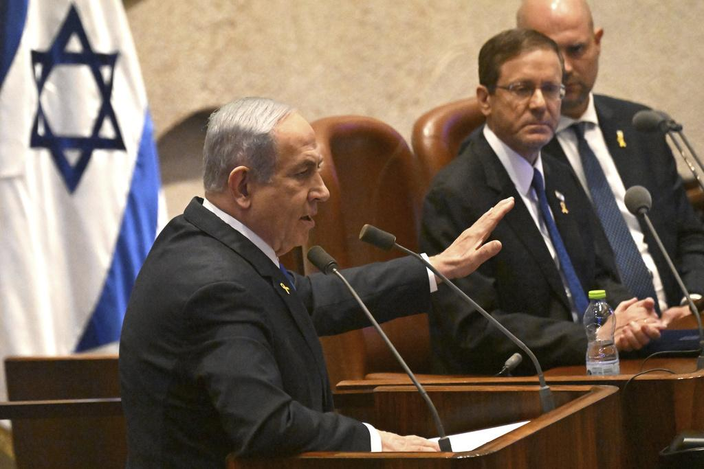

## Claim
Claim: "During his visit to the White House in April 2025 Israeli Prime Minister Benjamin Netanyahu announced plans to resettle Palestinians in Gaza to Ukraine and Syria."

## Actions
```
image_search("Benjamin Netanyahu White House April 2025")
image_search("Benjamin Netanyahu Gaza Ukraine Syria resettlement")
```

## Evidence
### Evidence from `image_search`
The Times of Israel ([https://www.timesofisrael.com/liveblog-april-7-2025/](https://www.timesofisrael.com/liveblog-april-7-2025/)) provides an image of Benjamin Netanyahu and Donald Trump shaking hands in the White House . NPR ([https://www.npr.org/2025/07/07/g-s1-76296/israel-netanyahu-meet-trump](https://www.npr.org/2025/07/07/g-s1-76296/israel-netanyahu-meet-trump)) contains an image of Benjamin Netanyahu and Donald Trump .

Al-Monitor ([https://www.al-monitor.com/originals/2025/06/netanyahu-visit-white-house-gaza-truce-pressure-mounts](https://www.al-monitor.com/originals/2025/06/netanyahu-visit-white-house-gaza-truce-pressure-mounts)) contains an image of Benjamin Netanyahu at the White House .


### Evidence from `image_search`
One source, StopFake.org, presents an image  with the word "FAKE" overlaid, discussing the resettlement of Palestinians to Ukraine and Syria. Another source, The Hill, contains an image of Benjamin Netanyahu .

The other source ([https://www.aa.com.tr/en/middle-east/netanyahu-orders-israeli-army-to-keep-control-of-syrias-demilitarized-buffer-zone-until-end-of-2025/3427726](https://www.aa.com.tr/en/middle-east/netanyahu-orders-israeli-army-to-keep-control-of-syrias-demilitarized-buffer-zone-until-end-of-2025/3427726)) does not contain any relevant information.


## Elaboration
The evidence includes images of Benjamin Netanyahu at the White House, specifically with Donald Trump. However, the evidence also includes a "FAKE" image discussing the resettlement of Palestinians to Ukraine and Syria.

The evidence does not provide any information to support the claim that Netanyahu announced plans to resettle Palestinians in Gaza to Ukraine and Syria during his visit to the White House. The "FAKE" image suggests that this information is false.

Therefore, the claim is likely false.


## Final Judgement
The search results show images of Netanyahu at the White House, but also a "FAKE" image related to the claim. There is no evidence to support the claim that Netanyahu announced plans to resettle Palestinians in Gaza to Ukraine and Syria.

`false`

### Verdict: FALSE

### Justification
The claim is false. While images confirm Benjamin Netanyahu's presence at the White House, a source explicitly labels information about resettling Palestinians to Ukraine and Syria as "FAKE" ([https://www.aa.com.tr/en/middle-east/netanyahu-orders-israeli-army-to-keep-control-of-syrias-demilitarized-buffer-zone-until-end-of-2025/3427726](https://www.aa.com.tr/en/middle-east/netanyahu-orders-israeli-army-to-keep-control-of-syrias-demilitarized-buffer-zone-until-end-of-2025/3427726)).
