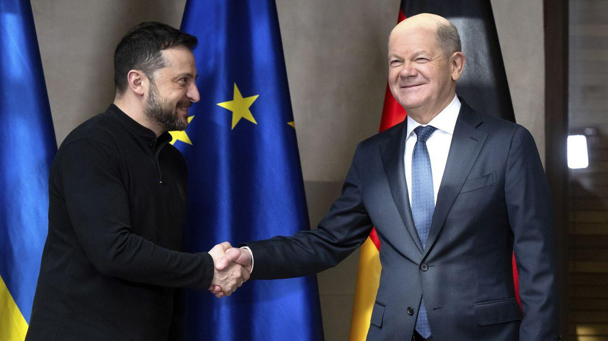
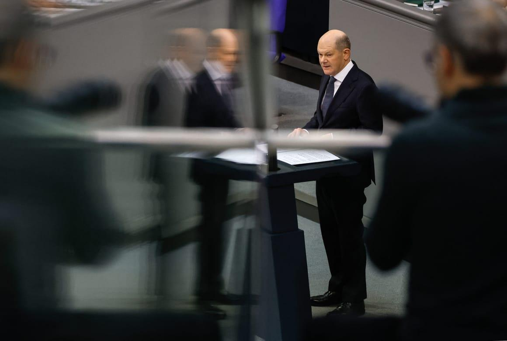
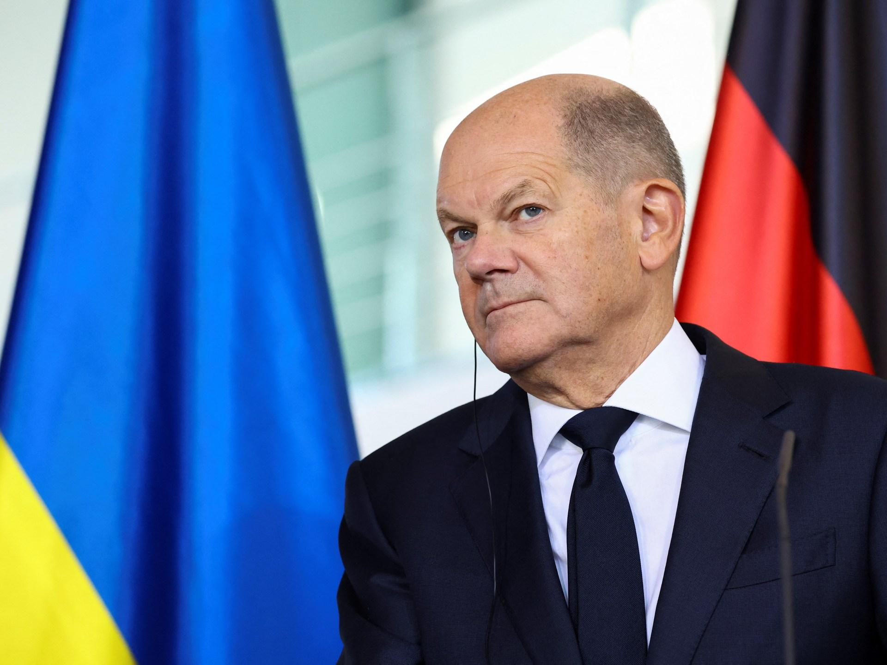

## Claim
Claim: "In February 2025 German Chancellor Olaf Scholz declared a state of emergency in Germany due to US President Donald Trump's peace plan for Ukraine."

## Actions
```
image_search("Olaf Scholz state of emergency Germany Trump Ukraine peace plan")
```

## Evidence
### Evidence from `image_search`
Euronews published a fact-check on February 19, 2025, stating that Scholz did not call for a German state of emergency over Russia-US peace talks (). Politico.eu and Al Jazeera also contain images of Olaf Scholz (, ).

The provided sources are: [https://www.euronews.com/my-europe/2025/02/19/fact-check-scholz-did-not-call-for-german-state-of-emergency-over-russia-us-peace-talks](https://www.euronews.com/my-europe/2025/02/19/fact-check-scholz-did-not-call-for-german-state-of-emergency-over-russia-us-peace-talks), [https://www.politico.eu/article/olaf-scholz-germany-donald-trump-war-in-ukraine-peace-plan/](https://www.politico.eu/article/olaf-scholz-germany-donald-trump-war-in-ukraine-peace-plan/), and [https://www.aljazeera.com/news/2024/12/2/germanys-scholz-pledges-680m-in-military-aid-on-surprise-ukraine-visit](https://www.aljazeera.com/news/2024/12/2/germanys-scholz-pledges-680m-in-military-aid-on-surprise-ukraine-visit).


## Elaboration
The evidence indicates that the claim is false. A Euronews fact-check from February 19, 2025, explicitly states that Scholz did not declare a state of emergency in Germany.


## Final Judgement
The claim is demonstrably false. The provided evidence, including a fact-check from Euronews, directly contradicts the claim that Olaf Scholz declared a state of emergency in Germany in February 2025.

`false`


### Verdict: FALSE

### Justification
The claim is false. A fact-check by Euronews on February 19, 2025, explicitly states that Olaf Scholz did not declare a state of emergency in Germany, contradicting the claim.
