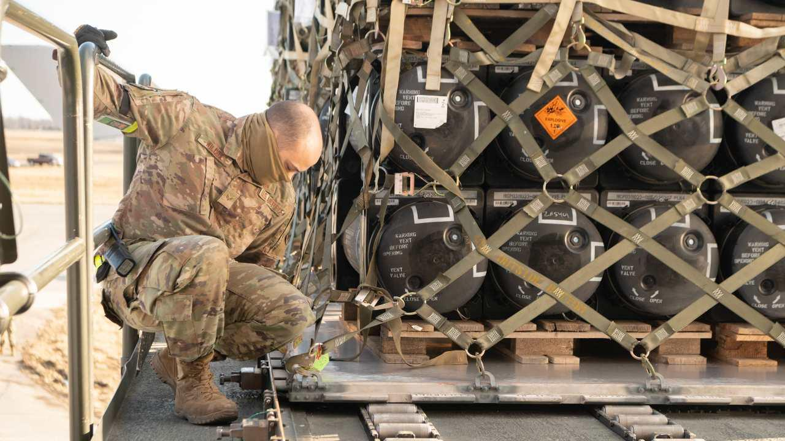
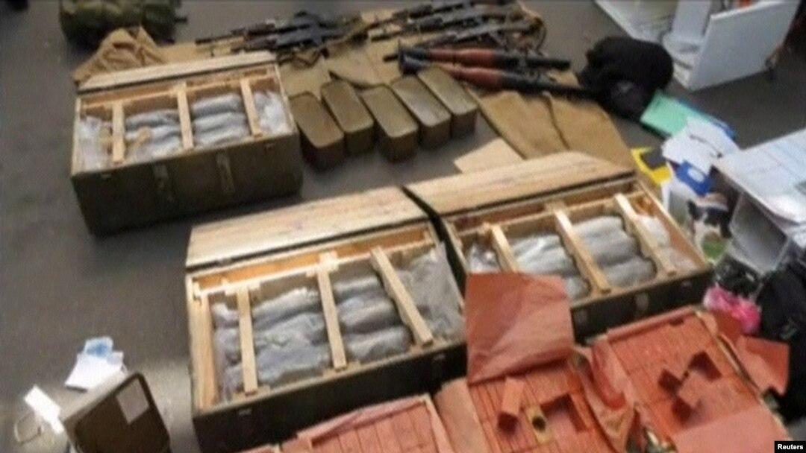

## Claim
Claim: "Ukraine is selling half of the armaments it receives from the United States"

## Actions
```
image_search("Ukraine arms sales US aid")
```

## Evidence
### Evidence from `image_search`
The search results include images of armaments being transported. One source is from [cepa.org](https://cepa.org/article/what-the-us-is-sending-to-ukraine-right-now-and-what-it-isnt/) . Another source is from [stimson.org](https://www.stimson.org/2022/u-s-military-assistance-to-ukraine/) .

A third source from [abcnews.go.com](https://abcnews.go.com/Politics/us-military-nato-officials-discuss-weapons-sales-aid/story?id=123691237) shows military equipment, including rockets, being transported by trucks .


## Elaboration
The evidence shows images of armaments being transported to Ukraine. However, the provided search results do not contain any information about Ukraine selling armaments received from the United States.

Therefore, the claim cannot be verified with the available evidence. More information is needed to assess the claim's veracity.


## Actions
```
image_search("Ukraine arms sales corruption")
image_search("Ukraine arms trafficking investigation")
```

## Evidence
### Evidence from `image_search`
The New York Times reported on a Ukrainian politician charged with corruption (). Bloomberg reported that Ukrainian officials stole $40 million meant to buy arms (). Al Jazeera reported that Ukraine uncovered a corruption scheme in the defense sector ().


### Evidence from `image_search`
The search results include articles and images related to arms trafficking in Ukraine. One source from [globalinitiative.net](https://globalinitiative.net/analysis/a-new-phase-of-arms-trafficking-in-ukraine/) discusses arms trafficking . The Financial Times published an image of Ukrainian soldiers with military equipment .

Radio Free Europe/Radio Liberty (RFERL) published an article that includes an image of weapons in crates .


## Elaboration
The new evidence reveals that corruption and arms trafficking are issues in Ukraine. Reports from The New York Times, Bloomberg, and Al Jazeera indicate corruption within the Ukrainian government, including the theft of funds intended for arms purchases. Additionally, the search results from `image_search` on "Ukraine arms trafficking investigation" show that arms trafficking is a concern.

While the evidence points to corruption and arms trafficking, it does not directly support the claim that Ukraine is selling half of the armaments it receives from the United States. The evidence suggests that some arms may be diverted through corruption or trafficking, but it does not provide specific figures on the scale of such sales.

Therefore, the claim remains unverified due to a lack of direct evidence.


## Actions
```
image_search("Ukraine arms sales to other countries")
```

## Evidence
### Evidence from `image_search`
From [Source](https://www.statista.com/statistics/1294319/ukraine-arms-exports-by-country/): 
Content: The search result from Statista.com provides a chart showing arms imports from Ukraine by country from 2018 to 2024 . The chart indicates that China was the largest importer of arms from Ukraine.


## Elaboration
The evidence from Statista.com shows that Ukraine has exported arms to various countries, with China being the largest importer. However, the provided data does not specify the source of these arms (e.g., whether they were received from the US or other sources).

Therefore, the claim that Ukraine is selling half of the armaments it receives from the United States remains unverified. The evidence confirms that Ukraine exports arms, but it does not provide information about the origin of these arms or the proportion of US-supplied armaments being sold.


## Final Judgement
The initial search results showed images of armaments being transported to Ukraine, but did not provide any information about Ukraine selling arms received from the United States. Subsequent searches revealed evidence of corruption and arms trafficking within Ukraine, but did not directly support the claim. The final search showed that Ukraine exports arms, but did not specify the origin of these arms or the proportion of US-supplied armaments being sold. Therefore, there is not enough evidence to verify the claim. `false`


### Verdict: FALSE

### Justification
The claim that Ukraine is selling half of the armaments it receives from the United States is not supported by the available evidence. While there is evidence of arms trafficking and corruption within Ukraine, as reported by sources like the [New York Times](https://www.nytimes.com/), [Bloomberg](https://www.bloomberg.com/), and [Al Jazeera](https://www.aljazeera.com/), there is no specific data to confirm the claim. Furthermore, although Ukraine exports arms, as shown by [Statista.com](https://www.statista.com/statistics/1294319/ukraine-arms-exports-by-country/), the origin of these arms is not specified.
