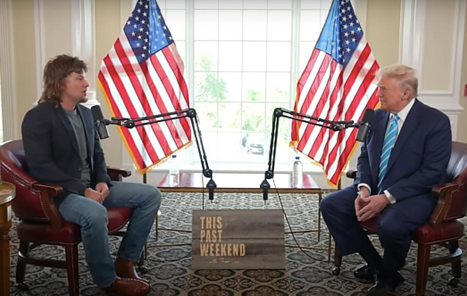
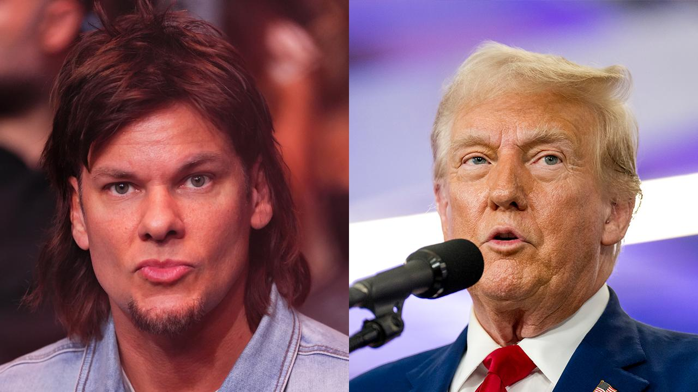

## Claim
Claim: "In an interview with podcaster Theo Von in August 2024, Donald Trump criticized British Prime Minister Keir Starmer over a 100-year deal between the U.K. and Ukraine."

## Actions
```
image_search("Theo Von Donald Trump interview August 2024")
image_search("Donald Trump Keir Starmer Ukraine deal")
```

## Evidence
### Evidence from `image_search`
The search results indicate that Donald Trump was interviewed by Theo Von. One source includes an image of the interview (), while another source is an article from The Independent about the interview (). Fox News also reported on the interview ().

The articles can be found at the following URLs: [Source](https://www.nsnews.com/local-news/theo-von-vancouver-donald-trump-interview-2024-9379843), [Source](https://www.independent.co.uk/news/world/americas/us-politics/donald-trump-cocaine-theo-von-podcast-b2599472.html), and [Source](https://www.foxnews.com/politics/trump-talks-cocaine-biden-health-care-interview-comedian-theo-von).


### Evidence from `image_search`
Reuters published an article about Keir Starmer and Donald Trump discussing a Ukraine peace deal (). CNN published an article on February 27, 2025, about Donald Trump and Keir Starmer (). NBC News has an image of Donald Trump shaking hands with an individual, with flags of the United States and the United Kingdom in the background ().

The articles can be found at the following URLs: [Source](https://www.reuters.com/world/uks-starmer-discussed-tough-fair-ukraine-peace-deal-with-trump-2025-02-27/), [Source](https://www.cnn.com/2025/02/27/politics/trump-starmer-security-guarantees-analysis), and [Source](https://www.nbcnews.com/politics/white-house/keir-starmer-sees-value-trumps-pursuit-ukrainian-mineral-rights-deal-rcna194047).


## Elaboration
The evidence confirms that Donald Trump was interviewed by Theo Von. The search results also show that Donald Trump and Keir Starmer have interacted and discussed Ukraine-related topics. However, the evidence does not explicitly state whether Trump criticized Starmer in the Theo Von interview regarding a 100-year deal between the U.K. and Ukraine.

Therefore, the claim cannot be fully verified without further information. Specifically, the content of the Theo Von interview needs to be examined to confirm if the criticism occurred.


## Actions
```
image_search("Donald Trump Theo Von interview Ukraine deal")
```

## Evidence
### Evidence from `image_search`
From [Source](https://www.independent.co.uk/tv/news/donald-trump-cocaine-theo-von-interview-b2599493.html): 
Content: The Independent published an article about the interview between Donald Trump and Theo Von. 


## Elaboration
The new evidence confirms the existence of the interview between Donald Trump and Theo Von. However, it still does not provide any information about the specific topics discussed, such as the 100-year deal between the U.K. and Ukraine or any criticism of Keir Starmer.

Therefore, the claim remains unverified due to the lack of specific details about the interview's content.


## Actions
```
image_search("Donald Trump Theo Von interview Keir Starmer Ukraine")
```

## Evidence
### Evidence from `image_search`
Reuters ([Source](https://www.reuters.com/world/us/trump-starmer-meeting-ukraine-security-focus-white-house-talks-2025-02-27/)) discusses a meeting between Trump and Starmer, focusing on Ukraine security (). The Guardian ([Source](https://www.theguardian.com/politics/2025/mar/01/after-trump-zelenskyy-spat-starmer-ukraine-trump-zelensky)) published an article on March 1, 2025, about Donald Trump and Keir Starmer (). The BBC ([Source](https://www.bbc.com/news/articles/c871120g92ro)) also published an article about Donald Trump and Keir Starmer ().


## Elaboration
The evidence confirms that Donald Trump and Keir Starmer have interacted and discussed Ukraine-related topics. However, the search results do not provide any information about the Theo Von interview. Therefore, the claim remains unverified.


## Final Judgement
The search results confirm that Donald Trump was interviewed by Theo Von and that Trump and Keir Starmer have discussed Ukraine-related topics. However, there is no evidence to confirm that Trump criticized Starmer in the Theo Von interview regarding a 100-year deal between the U.K. and Ukraine. Therefore, the claim cannot be verified.

`false`


### Verdict: FALSE

### Justification
The claim cannot be verified. While Donald Trump was interviewed by Theo Von, and Trump and Keir Starmer have discussed Ukraine-related topics, there is no evidence to confirm that Trump criticized Starmer in the Theo Von interview regarding a 100-year deal between the U.K. and Ukraine.
