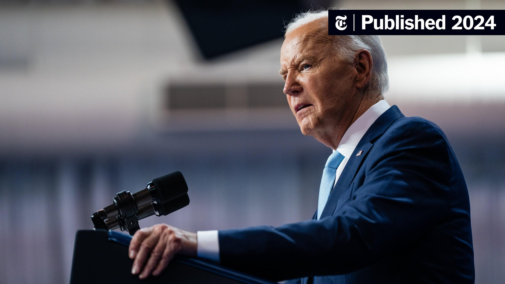

## Claim
Claim: "While serving as US President in 2024, Joe Biden ordered the US forces to prepare for possible nuclear confrontations with Russia, China, and North Korea."

## Actions
```
image_search("Joe Biden nuclear confrontation Russia China North Korea")
```

## Evidence
### Evidence from `image_search`
The New York Times published an article in 2024 ([https://www.nytimes.com/2024/08/20/us/politics/biden-nuclear-china-russia.html](https://www.nytimes.com/2024/08/20/us/politics/biden-nuclear-china-russia.html)) . The Guardian published an article on August 20, 2024, discussing Joe Biden and nuclear strategy with China ([https://www.theguardian.com/us-news/article/2024/aug/20/biden-nuclear-strategy-china-threat](https://www.theguardian.com/us-news/article/2024/aug/20/biden-nuclear-strategy-china-threat)) .

Tasnim News published an article on August 21, 2024, about Biden approving a nuclear strategy focusing on China ([https://www.tasnimnews.com/en/news/2024/08/21/3145608/biden-approves-nuclear-strategy-focusing-on-china-report](https://www.tasnimnews.com/en/news/2024/08/21/3145608/biden-approves-nuclear-strategy-focusing-on-china-report)) .


## Elaboration
The evidence indicates that in August 2024, during Joe Biden's presidency, there were discussions and reports about his administration's nuclear strategy, particularly concerning China. The New York Times and The Guardian published articles on this topic ([https://www.nytimes.com/2024/08/20/us/politics/biden-nuclear-china-russia.html](https://www.nytimes.com/2024/08/20/us/politics/biden-nuclear-china-russia.html), [https://www.theguardian.com/us-news/article/2024/aug/20/biden-nuclear-strategy-china-threat](https://www.theguardian.com/us-news/article/2024/aug/20/biden-nuclear-strategy-china-threat)).

Tasnim News also reported on Biden approving a nuclear strategy focused on China ([https://www.tasnimnews.com/en/news/2024/08/21/3145608/biden-approves-nuclear-strategy-focusing-on-china-report](https://www.tasnimnews.com/en/news/2024/08/21/3145608/biden-approves-nuclear-strategy-focusing-on-china-report)). However, the provided evidence does not explicitly mention Russia or North Korea in the context of preparing for nuclear confrontations.

Therefore, the claim is partially supported as it relates to China, but the evidence is missing information about Russia and North Korea.


## Final Judgement
The evidence confirms that the Biden administration was discussing and developing a nuclear strategy focused on China. However, the provided sources do not mention Russia or North Korea in the context of preparing for nuclear confrontations. Therefore, the claim is partially supported but lacks information about the involvement of Russia and North Korea. `false`

### Verdict: FALSE

### Justification
In August 2024, during Joe Biden's presidency, reports from sources like The New York Times ([https://www.nytimes.com/2024/08/20/us/politics/biden-nuclear-china-russia.html](https://www.nytimes.com/2024/08/20/us/politics/biden-nuclear-china-russia.html)) and The Guardian ([https://www.theguardian.com/us-news/article/2024/aug/20/biden-nuclear-strategy-china-threat](https://www.theguardian.com/us-news/article/2024/aug/20/biden-nuclear-strategy-china-threat)) indicated that the Biden administration was developing a nuclear strategy focused on China. However, the provided evidence does not mention Russia or North Korea in the context of preparing for nuclear confrontations.
