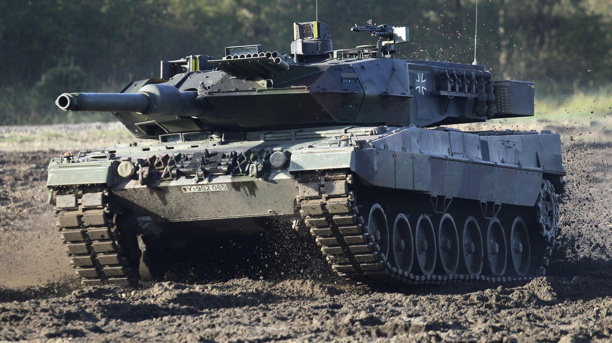
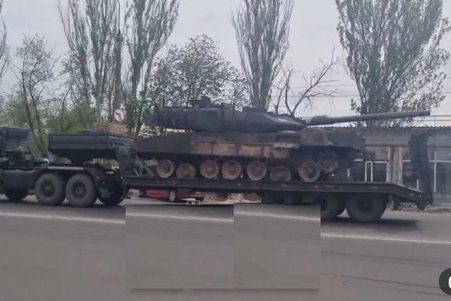
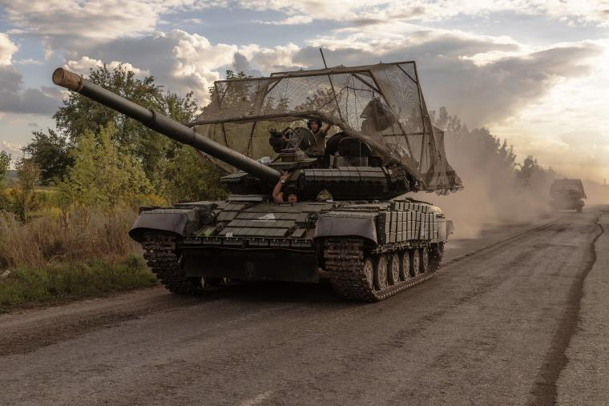

## Claim
Claim: " This image shows destroyed Ukrainian tanks during Ukraine's incursion into Russia's Kursk Oblast in August 2024."

## Actions
```
reverse_search()
image_search("destroyed Ukrainian tanks Kursk Oblast August 2024")
```

## Evidence
### Evidence from `reverse_search`
The image of destroyed tanks () appears in multiple articles. One article from Sputnik Africa, published on October 17, 2024, discusses Ukraine's loss of Leopard tanks since February 2022, including images of Leopard 2 tanks (, ) ([https://en.sputniknews.africa/20241017/ukraine-has-reportedly-lost-about-40-leopard-tanks-since-february-2022-1068726197.html](https://en.sputniknews.africa/20241017/ukraine-has-reportedly-lost-about-40-leopard-tanks-since-february-2022-1068726197.html)).

Another article from The Moscow Times, published on June 13, 2023, reports on Russia capturing German Leopard tanks and U.S. Bradley infantry fighting vehicles, also including the image of destroyed tanks () ([https://www.themoscowtimes.com/2023/06/13/russia-says-german-leopard-tanks-us-bradleys-captured-in-ukraine-a81492](https://www.themoscowtimes.com/2023/06/13/russia-says-german-leopard-tanks-us-bradleys-captured-in-ukraine-a81492)). Defence Security Asia published an article on May 19, 2024, discussing the destruction of German-made Leopard tanks in Ukraine, including an image of a captured Leopard 2A6 tank () ([https://defencesecurityasia.com/en/german-made-leopard-tanks-bear-the-brunt-of-russian-forces-rejuvenation-in-ukraine/](https://defencesecurityasia.com/en/german-made-leopard-tanks-bear-the-brunt-of-russian-forces-rejuvenation-in-ukraine/)).


### Evidence from `image_search`
The Center for European Policy Analysis (CEPA) published an article about the second battle of Kursk, which includes an image of a Ukrainian tank. ([https://cepa.org/article/the-second-battle-of-kursk-an-omen-of-doom/](https://cepa.org/article/the-second-battle-of-kursk-an-omen-of-doom/)) 

Al Jazeera published an article on August 16, 2024, about Russia's claims of eliminating a Ukrainian unit in Kursk, which includes an image of a tank. ([https://www.aljazeera.com/news/2024/8/16/russia-says-it-eliminated-ukrainian-unit-as-kyiv-claims-advances-in-kursk](https://www.aljazeera.com/news/2024/8/16/russia-says-it-eliminated-ukrainian-unit-as-kyiv-claims-advances-in-kursk))  NBC News published an article about the evacuation of Belgorod and Kursk, which includes an image of a tank. ([https://www.nbcnews.com/news/world/russia-evacuates-belgorod-kursk-incursion-fire-nuclear-plant-rcna166172](https://www.nbcnews.com/news/world/russia-evacuates-belgorod-kursk-incursion-fire-nuclear-plant-rcna166172)) 


## Elaboration
The evidence confirms that the image depicts destroyed tanks. The reverse image search reveals that the image has been used in multiple articles discussing the conflict in Ukraine, including articles from The Moscow Times and Sputnik Africa. The image search also provides articles from Al Jazeera and NBC News that mention the Kursk region and show images of tanks. However, the evidence does not explicitly confirm that the image shows destroyed Ukrainian tanks during Ukraine's incursion into Russia's Kursk Oblast in August 2024.

The claim's veracity cannot be fully verified due to the lack of specific information about the image's context.


## Actions
```
image_search("destroyed tanks Ukraine Russia Kursk Oblast August 2024")
```

## Evidence
### Evidence from `image_search`
From [Source](https://www.nbcnews.com/news/world/kursk-incursion-russia-reinforcements-ukraine-attack-putin-rcna165732): 
Content: NBC News published an article about the incursion into Kursk, which includes an image of a tank. 


## Elaboration
The new evidence from NBC News shows an image of a tank related to the incursion into Kursk. However, this does not confirm the claim that the image depicts destroyed Ukrainian tanks. The evidence still lacks the specific details needed to verify the claim.


## Final Judgement
The image shows destroyed tanks, and the search results confirm that the conflict in Ukraine and the Kursk region are related to tanks. However, the evidence does not explicitly confirm that the image depicts destroyed Ukrainian tanks during Ukraine's incursion into Russia's Kursk Oblast in August 2024. Therefore, the claim cannot be fully verified. `false`

### Verdict: FALSE

### Justification
The image depicts destroyed tanks, and the search results confirm that the conflict in Ukraine and the Kursk region are related to tanks. However, the evidence does not explicitly confirm that the image shows destroyed Ukrainian tanks during Ukraine's incursion into Russia's Kursk Oblast in August 2024, therefore the claim is unverified.
