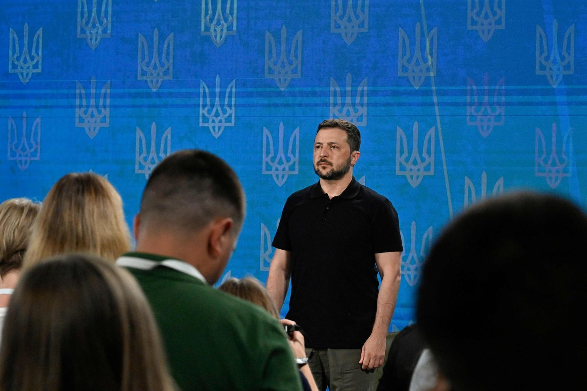
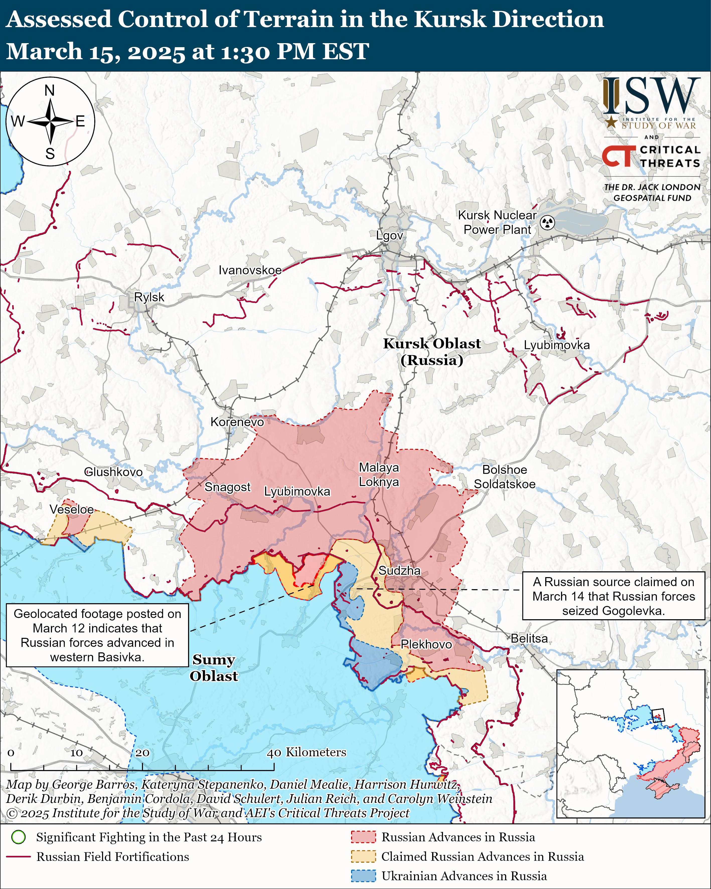

## Claim
Claim: " This image shows Ukrainian President Volodymyr Zelensky arriving in August 2024 in the Sudzha of Kursk region, Russia, which had just been occupied by Ukrainian troops in the Kursk Offensive, and meeting with representatives of the people there."

## Actions
```
reverse_search()
image_search("Volodymyr Zelensky Kursk Offensive")
```

## Evidence
### Evidence from `reverse_search`
The image () of Volodymyr Zelensky is featured in articles about his visit to the front lines. The BBC reports that Zelensky visited troops in the Kharkiv region, as seen in the image, which was published on May 28, 2022.  Telegrafi.com also published an article about Zelensky's visit to the front line in the Kharkiv region, which included the image and mentioned it was a rare trip outside of Kyiv. The article was published 3 years ago.

The sources are: [https://www.bbc.com/news/live/world-europe-61612803](https://www.bbc.com/news/live/world-europe-61612803), [https://global.solarpriceza.com/merchant/zelensky-on-the-front-line-02eb5d0-19-29474101-2-21/](https://global.solarpriceza.com/merchant/zelensky-on-the-front-line-02eb5d0-19-29474101-2-21/), and [https://telegrafi.com/en/zelensky-on-a-rare-trip-outside-kiev-visited-the-front-line-where-he-met-ukrainian-troops/](https://telegrafi.com/en/zelensky-on-a-rare-trip-outside-kiev-visited-the-front-line-where-he-met-ukrainian-troops/).


### Evidence from `image_search`
Le Monde published an article on August 28, 2024, about Volodymyr Zelensky presenting the Ukrainian offensive in Kursk as a victory plan.  The Institute for the Study of War and AEI's Critical Threats Project published a map showing the assessed control of terrain in the Kursk direction on March 15, 2025, indicating Russian advances in the area. 

The South China Morning Post published an article about the Ukraine war, where Zelensky confirms a new offensive in Russia's Kursk.


## Elaboration
The claim is inaccurate. The image (

## Final Judgement
The image of Zelensky was taken in May 2022, not August 2024, and the location was the Kharkiv region, not the Sudzha of Kursk region. The claim also incorrectly states that Ukrainian troops occupied the Kursk region.

`false`

### Verdict: FALSE

### Justification
The image of Volodymyr Zelensky was taken in May 2022 in the Kharkiv region, not in August 2024 in the Sudzha of the Kursk region, as claimed. The evidence from the BBC ([https://www.bbc.com/news/live/world-europe-61612803](https://www.bbc.com/news/live/world-europe-61612803)) and other sources confirms the correct date and location. Additionally, the claim that Ukrainian troops occupied the Kursk region is not supported by the provided evidence.
