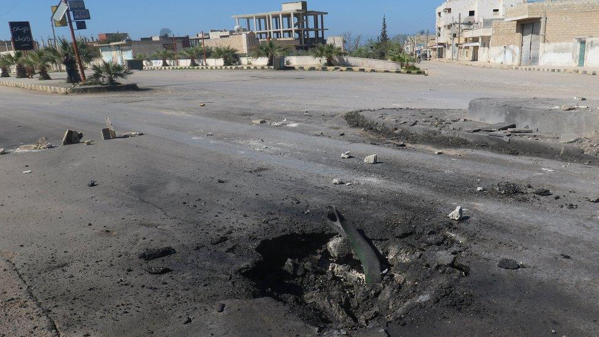
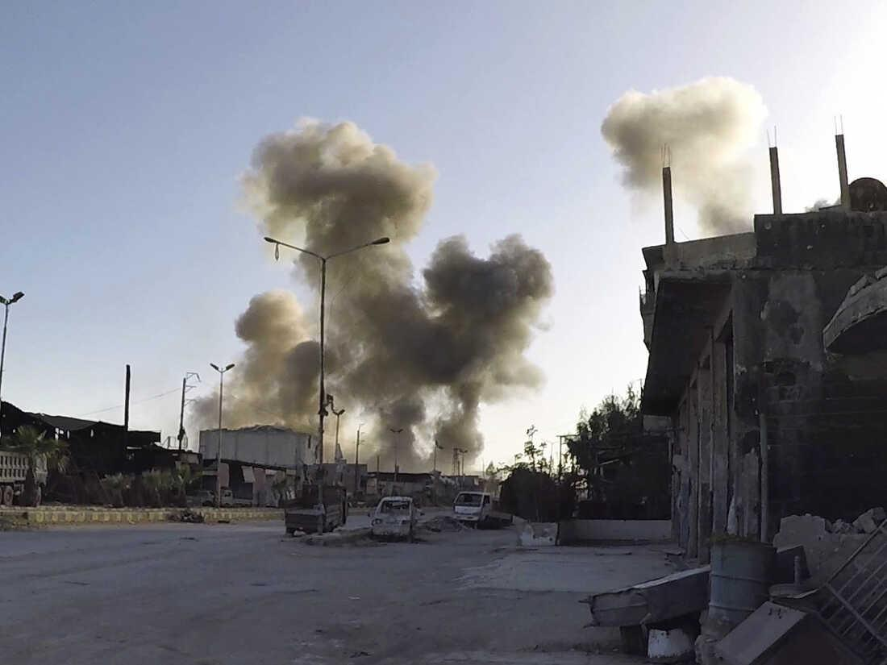
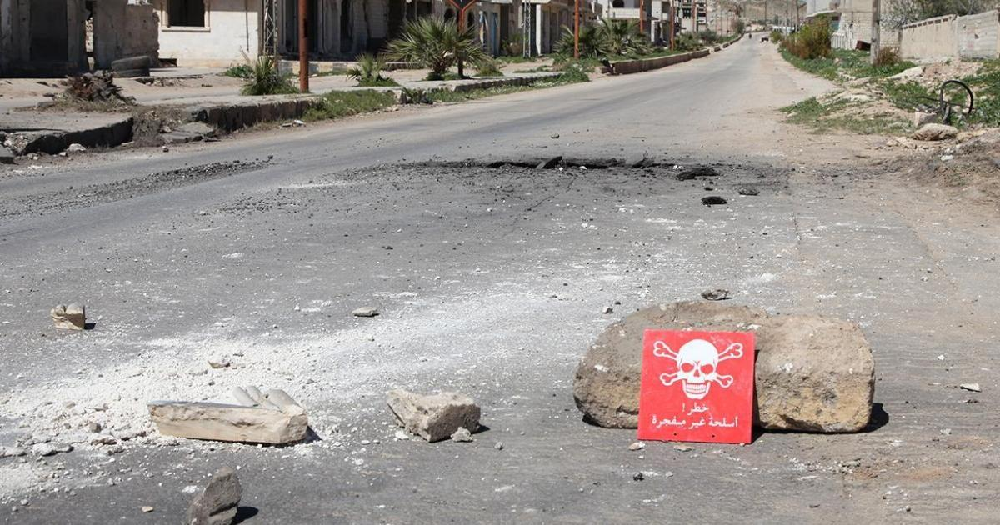
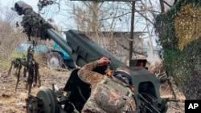

## Claim
Claim: " This image shows a chemical attack by the Armed Forces of Ukraine during the Kursk offensive in August 2024."

## Actions
```
geolocate()
image_search("chemical attack explosion road")
web_search("Kursk offensive 2024 chemical attack")
```

## Evidence
### Evidence from `geolocate`
The most likely countries where the image was taken are: {'Palestine': 0.27, 'Jordan': 0.13, 'Ukraine': 0.08, 'Israel': 0.05, 'Argentina': 0.03, 'Kyrgyzstan': 0.03, 'Lesotho': 0.03, 'Mexico': 0.03, 'Pakistan': 0.03, 'Russia': 0.03}

### Evidence from `image_search`
The BBC News website contains an image of a road with a hole in it (). NPR published an article about a chemical attack (). The Human Rights Watch report discusses the Syrian government's use of chemical weapons ().

The provided sources do not contain information about the Kursk offensive in August 2024 or the Armed Forces of Ukraine.


### Evidence from `web_search`
Reuters reports that Russia claimed Ukrainian forces used chemical weapons during the Kursk offensive in August 2024, but Reuters could not independently verify the claim. The SBU (Ukraine's State Security Service) stated that Russia might stage crimes and blame Ukraine. The article was published on August 12, 2024. []

RFE/RL, published on December 17, 2024, discusses the intensified offensive by Russian forces, bolstered by North Korean troops, against Ukrainian troops in the Kursk region. []


## Elaboration
The evidence indicates that Russia claimed Ukraine used chemical weapons during the Kursk offensive in August 2024, but this claim is unverified. The SBU suggested Russia might stage such events. The image search results do not provide any information about the image in question. The geolocation data suggests the image was most likely taken in Palestine, Jordan, or Ukraine.

The claim cannot be verified because the evidence does not confirm the image depicts a chemical attack by the Armed Forces of Ukraine. The evidence only provides a claim by Russia that is unverified.

The information about the image's origin and the nature of the explosion is missing.


## Final Judgement
The claim is misleading. While there are reports of a chemical attack during the Kursk offensive, the image's origin and the nature of the explosion are not confirmed. The geolocation data suggests the image was most likely taken in Palestine, Jordan, or Ukraine. The claim misrepresents the origin and content of the image. `misleading`

### Verdict: MISLEADING

### Justification
The claim is misleading. While there are reports of a chemical attack during the Kursk offensive, the image's origin and the nature of the explosion are not confirmed. The geolocation data suggests the image was most likely taken in Palestine, Jordan, or Ukraine. The claim misrepresents the origin and content of the image.
