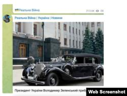
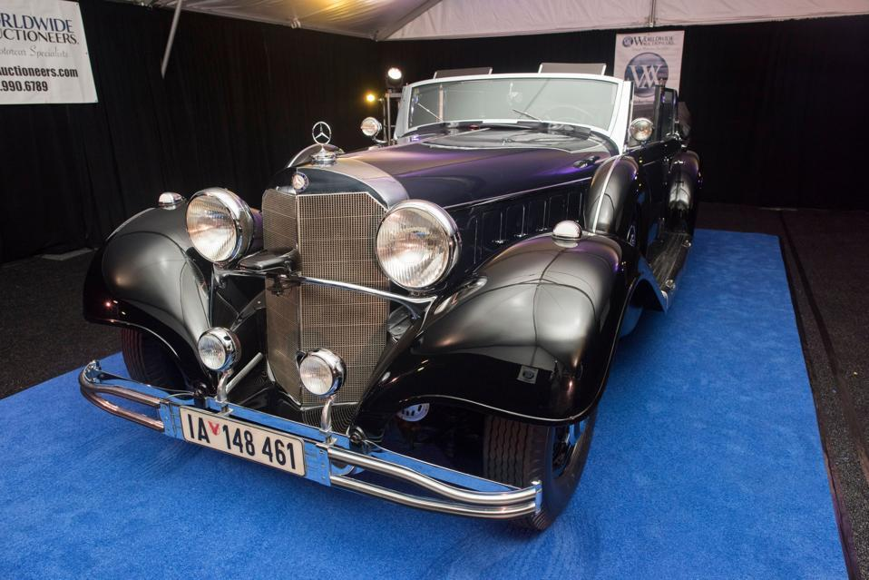
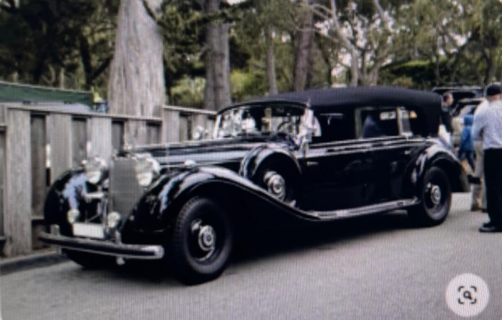

## Claim
Claim: " This image shows Hitler's parade car which was bought by the Ukrainian president Volodymyr Zelenskyy for 15 Million US-$."

## Actions
```
image_search("Mercedes-Benz parade car Hitler")
web_search("Mercedes-Benz parade car Zelenskyy")
```

## Evidence
### Evidence from `image_search`
Newsweek published an article about Adolf Hitler's parade car (). The Seattle Times also published an article about Hitler's parade car ().

*   [https://www.newsweek.com/adolf-hitlers-car-will-be-sold-auction-who-would-buy-it-756783](https://www.newsweek.com/adolf-hitlers-car-will-be-sold-auction-who-would-buy-it-756783)
*   [https://www.seattletimes.com/seattle-news/how-hitlers-car-ended-up-parked-in-medina/](https://www.seattletimes.com/seattle-news/how-hitlers-car-ended-up-parked-in-medina/)


### Evidence from `web_search`
Multiple sources debunk the claim that Volodymyr Zelenskyy bought Hitler's parade car. The story originated from fake news sites and was quickly debunked. The car was previously listed by Worldwide Auctioneers and is now in the car collection of Australian billionaire Clive Palmer.

The articles referencing the claim include: [https://www.voanews.com/a/russian-propagandists-push-fake-story-that-zelenskyy-bought-hitler-s-car/7818175.html](https://www.voanews.com/a/russian-propagandists-push-fake-story-that-zelenskyy-bought-hitler-s-car/7818175.html), [https://www.forbes.com/sites/petersuciu/2024/10/09/despite-online-claims-ukraines-zelensky-didnt-buy-hitlers-car/](https://www.forbes.com/sites/petersuciu/2024/10/09/despite-online-claims-ukraines-zelensky-didnt-buy-hitlers-car/) and [https://simanaitissays.com/2024/10/15/yet-another-collector-car-for-zelensky/](https://simanaitissays.com/2024/10/15/yet-another-collector-car-for-zelensky/). , , , , , 


## Elaboration
The claim that Volodymyr Zelenskyy bought Hitler's parade car for $15 million is false. Multiple sources debunk this story, stating it originated from fake news sites. The car was previously listed by Worldwide Auctioneers and is now in the car collection of Australian billionaire Clive Palmer.


## Final Judgement
The claim is demonstrably false. The evidence shows that the story is fake news and the car is not owned by Zelenskyy. `false`

### Verdict: FALSE

### Justification
The claim is false. Multiple sources, including [VOA News](https://www.voanews.com/a/russian-propagandists-push-fake-story-that-zelenskyy-bought-hitler-s-car/7818175.html) and [Forbes](https://www.forbes.com/sites/petersuciu/2024/10/09/despite-online-claims-ukraines-zelensky-didnt-buy-hitlers-car/), debunk the story, indicating it originated from fake news. The car is currently owned by Australian billionaire Clive Palmer.
