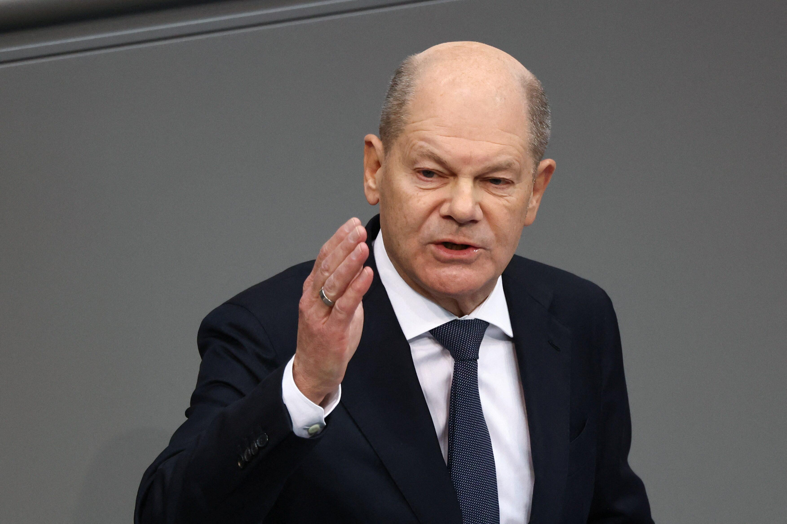

## Claim
Claim: "In February 2025 German Chancellor Olaf Scholz declared a state of emergency in Germany due to US President Donald Trump's peace plan for Ukraine."

## Actions
```
web_search("Olaf Scholz state of emergency Germany Trump peace plan Ukraine")
```

## Evidence
### Evidence from `web_search`
POLITICO reports that Olaf Scholz was unaware of Donald Trump's peace plan for Ukraine, and the article was published on February 23, 2024.  Euronews published a fact-check on February 19, 2025, stating that Scholz did not declare a state of emergency in Germany due to the US's peace negotiations with Russia <image:0>. Reuters published an article on February 13, 2025, stating that Scholz said there must be no imposed peace in Ukraine .

*   [https://www.politico.eu/article/olaf-scholz-germany-donald-trump-war-in-ukraine-peace-plan/](https://www.politico.eu/article/olaf-scholz-germany-donald-trump-war-in-ukraine-peace-plan/)
*   [https://www.euronews.com/my-europe/2025/02/19/fact-check-scholz-did-not-call-for-german-state-of-emergency-over-russia-us-peace-talks](https://www.euronews.com/my-europe/2025/02/19/fact-check-scholz-did-not-call-for-german-state-of-emergency-over-russia-us-peace-talks)
*   [https://www.reuters.com/world/europe/there-must-be-no-imposed-peace-ukraine-says-germanys-scholz-2025-02-13/](https://www.reuters.com/world/europe/there-must-be-no-imposed-peace-ukraine-says-germanys-scholz-2025-02-13/)


## Elaboration
The claim is demonstrably false. Euronews published a fact-check on February 19, 2025, stating that Scholz did not declare a state of emergency in Germany due to US peace negotiations with Russia. Additionally, Reuters reported on February 13, 2025, that Scholz stated there must be no imposed peace in Ukraine.


## Final Judgement
The claim is demonstrably false. Multiple sources, including Euronews and Reuters, confirm that Olaf Scholz did not declare a state of emergency in Germany in February 2025 due to Donald Trump's peace plan for Ukraine.

`false`

### Verdict: FALSE

### Justification
The claim is false. Multiple sources, including a fact-check by [Euronews](https://www.euronews.com/my-europe/2025/02/19/fact-check-scholz-did-not-call-for-german-state-of-emergency-over-russia-us-peace-talks), confirm that Olaf Scholz did not declare a state of emergency in Germany in February 2025.
