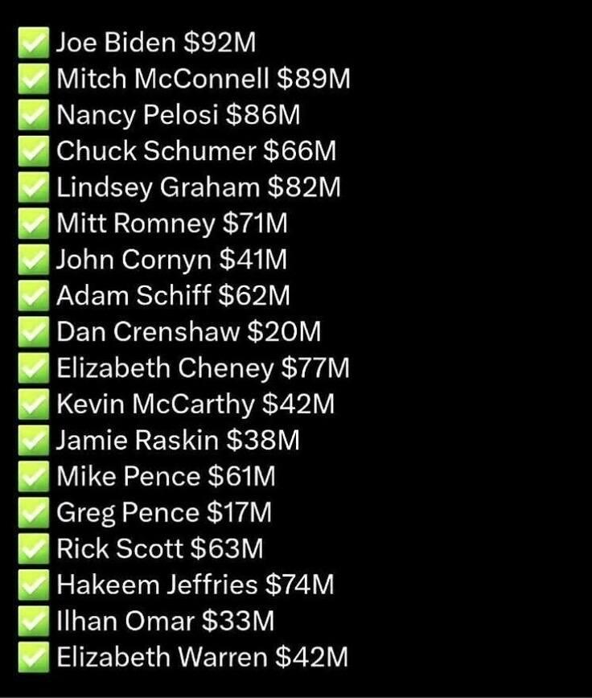
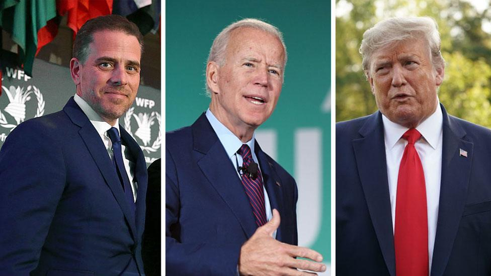
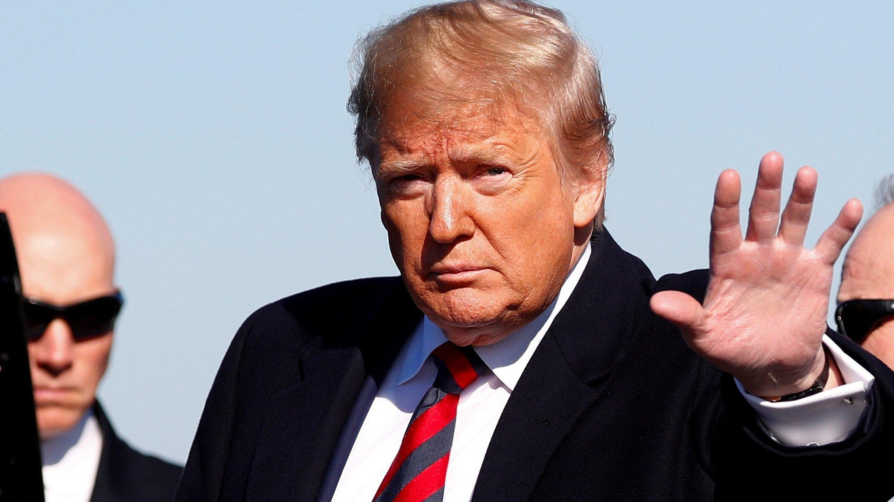
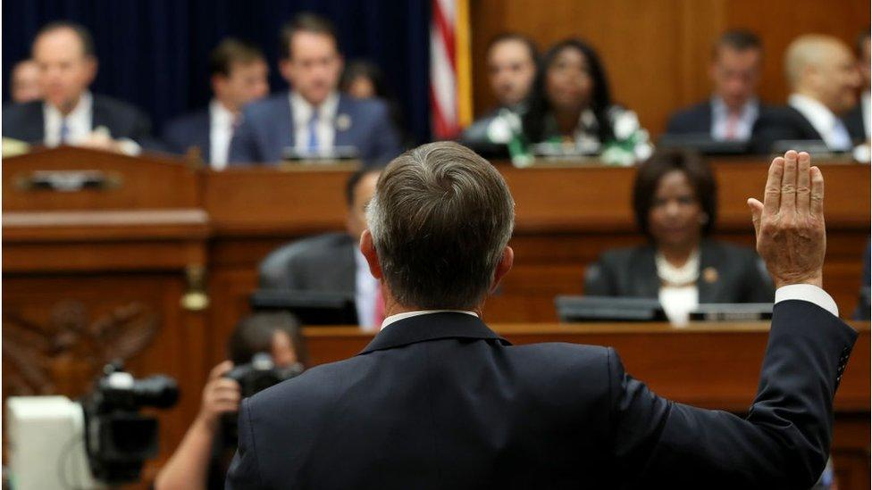
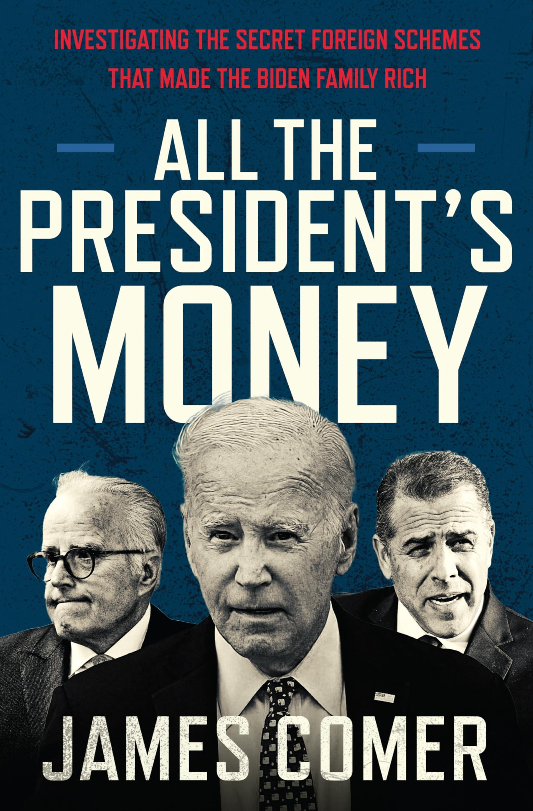

## Claim
Claim: " This image shows an authentic list realeased by Ukraine showing US politicians taking bribes from Ukraine. The highest bribe was 92 Million US-$ for Joe Biden."

## Actions
```
web_search("Joe Biden Mitch McConnell Nancy Pelosi Ukraine bribes")
image_search("US politicians Ukraine bribes list")
```

## Evidence
### Evidence from `web_search`
The search results discuss corruption concerns related to Ukraine aid, mentioning Joe Biden, Mitch McConnell, and Nancy Pelosi. One article from mynbc15.com discusses a confidential document suggesting Western support may depend on efforts to combat corruption, and another from the BBC discusses the impeachment inquiry into President Donald Trump, focusing on his contacts with Ukraine and allegations against Joe Biden. , , , , , , 

The articles are from mynbc15.com ([https://mynbc15.com/news/nation-world/corruption-concerns-cloud-ukraine-aid-commitments-congress-democrat-republican-democracy-authoritarian-mccarthy-mcconnell-putin-zelensky-oversight-graft](https://mynbc15.com/news/nation-world/corruption-concerns-cloud-ukraine-aid-commitments-congress-democrat-republican-democracy-authoritarian-mccarthy-mcconnell-putin-zelensky-oversight-graft)), king5.com ([https://www.king5.com/article/news/nation-world/congress-wants-answers-on-trumps-dig-for-biden-dirt-ukraine/507-66cb4ea8-686a-44da-b304-3a7d70712d68](https://www.king5.com/article/news/nation-world/congress-wants-answers-on-trumps-dig-for-biden-dirt-ukraine/507-66cb4ea8-686a-44da-b304-3a7d70712d68)), and bbc.co.uk ([https://www.bbc.co.uk/news/world-us-canada-49842600](https://www.bbc.co.uk/news/world-us-canada-49842600)).


### Evidence from `image_search`
The search results include a book titled "All the President's Money" by James Comer (), an image of a person with money in their pocket (), and an Al Jazeera article about a corruption scheme uncovered in Ukraine's defense sector ().

The provided links are: [Source](https://www.amazon.com/All-Presidents-Money-Investigating-Foreign/dp/0063420015), [Source](https://kkc.com/corruption-index/corruption-in-ukraine/), and [Source](https://www.aljazeera.com/news/2025/8/2/ukraine-says-defence-sector-corruption-scheme-uncovered).


## Elaboration
The evidence indicates that there are concerns about corruption related to Ukraine aid and that Joe Biden, Mitch McConnell, and Nancy Pelosi have been mentioned in connection to these concerns. However, the evidence does not provide any information about a list released by Ukraine detailing bribes taken by US politicians, nor does it confirm the amounts listed in the image.

Therefore, the claim cannot be verified due to a lack of evidence.


## Actions
```
reverse_search()
```

## Evidence
No new evidence found.

## Elaboration
The claim is not supported by the evidence. The initial search results mention corruption concerns and investigations related to Ukraine and some US politicians, but they do not provide any information about a list released by Ukraine detailing bribes. The reverse image search did not yield any additional information to support the claim.


## Final Judgement
The claim presents an image purporting to be a list of US politicians taking bribes from Ukraine. While there are discussions about corruption and investigations related to Ukraine and some US politicians, there is no evidence to support the existence or authenticity of the list presented in the image. Therefore, the claim is misleading because it presents an unverified list as factual. `misleading`

### Verdict: MISLEADING

### Justification
The claim is misleading. While there are discussions about corruption related to Ukraine and some US politicians, the provided evidence, including web and image searches, does not support the existence or authenticity of the list presented in the image. The search results mention corruption concerns and investigations related to Ukraine and some US politicians, but they do not provide any information about a list released by Ukraine detailing bribes.
