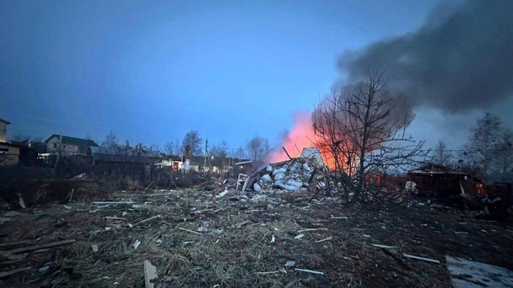
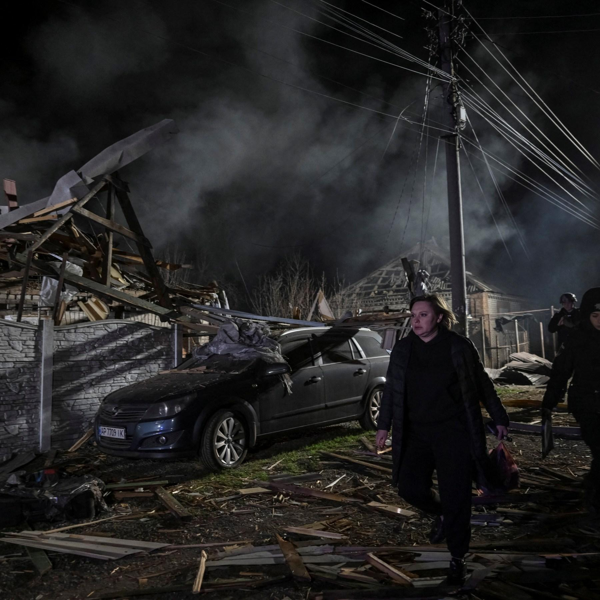
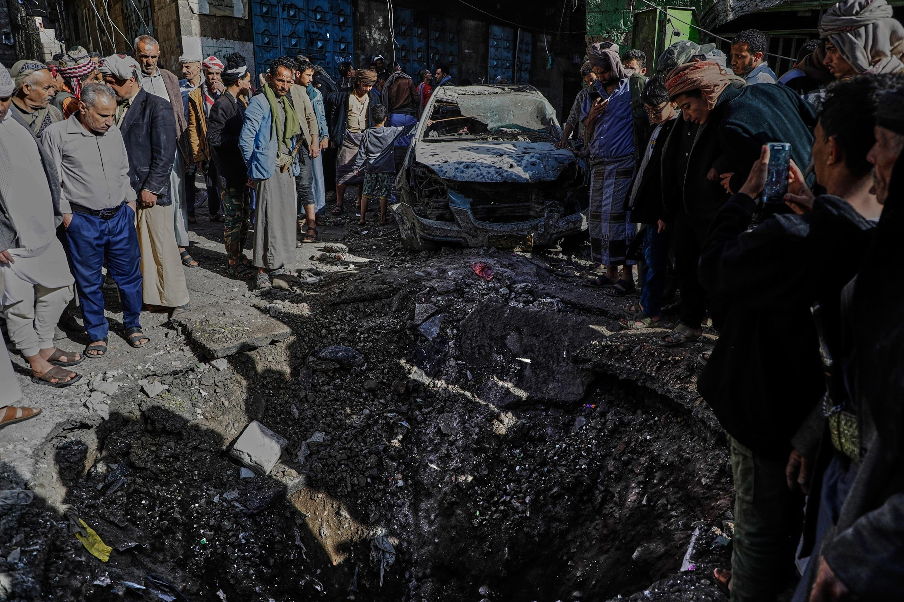

## Claim
Claim: " This image shows a US drone which was shot down in March 2025 by the Houthis using Russian missiles."

## Actions
```
geolocate()
image_search("drone shot down March 2025")
web_search("US drone shot down by Houthis March 2025")
```

## Evidence
### Evidence from `geolocate`
The most likely countries where the image was taken are: {'Israel': 0.64, 'Palestine': 0.13, 'United Arab Emirates': 0.12, 'Jordan': 0.08, 'Tunisia': 0.01, 'Albania': 0.0, 'Andorra': 0.0, 'Argentina': 0.0, 'Australia': 0.0, 'Austria': 0.0}

### Evidence from `image_search`
Euronews published an article on March 11, 2025, about a drone attack (). Al Jazeera published an article about a deadly Russian drone attack in Ukraine ().

The France24 source provided no content.


### Evidence from `web_search`
The Associated Press reports that Houthi rebels have shot down seven U.S. Reaper drones in recent weeks, published on July 28, 2025, ([https://apnews.com/article/houthis-us-warships-red-sea-e6e97a7131c48640ccf74b1916628234](https://apnews.com/article/houthis-us-warships-red-sea-e6e97a7131c48640ccf74b1916628234)). ABC News reports that the Houthis have shot down six MQ-9 Reaper drones since March 15, 2025, (), published on April 23, 2025, ([https://abcnews.go.com/Politics/houthis-shoot-growing-number-us-drones/story?id=121099082](https://abcnews.go.com/Politics/houthis-shoot-growing-number-us-drones/story?id=121099082)).

Al Jazeera reports that the Houthis said they shot down a US drone in the Hajjah governorate in Yemen, (<image:i>), published on April 22, 2025, ([https://www.aljazeera.com/news/2025/4/22/houthis-say-group-downed-us-drone-in-northwest-yemen-as-us-strikes-continue](https://www.aljazeera.com/news/2025/4/22/houthis-say-group-downed-us-drone-in-northwest-yemen-as-us-strikes-continue)). The Houthis claim this is the seventh US drone downed this month and the 22nd since the start of the war in Gaza. The US has been carrying out air attacks against Houthi targets since March, killing more than 200 people.


## Elaboration
The evidence suggests that the claim is partially accurate. The web search results confirm that the Houthis have shot down U.S. drones. The ABC News article states that six MQ-9 Reaper drones have been shot down since March 15, 2025. The Al Jazeera article mentions a US drone being shot down in Yemen. However, the provided image's geolocation data indicates that the image was most likely taken in Israel. Therefore, the claim is inaccurate because the image does not depict a drone shot down by the Houthis in Yemen.


## Final Judgement
The claim is misleading because the image does not depict a US drone shot down by the Houthis. While the Houthis have shot down US drones, the image's geolocation suggests it was taken in Israel.

`misleading`

### Verdict: MISLEADING

### Justification
The claim is misleading. While the Houthis have shot down U.S. drones, the image's geolocation data suggests it was taken in Israel, not in a location related to the Houthis' actions. The Associated Press ([https://apnews.com/article/houthis-us-warships-red-sea-e6e97a7131c48640ccf74b1916628234](https://apnews.com/article/houthis-us-warships-red-sea-e6e97a7131c48640ccf74b1916628234)) and ABC News ([https://abcnews.go.com/Politics/houthis-shoot-growing-number-us-drones/story?id=121099082](https://abcnews.go.com/Politics/houthis-shoot-growing-number-us-drones/story?id=121099082)) confirm that the Houthis have shot down U.S. drones.
