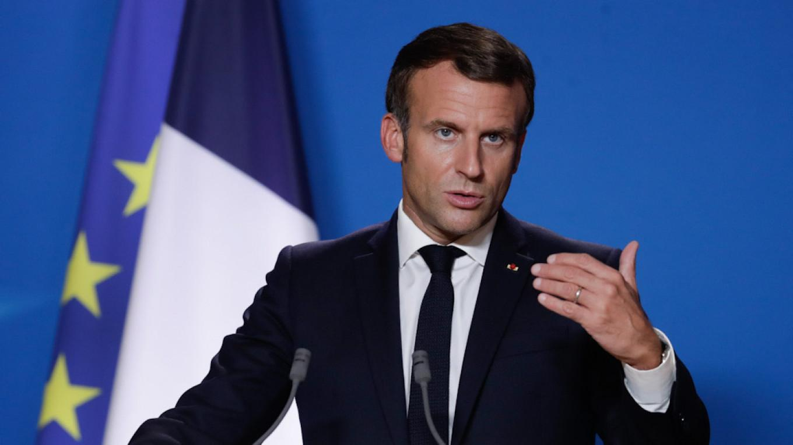

## Claim
Claim: "French President Emmanuel Macron called Russian President Vladimir Putin a 'butcher' during his press conference with Donald Trump on Monday, Feb. 24, 2025."

## Actions
```
web_search("Emmanuel Macron Vladimir Putin butcher February 24 2025")
```

## Evidence
### Evidence from `web_search`
According to a Yahoo News UK article, Emmanuel Macron did not call Vladimir Putin a "butcher" during a press conference with Donald Trump on February 24, 2025. Instead, Macron referred to the killings of Ukrainian civilians in Bucha in 2022. The article includes a video clip and a transcript of the press conference. 

France 24 ([Source](https://www.france24.com/en/live-news/20220327-macron-warns-against-escalation-after-biden-brands-putin-butcher)) and The Moscow Times ([Source](https://www.themoscowtimes.com/2022/03/27/macron-warns-against-escalation-after-biden-brands-putin-butcher-a77097)) reported that Macron warned against escalating verbal attacks on Russia after Joe Biden called Vladimir Putin a "butcher" in March 2022. <image:i>, 


## Elaboration
The evidence indicates that Emmanuel Macron did not call Vladimir Putin a "butcher" during a press conference with Donald Trump on February 24, 2025. The Yahoo News UK article explicitly states this, and the provided image shows Macron and Trump together.

The evidence also suggests that Macron used the term "butcher" in reference to the killings of Ukrainian civilians in Bucha in 2022. Furthermore, Macron cautioned against escalating verbal attacks on Russia after Joe Biden used the term "butcher" to describe Putin in March 2022.


## Final Judgement
The claim that Emmanuel Macron called Vladimir Putin a "butcher" during a press conference with Donald Trump on February 24, 2025, is false. The search results indicate that Macron did not use this term in the specified context.

`false`


### Verdict: FALSE

### Justification
The claim is false. According to a Yahoo News UK article, Emmanuel Macron did not call Vladimir Putin a "butcher" during a press conference with Donald Trump on February 24, 2025. Instead, Macron referred to the killings of Ukrainian civilians in Bucha in 2022.
