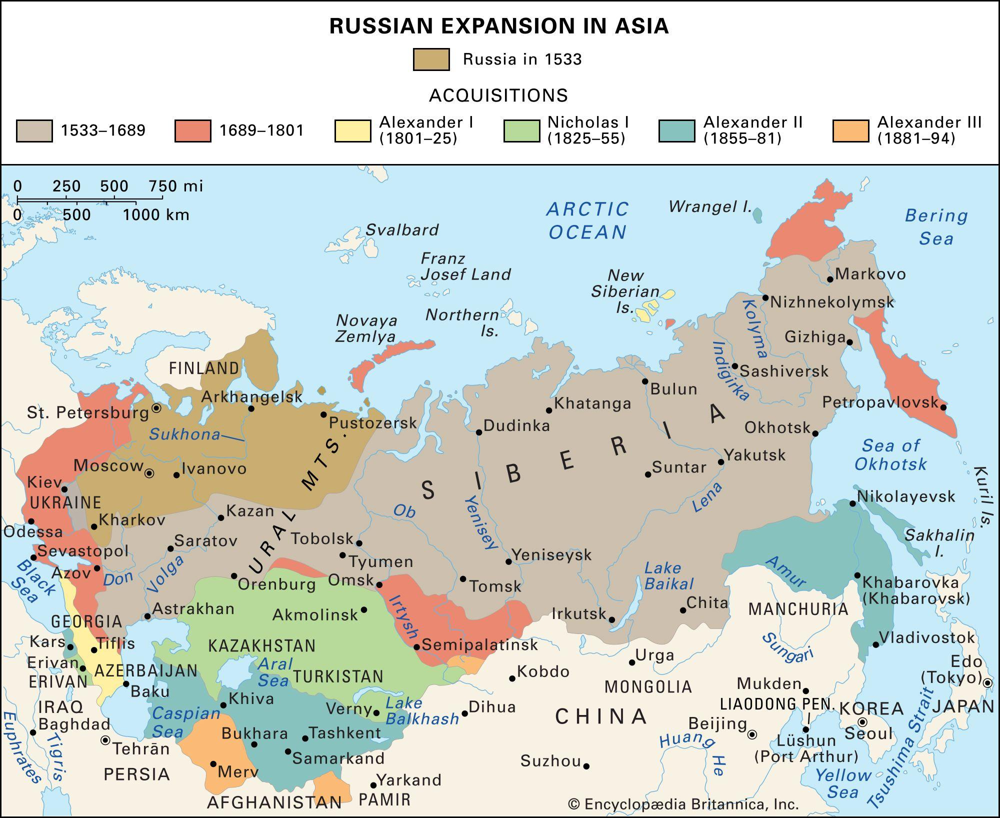
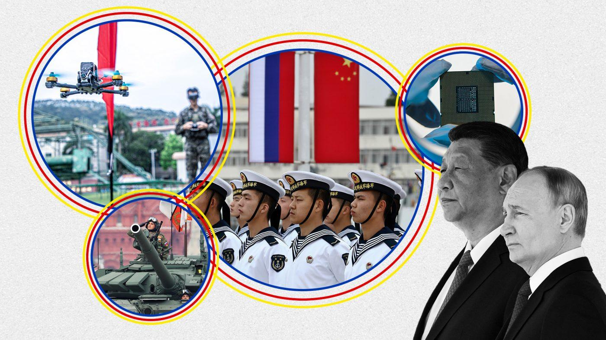
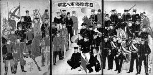

## Claim
Claim: "China and Japan plan to invade the Russian Federation."

## Actions
```
web_search("China Japan invade Russia")
```

## Evidence
### Evidence from `web_search`
The Soviet Union invaded Manchuria on August 9, 1945, as part of the Soviet-Japanese War of World War II, resulting in a Soviet victory and the collapse of Japanese puppet states. (<image:k>, <image:i>) The Russo-Japanese War (1904–05) saw Japan defeat Russia, stemming from their rivalry over Korea and Manchuria. []

*   [Source](https://en.wikipedia.org/wiki/Soviet_invasion_of_Manchuria)
*   [Source](https://www.history.com/this-day-in-history/august-8/soviets-declare-war-on-japan-invade-manchuria)
*   [Source](https://www.britannica.com/event/Russo-Japanese-War)

## Elaboration
The evidence mentions historical conflicts between Russia and both China and Japan. The Soviet Union invaded Manchuria in 1945, resulting in a Soviet victory. Japan and Russia also fought the Russo-Japanese War (1904-05), where Japan defeated Russia.

The provided evidence does not support the claim that China and Japan currently plan to invade the Russian Federation. The evidence only describes historical conflicts.

Therefore, I cannot verify the claim with the provided evidence. Additional information about current geopolitical relations between these countries would be needed.


## Actions
```
web_search("China Japan Russia current relations")
web_search("China Russia military cooperation")
web_search("Japan Russia military conflict")
```

## Evidence
### Evidence from `web_search`
China and Russia have been conducting joint military drills in the Sea of Japan since 2012, raising security concerns for Japan's Ministry of Defence. (<image:k>) Japan has condemned China's cooperation with Russia, and there are ongoing territorial disputes between China and Japan over the Senkaku Islands. (<image:k>) The Brookings article from 1997 discusses the U.S.-Japan security relationship and regional security goals regarding Korea, China, and Russia.


### Evidence from `web_search`
Newsweek reports on joint military drills between China and Russia in the Sea of Japan, including artillery fire exercises, anti-submarine warfare training, air defense operations, and joint search and rescue missions. () Japan's Ministry of Defense warned that China's military cooperation with Russia poses serious security concerns. The drills are part of the "Maritime Interaction-2025" exercise. [Source](https://www.newsweek.com/china-russia-drills-trump-2108410)

The Center for European Policy Analysis (CEPA) published an article discussing military cooperation between Russia and China, which has grown, especially after 2014, due to sanctions against Russia. The cooperation includes arms trade, joint military exercises, and technology imports. () The article also mentions that it is unlikely that the cooperation will develop into an alliance. [Source](https://cepa.org/comprehensive-reports/partnership-short-of-alliance-military-cooperation-between-russia-and-china/)


### Evidence from `web_search`
The Russo-Japanese War (1904-1905) is discussed, where Japan defeated Russia over Manchuria and Korea, significantly impacting global power dynamics. [<image:k>, , , ]

*   [Source](https://en.wikipedia.org/wiki/Russo-Japanese_War)
*   [Source](https://www.asianstudies.org/publications/eaa/archives/the-russo-japanese-war-and-world-history/)


## Elaboration
The evidence indicates that China and Russia have increased military cooperation, including joint drills in the Sea of Japan since 2012. Japan views this cooperation with concern. There are also ongoing territorial disputes between China and Japan. However, the evidence does not support the claim that China and Japan plan to invade the Russian Federation. The military cooperation between China and Russia, and the historical conflicts between Russia and Japan, do not equate to a planned invasion.

Therefore, I cannot verify the claim.


## Actions
```
web_search("China Japan Russia military alliance")
```

## Evidence
### Evidence from `web_search`
From [Source](https://news.usni.org/2025/08/06/russia-china-simulate-attack-on-enemy-submarine-in-sea-of-japan-drills): 
Content: The search result from USNI News, published on August 6, 2025, reports on joint military drills between Russia and China in the Sea of Japan. The drills included anti-submarine warfare, joint firing exercises, and submarine rescue simulations. Japan's Joint Staff Office (JSO) issued releases about Russian and PLAN ships transiting near Japan. <image:k>


## Elaboration
The evidence shows that China and Russia conduct joint military drills, including anti-submarine warfare exercises in the Sea of Japan. Japan has expressed security concerns regarding this cooperation. However, there is no evidence of a military alliance between China, Japan, and Russia.

Therefore, I cannot verify the claim.


## Final Judgement
The evidence indicates that China and Russia have increased military cooperation, including joint drills, which Japan views with concern. However, there is no evidence to support the claim that China and Japan plan to invade the Russian Federation. The historical conflicts and current geopolitical dynamics do not equate to a planned invasion.

`not enough information`

### Verdict: NEI

### Justification
The evidence reveals that China and Russia have increased military cooperation, including joint drills in the Sea of Japan, which raises security concerns for Japan. However, there is no evidence to support the claim that China and Japan plan to invade the Russian Federation. The historical conflicts, such as the [Russo-Japanese War](https://www.britannica.com/event/Russo-Japanese-War), and current geopolitical dynamics do not indicate a planned invasion.
