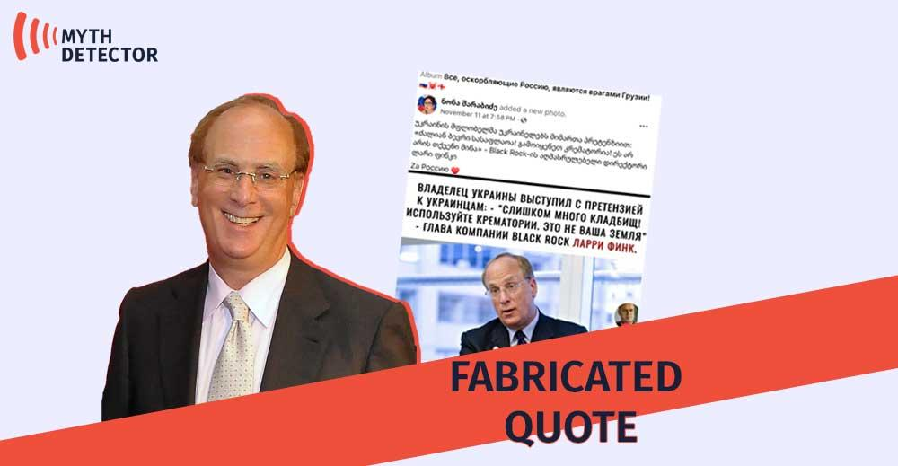

## Claim
Claim: "BlackRock has asked that Ukrainian soldiers not be buried on the land it owns in Ukraine."

## Actions
```
web_search("BlackRock Ukraine land burial soldiers")
```

## Evidence
### Evidence from `web_search`
The Asia Fact Check Lab published an article on August 26, 2024, stating that the claim that BlackRock asked the Ukrainian government to stop burying deceased Ukrainian soldiers on land it owns is false. The claim originated from a Bulgarian politician and was shared by Russian and Chinese media. The article also states that BlackRock does not own any land in Ukraine and that Ukrainian law prohibits foreign companies from purchasing arable land. ()

Mythdetector.com fact-checked a claim that Larry Fink, the head of BlackRock, called for the cremation of Ukrainian soldiers, finding it to be disinformation. The quote originated from an anonymous Russian-language TikTok account. () Detector Media also found the claim that BlackRock owns 47% of Ukraine's territory and asked not to bury soldiers on its land to be wrong. In late 2022, Zelensky held a meeting with BlackRock CEO Larry Fink to discuss projects for the country's recovery, and in 2023, the Ukrainian government signed an agreement with BlackRock and JPMorgan to create a fund to attract private investment for the Ukrainian economy, but this did not include restrictions on burying the military.

*   [https://www.rfa.org/english/news/afcl/afcl-blackrock-ukraine-land-08262024030948.html](https://www.rfa.org/english/news/afcl/afcl-blackrock-ukraine-land-08262024030948.html)
*   [https://mythdetector.com/en/head-of-blackrock-circulates/](https://mythdetector.com/en/head-of-blackrock-circulates/)
*   [https://disinfo.detector.media/en/post/blackrock-allegedly-owns-47-of-ukraines-territory-and-has-banned-ukraine-from-burying-its-military](https://disinfo.detector.media/en/post/blackrock-allegedly-owns-47-of-ukraines-territory-and-has-banned-ukraine-from-burying-its-military)


## Elaboration
The claim is false. The Asia Fact Check Lab found that the claim originated from a Bulgarian politician and was shared by Russian and Chinese media. BlackRock does not own any land in Ukraine, and Ukrainian law prohibits foreign companies from purchasing arable land. Detector Media also found the claim to be wrong.


## Final Judgement
The evidence indicates that the claim is false. Multiple fact-checking organizations have debunked the claim, citing that BlackRock does not own land in Ukraine and that Ukrainian law prevents foreign companies from purchasing arable land.

`false`


### Verdict: FALSE

### Justification
The claim that BlackRock requested Ukrainian soldiers not be buried on its land is false. Fact-checks by the Asia Fact Check Lab ([https://www.rfa.org/english/news/afcl/afcl-blackrock-ukraine-land-08262024030948.html](https://www.rfa.org/english/news/afcl/afcl-blackrock-ukraine-land-08262024030948.html)) and Detector Media found the claim to be incorrect, noting that BlackRock does not own land in Ukraine and that Ukrainian law prohibits foreign companies from purchasing arable land.
