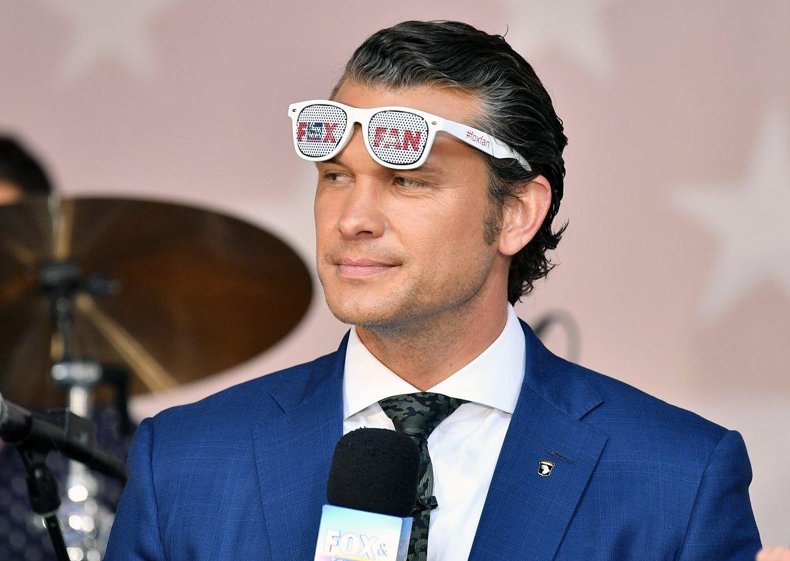

## Claim
Claim: "US Secretary of Defense Pete Hegseth called Putin a 'war criminal'."

## Actions
```
web_search("Pete Hegseth Putin war criminal")
```

## Evidence
### Evidence from `web_search`
Newsweek reported that Pete Hegseth called Putin a "war criminal" on Fox News in March 2022. ([https://www.newsweek.com/pete-hegseth-vladimir-putin-war-criminal-1985251](https://www.newsweek.com/pete-hegseth-vladimir-putin-war-criminal-1985251)). POLITICO reported that Roger Wicker said Pete Hegseth called Putin a “war criminal who needs to be in prison for the rest of his life.” The Kyiv Independent reported that Hegseth stated that "Russia is the aggressor" in the war. ([https://kyivindependent.com/republicans-press-pentagon-chief-over-trumps-plan-to-end-russias-war-against-ukraine-politico-reports/](https://kyivindependent.com/republicans-press-pentagon-chief-over-trumps-plan-to-end-russias-war-against-ukraine-politico-reports/)) , , 


## Elaboration
The evidence indicates that Pete Hegseth, not the US Secretary of Defense, called Putin a "war criminal." Newsweek reported this, citing a Fox News appearance in March 2022 ([https://www.newsweek.com/pete-hegseth-vladimir-putin-war-criminal-1985251](https://www.newsweek.com/pete-hegseth-vladimir-putin-war-criminal-1985251)).

The evidence also shows that Roger Wicker stated that Pete Hegseth called Putin a "war criminal who needs to be in prison for the rest of his life." The Kyiv Independent reported that Hegseth also stated that "Russia is the aggressor" in the war ([https://kyivindependent.com/republicans-press-pentagon-chief-over-trumps-plan-to-end-russias-war-against-ukraine-politico-reports/](https://kyivindependent.com/republicans-press-pentagon-chief-over-trumps-plan-to-end-russias-war-against-ukraine-politico-reports/)).


## Final Judgement
The claim is false because Pete Hegseth, not the US Secretary of Defense, made the statement. The evidence from Newsweek and POLITICO confirms that Pete Hegseth called Putin a "war criminal."

`false`


### Verdict: FALSE

### Justification
Pete Hegseth, not the US Secretary of Defense, called Putin a "war criminal," as reported by [Newsweek](https://www.newsweek.com/pete-hegseth-vladimir-putin-war-criminal-1985251) and confirmed by POLITICO.
