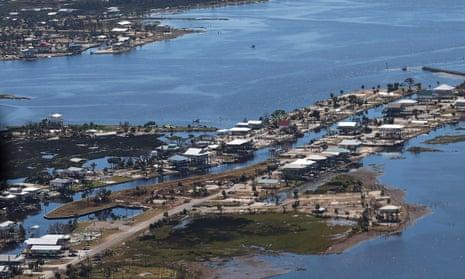

## Claim
Claim: "In remarks to reporters on September 29, 2024 US President Joe Biden announced that no more aid would be provided for the areas affected by Hurrican Helene, but 2.4 billion US-$ more for Ukraine."

## Actions
```
web_search("Joe Biden Hurricane Helene aid Ukraine September 29 2024")
```

## Evidence
### Evidence from `web_search`
The BBC published an article on October 9, 2024, discussing misinformation about the government's response to Hurricane Helene, including claims made by Donald Trump and his allies (, , , ). The article mentions the North Carolina National Guard's rescue efforts. The Yahoo News article, published by Fox News, discusses a claim that Biden said no more aid would be provided for areas affected by Hurricane Helene and that Biden announced a new $8 billion military aid package for Ukraine on Sept. 29 (). The article includes a link to a PolitiFact fact-check debunking the claim.

The Guardian published an article on October 5, 2024, discussing the White House's response to claims about Hurricane Helene and relief aid, including that the White House is urging Congress to pass a disaster-relief package and that Biden viewed the damage and cleanup efforts (). The article also mentions that the SBA will run out of funding in a matter of weeks.


## Elaboration
The evidence suggests the claim is likely false. A Yahoo News article, published by Fox News, discusses a claim that Biden said no more aid would be provided for areas affected by Hurricane Helene and that Biden announced a new $8 billion military aid package for Ukraine on Sept. 29. The article includes a link to a PolitiFact fact-check debunking the claim. Additionally, The Guardian reported that the White House is urging Congress to pass a disaster-relief package.

The evidence does not specify the exact amount of aid for Ukraine.


## Final Judgement
The search results indicate that the claim is likely false. The evidence includes a Yahoo News article that mentions the claim and links to a PolitiFact fact-check debunking it. The Guardian also reported on the White House's response to claims about Hurricane Helene and relief aid.

`false`

### Verdict: FALSE

### Justification
The claim is likely false. A Yahoo News article, referencing a PolitiFact fact-check, debunks the assertion that Biden announced no further aid for Hurricane Helene victims while simultaneously allocating funds to Ukraine. Furthermore, The Guardian reported on the White House's efforts to secure disaster relief, contradicting the claim.
