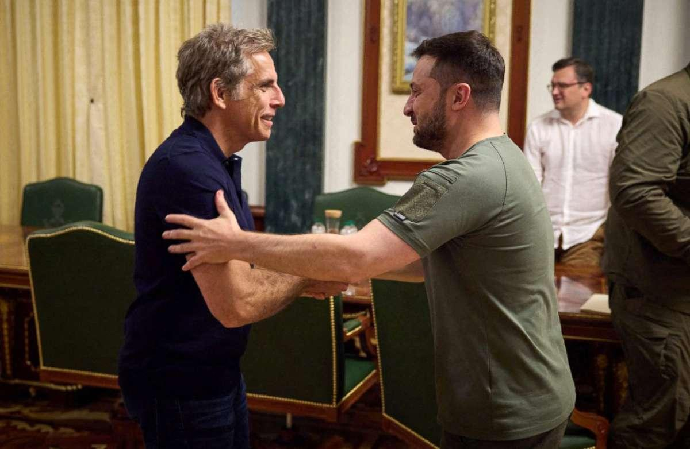
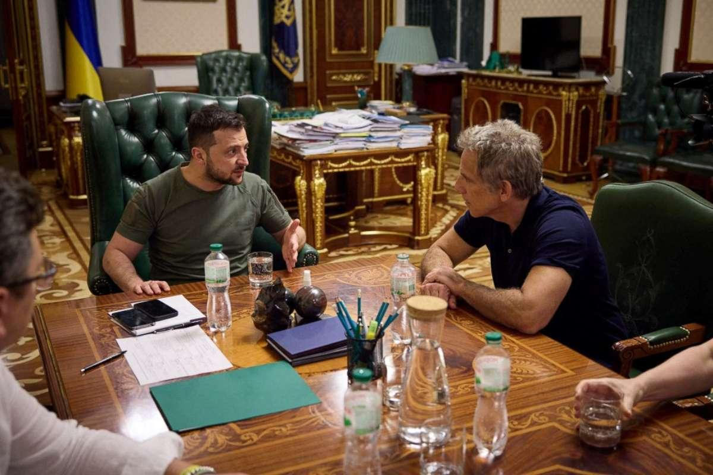

## Claim
Claim: " This image shows Ben Stiller and Ukrainian President Volodymyr Zelensky at their meeting on June 20, 2022, for which Stiller received $4 million from USAID."

## Actions
```
web_search("Ben Stiller Zelensky meeting June 20 2022")
web_search("Ben Stiller USAID Ukraine")
```

## Evidence
### Evidence from `web_search`
Ben Stiller met with Ukrainian President Volodymyr Zelenskyy in Kyiv on June 20, 2022, as part of his role as a goodwill ambassador for the United Nations High Commissioner for Refugees (UNHCR). The meeting is documented in articles from ABC News ([https://abcnews.go.com/International/ben-stiller-meets-volodymyr-zelenskyy-ukraine-world-refugee/story?id=85517989](https://abcnews.go.com/International/ben-stiller-meets-volodymyr-zelenskyy-ukraine-world-refugee/story?id=85517989)), The Washington Post ([https://www.washingtonpost.com/video/world/ben-stiller-to-zelensky-youre-my-hero/2022/06/20/d15f1fcb-da3a-4847-a0e0-e00b22625396_video.html](https://www.washingtonpost.com/video/world/ben-stiller-to-zelensky-youre-my-hero/2022/06/20/d15f1fcb-da3a-4847-a0e0-e00b22625396_video.html)), and the BBC ([https://www.bbc.com/news/av/world-61875351](https://www.bbc.com/news/av/world-61875351)).

The ABC News article does not mention Stiller receiving $4 million from USAID. The image of the meeting is present in the Washington Post video and the ABC News article. , , 


### Evidence from `web_search`
The provided sources discuss claims that Ben Stiller's trip to Ukraine in June 2022 was funded by USAID. Stiller denied these claims, stating that the trip was self-funded. The articles from [Vanity Fair](https://www.vanityfair.com/hollywood/story/ben-stiller-denies-elon-musks-retweet-claiming-usaid-funded-the-stars-trip-to-ukraine?srsltid=AfmBOoqmZtyUwoMPiFsX8zL7DdXJOT30rVSXIZLNyC8z9NQ6jnf-Uufb), [IMDB](https://www.imdb.com/news/ni65111956/), and [MSNBC](https://www.msnbc.com/morning-joe/watch/-totally-false-actor-ben-stiller-debunks-claims-usaid-funded-ukraine-trip-231285317684) all debunk the claim that USAID funded Stiller's trip. 


## Elaboration
The claim that Ben Stiller received $4 million from USAID for his meeting with Volodymyr Zelensky on June 20, 2022, is false. Evidence from multiple sources, including Vanity Fair, IMDB, and MSNBC, indicates that Stiller denied these claims and stated that he self-funded the trip. The image in the claim is present in the articles about the meeting.


## Final Judgement
The image accurately depicts Ben Stiller and Volodymyr Zelenskyy meeting on June 20, 2022. However, the claim that Stiller received $4 million from USAID for the meeting is false. Multiple sources confirm that Stiller denied these claims and stated that he self-funded the trip.

`false`

### Verdict: FALSE

### Justification
The image accurately depicts Ben Stiller and Volodymyr Zelenskyy meeting on June 20, 2022, as confirmed by sources like [ABC News](https://abcnews.go.com/International/ben-stiller-meets-volodymyr-zelenskyy-ukraine-world-refugee/story?id=85517989) and [The Washington Post](https://www.washingtonpost.com/video/world/ben-stiller-to-zelensky-youre-my-hero/2022/06/20/d15f1fcb-da3a-4847-a0e0-e00b22625396_video.html). However, the assertion that Stiller received $4 million from USAID is false, as reported by [Vanity Fair](https://www.vanityfair.com/hollywood/story/ben-stiller-denies-elon-musks-retweet-claiming-usaid-funded-the-stars-trip-to-ukraine?srsltid=AfmBOoqmZtyUwoMPiFsX8zL7DdXJOT30rVSXIZLNyC8z9NQ6jnf-Uufb), [IMDB](https://www.imdb.com/news/ni65111956/), and [MSNBC](https://www.msnbc.com/morning-joe/watch/-totally-false-actor-ben-stiller-debunks-claims-usaid-funded-ukraine-trip-231285317684), which state that Stiller self-funded the trip.
