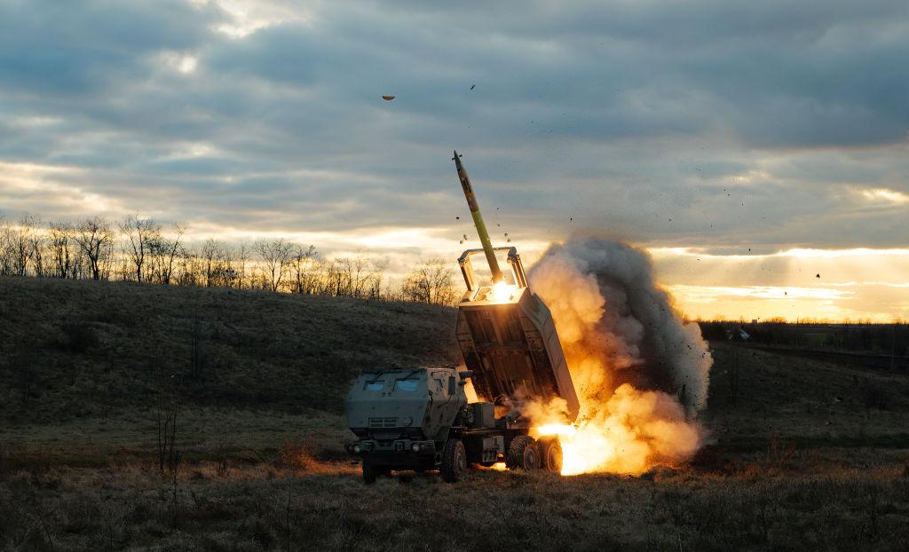
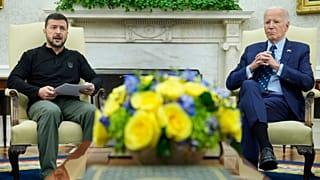
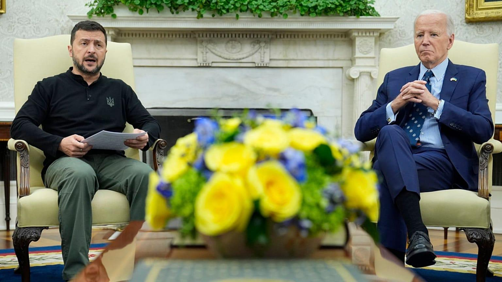

## Claim
Claim: " This image shows an authentic list realeased by Ukraine showing US politicians taking bribes from Ukraine. The highest bribe was 92 Million US-$ for Joe Biden."

## Actions
```
web_search("Joe Biden Mitch McConnell Nancy Pelosi wealth")
web_search("US politicians Ukraine bribes")
```

## Evidence
### Evidence from `web_search`
The Yahoo Finance article from February 13, 2025, discusses Elon Musk's questioning of the wealth of members of Congress, including Joe Biden, Nancy Pelosi, Mitch McConnell, Chuck Schumer, and Elizabeth Warren. The article also mentions that members of Congress can buy and sell stocks, options, and cryptocurrency as long as they disclose the transactions in a timely manner. The Yahoo News article discusses the wealth of Nancy Pelosi, mentioning her real estate investments and stock holdings (, , , ).

The Conversation published an article on July 21, 2023, discussing the age of US politicians, mentioning Joe Biden, Mitch McConnell, and Nancy Pelosi ().


### Evidence from `web_search`
The BBC News article from July 21, 2023, reports on an FBI document detailing an allegation that Joe Biden and his son accepted bribes from a Ukrainian firm, but there is no evidence that Joe Biden received any payments from Ukraine. The Dispatch published on December 31, 2024, states that a viral image claiming U.S. politicians received kickback payments from Ukraine is false, and Ukrainian officials have not released any such information. Euronews, updated on 15/01/2025, discusses old false claims about Ukrainian kickbacks to US politicians.

The sources are: [https://www.bbc.com/news/world-us-canada-66272217](https://www.bbc.com/news/world-us-canada-66272217), [https://thedispatch.com/article/claims-about-kickbacks-to-u-s-politicians-from-ukraine-are-false/](https://thedispatch.com/article/claims-about-kickbacks-to-u-s-politicians-from-ukraine-are-false/), and [https://www.euronews.com/video/2025/01/15/old-false-claims-resurface-about-ukrainian-kickbacks-to-us-politicians](https://www.euronews.com/video/2025/01/15/old-false-claims-resurface-about-ukrainian-kickbacks-to-us-politicians).      


## Elaboration
The claim is false. Multiple sources state that the image is a viral, false claim. There is no evidence that Ukraine released a list of US politicians taking bribes.


## Final Judgement
The evidence indicates that the claim is false. Multiple sources confirm that the image is a false claim and that Ukrainian officials have not released any such information.

`false`


### Verdict: FALSE

### Justification
The claim that Ukraine released a list of US politicians taking bribes is false. Multiple sources, including the BBC News ([https://www.bbc.com/news/world-us-canada-66272217](https://www.bbc.com/news/world-us-canada-66272217)), The Dispatch, and Euronews, confirm that the image is a false claim and that Ukrainian officials have not released any such information.
