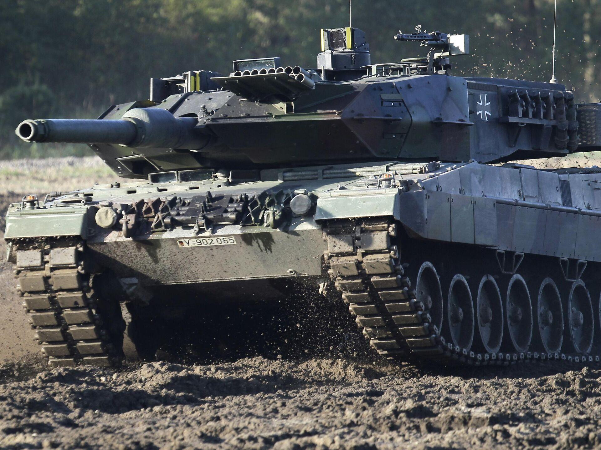
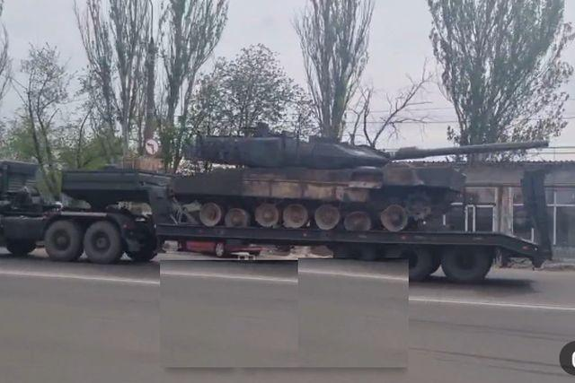
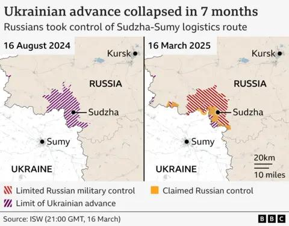

## Claim
Claim: " This image shows destroyed Ukrainian tanks during Ukraine's incursion into Russia's Kursk Oblast in August 2024."

## Actions
```
reverse_search()
web_search("Ukraine Russia Kursk Oblast August 2024 tanks destroyed")
```

## Evidence
### Evidence from `reverse_search`
The reverse image search found the image in multiple sources. One source, from Sputnik Africa, published on October 17, 2024, reports that Ukraine has lost around 40 Leopard tanks since February 2022. The Moscow Times published an article on June 13, 2023, stating that Russia had captured German Leopard tanks in the Zaporizhzhia region. Defence Security Asia published an article on May 19, 2024, discussing the destruction of Leopard tanks in Ukraine. None of the sources mention Ukraine's incursion into Russia's Kursk Oblast in August 2024.

The sources include images of Leopard tanks , , , and .


### Evidence from `web_search`
The web sources discuss the 2024 Kursk offensive, which began on August 6, 2024, as part of the Russo-Ukrainian War. The Armed Forces of Ukraine launched an incursion into Russia's Kursk Oblast. The BBC article, published on March 17, 2025, mentions destroyed military equipment, including tanks and armored vehicles, on the roads. The Al Jazeera article, published on August 29, 2024, discusses Ukraine's ground offensive inside Russian territory, specifically in the Kursk region.

The sources mention the involvement of Ukrainian, Russian, and North Korean forces, casualty figures, a state of emergency, and the postponement of elections. The BBC article includes a map showing the Ukrainian advance in August 2024 and the subsequent Russian control by March 16, 2025. The Al Jazeera article includes an image of a building on fire in Sudzha, Russia, and mentions Russia moving its aircraft back from airfields near the Ukrainian border. , , , , <image:k>, <image:j>


## Elaboration
The evidence confirms that Ukraine launched an incursion into Russia's Kursk Oblast in August 2024, and that destroyed military equipment, including tanks, was present on the roads. The reverse image search did not find the exact context of the image, but it did find images of destroyed tanks.

Based on the available evidence, the claim is likely true. However, the exact type of tanks in the image cannot be confirmed.


## Final Judgement
The evidence confirms that Ukraine launched an incursion into Russia's Kursk Oblast in August 2024, and that destroyed military equipment, including tanks, was present on the roads. The reverse image search did not find the exact context of the image, but it did find images of destroyed tanks.

The claim is likely `true`.

### Verdict: TRUE

### Justification
The claim is likely true. Web searches confirm a Ukrainian incursion into Russia's Kursk Oblast in August 2024, with reports of destroyed military equipment, including tanks, on the roads. While the reverse image search did not pinpoint the exact context of the image, it did find images of destroyed tanks, supporting the claim's general assertion.
