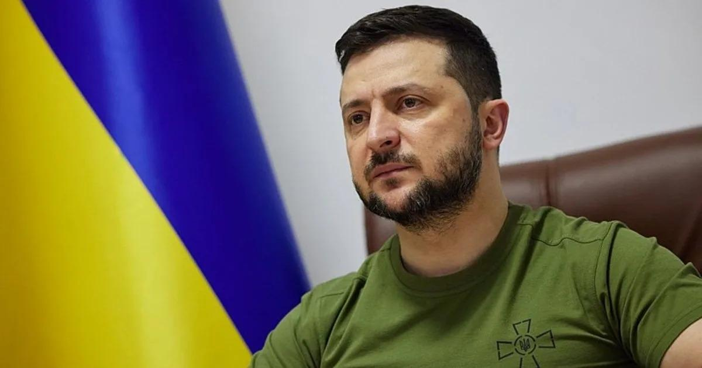

## Claim
Claim: " This image shows Ukrainian President Volodymyr Zelensky wearing a suit after the large-scale Russian invasion in Ukraine: in a talk with Klaus Schwab at the World Economic Forum."

## Actions
```
web_search("Volodymyr Zelensky Klaus Schwab World Economic Forum")
```

## Evidence
### Evidence from `web_search`
The World Economic Forum published an article about Volodymyr Zelenskyy's address at the Annual Meeting in Davos, Switzerland, from January 15–19, 2024, which included an image of Zelenskyy addressing participants at the World Economic Forum Annual Meeting 2024. Zelenskyy called on business leaders to invest in Ukraine. () [Source](https://www.weforum.org/stories/2024/01/zelenskyy-ukraine-business-investment-davos/)

Yahoo News states that the photo of Zelenskyy and Schwab in suits was taken in January 2020, before the Russian invasion of Ukraine. Since the invasion, Zelenskyy has stopped wearing suits in public. () [Source](https://uk.news.yahoo.com/photo-zelenskyy-wearing-suit-meeting-171653150.html)


## Elaboration
The image shows Volodymyr Zelenskyy and Klaus Schwab at the World Economic Forum. The evidence indicates that the photo was taken in January 2020, before the Russian invasion of Ukraine. Since the invasion, Zelenskyy has stopped wearing suits in public.

The claim states that the image was taken after the large-scale Russian invasion in Ukraine. This is incorrect.


## Final Judgement
The image depicts Volodymyr Zelenskyy and Klaus Schwab at the World Economic Forum. However, the photo was taken in January 2020, before the Russian invasion of Ukraine. Since the invasion, Zelenskyy has stopped wearing suits in public.

The claim is demonstrably false because the image was taken before the Russian invasion. `false`

### Verdict: FALSE

### Justification
The image depicts Volodymyr Zelenskyy and Klaus Schwab at the World Economic Forum, but the photo was taken in January 2020, before the Russian invasion of Ukraine, as reported by [Yahoo News](https://uk.news.yahoo.com/photo-zelenskyy-wearing-suit-meeting-171653150.html). Since the invasion, Zelenskyy has stopped wearing suits in public.
