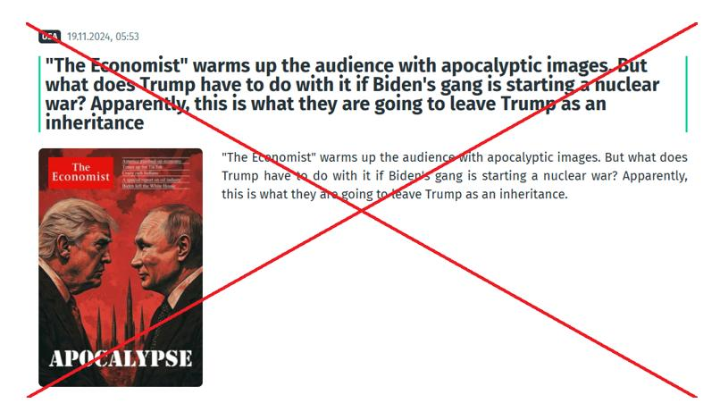
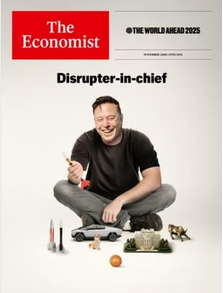

## Claim
Claim: " This image shows a screenshot of an authentic cover of the magazine The Economist from the end of 2024 illustrating Donald Trump and Vladimir Putin and warning of an apocalypse."

## Actions
```
reverse_search()
```

## Evidence
### Evidence from `reverse_search`
The image of the Economist cover featuring Donald Trump and Vladimir Putin is altered and not authentic. PesaCheck states that the original cover from March 16, 2024, did not include the images of Trump and Putin and the altered cover lacks a publication date. DW.com and Ukrinform.net also confirm that the image is a fake cover created by Russian propagandists, with the headline "Apocalypse" and missiles in the background, and that the actual Economist issue from November 16, 2024, depicted a globe being struck by a golf club.       

The sources are: [PesaCheck](https://pesacheck.org/altered-this-front-cover-was-not-published-by-the-economist-cd0c20d99b9b), [DW.com](https://www.dw.com/en/fact-check-how-to-spot-fabricated-news-reports/a-71992819), and [Ukrinform.net](https://www.ukrinform.net/rubric-factcheck/3930063-russian-propaganda-fabricates-the-economist-cover-about-beginning-of-world-war-iii.html).


## Elaboration
The claim is false. The evidence indicates that the image is a manipulated cover of The Economist magazine. The original cover from March 16, 2024, did not feature Trump and Putin, and the altered version lacks a publication date. Furthermore, the actual Economist issue from November 16, 2024, depicted a globe being struck by a golf club.


## Final Judgement
The image is a manipulated cover of The Economist magazine, not an authentic one. The original cover did not feature Trump and Putin, and the actual issue from November 16, 2024, had a different image.

`false`

### Verdict: FALSE

### Justification
The image is a fabricated cover of The Economist magazine, as confirmed by [PesaCheck](https://pesacheck.org/altered-this-front-cover-was-not-published-by-the-economist-cd0c20d99b9b), [DW.com](https://www.dw.com/en/fact-check-how-to-spot-fabricated-news-reports/a-71992819), and [Ukrinform.net](https://www.ukrinform.net/rubric-factcheck/3930063-russian-propaganda-fabricates-the-economist-cover-about-beginning-of-world-war-iii.html). The original cover did not feature Trump and Putin, and the actual issue from November 16, 2024, had a different image.
