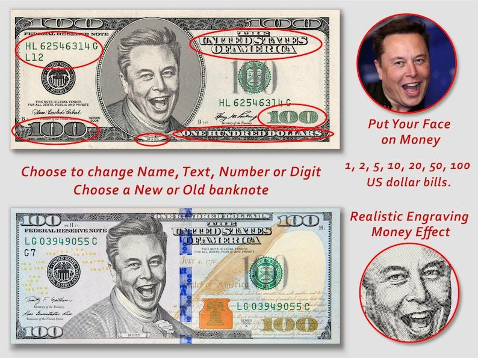
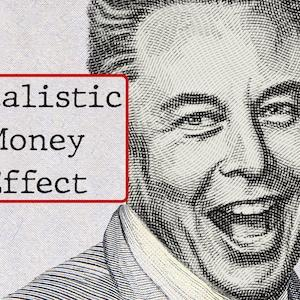

## Claim
Claim: " This image shows a screenshot of an authentic X post from Elon Musk on November 6, 2025 saying 'The last dollar for Zelenskiy'."

## Actions
```
web_search("Elon Musk Zelenskiy last dollar")
reverse_search()
```

## Evidence
### Evidence from `web_search`
The AOL article ([https://www.aol.com/fact-check-elon-musk-didn-164103080.html](https://www.aol.com/fact-check-elon-musk-didn-164103080.html)) fact-checks the claim that Elon Musk posted a "last dollar" image for Zelenskyy and states the claim is false. The Politico.eu article ([https://www.politico.eu/article/billionaire-elon-musk-mocks-ukraine-president-zelenskyy-asking-aid-with-meme/](https://www.politico.eu/article/billionaire-elon-musk-mocks-ukraine-president-zelenskyy-asking-aid-with-meme/)) reports that Elon Musk mocked Ukrainian President Volodymyr Zelenskyy using a meme.

The StopFake.org article ([https://www.stopfake.org/en/fake-ukraine-stopped-using-the-starlink-system-and-insulted-elon-musk-united24/](https://www.stopfake.org/en/fake-ukraine-stopped-using-the-starlink-system-and-insulted-elon-musk-united24/)) discusses a fake post about Elon Musk and Zelensky. 


### Evidence from `reverse_search`
The image was found on a website with the title "Dollar Bill Frame Gold Glass Frame For Coin Display Wall Hanging ...", but the website is unavailable. The image was also found on an Etsy listing for custom dollar bill art, created on July 2, 2025, which includes custom dollar bills with faces on them. The image was also found on Redbubble, a website that sells stickers. , , , , , , , , , , , , , , , , , , , .


## Elaboration
The claim is false. The evidence indicates that the image is a meme and that the claim has been fact-checked as false by multiple sources ([https://www.aol.com/fact-check-elon-musk-didn-164103080.html](https://www.aol.com/fact-check-elon-musk-didn-164103080.html)). The reverse image search also shows that the image is available on websites that sell custom dollar bill art.


## Final Judgement
The claim is demonstrably false. The image is a meme, and the claim has been fact-checked as false by multiple sources. The reverse image search also shows that the image is available on websites that sell custom dollar bill art. `false`

### Verdict: FALSE

### Justification
The claim is false. Multiple sources, including an AOL fact-check ([https://www.aol.com/fact-check-elon-musk-didn-164103080.html](https://www.aol.com/fact-check-elon-musk-didn-164103080.html)), have debunked the assertion that Elon Musk posted the image. The image itself is a meme, and reverse image searches show it is available on sites selling custom dollar bill art.
