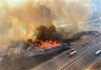
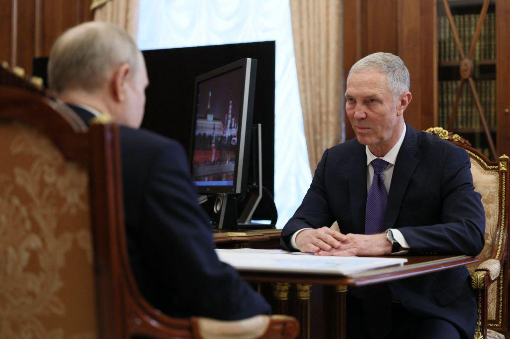

## Claim
Claim: "Russia offered assistance for the California wildfires from January 2025."

## Actions
```
web_search("Russia California wildfires assistance 2025")
```

## Evidence
### Evidence from `web_search`
Tasnim News Agency reported on January 12, 2025, that Russia's Foreign Ministry Spokeswoman Maria Zakharova commented on the California wildfires, mentioning reports of prisoners being mobilized to extinguish the fires. The article also noted that wildfires began spreading across Los Angeles County on January 7. ([https://www.tasnimnews.com/en/news/2025/01/12/3236714/russia-notes-us-hypocrisy-in-california-fire-case](https://www.tasnimnews.com/en/news/2025/01/12/3236714/russia-notes-us-hypocrisy-in-california-fire-case)) , 

The Dispatch reported on January 15, 2025, that Vladimir Saldo, the governor of the Russian-occupied Kherson oblast region of Ukraine, offered sanctuary to California fire victims who had not supported Ukraine since February 2022. ([https://thedispatch.com/article/assessing-claims-that-russia-offered-sanctuary-to-california-fire-victims/](https://thedispatch.com/article/assessing-claims-that-russia-offered-sanctuary-to-california-fire-victims/))  NPR reported on January 16, 2025, that Russia used the Los Angeles wildfires to spread anti-Ukraine propaganda. ([https://www.npr.org/2025/01/16/nx-s1-5259842/los-angeles-california-fires-russia-ukraine](https://www.npr.org/2025/01/16/nx-s1-5259842/los-angeles-california-fires-russia-ukraine)) 


## Elaboration
The evidence indicates that Russia commented on the California wildfires and that Vladimir Saldo offered sanctuary to fire victims. However, the evidence does not explicitly state that Russia offered assistance for the California wildfires.

The evidence suggests that Russia's involvement was more related to propaganda and offering sanctuary rather than direct assistance in extinguishing the fires.

To verify the claim, information is missing about whether Russia offered any form of assistance, such as personnel, equipment, or financial aid, to combat the wildfires.


## Actions
```
web_search("Russia offer assistance California wildfires")
```

## Evidence
### Evidence from `web_search`
From [Source](https://www.voanews.com/a/russia-exploits-wildfires-in-los-angeles-to-push-anti-u-s-anti-ukraine-propaganda/7938909.html): 
Content: Voice of America (VOA) reported on January 16, 2025, that Russia exploited the Los Angeles wildfires to push anti-US and anti-Ukraine propaganda. The article mentions Maria Zakharova, the Russian Foreign Ministry spokeswoman, accusing the U.S. of hypocrisy regarding the use of inmate firefighters. The article also mentions that Lavrov claimed that the U.S. "burned almost all of California." 


## Elaboration
The new evidence from Voice of America ([https://www.voanews.com/a/russia-exploits-wildfires-in-los-angeles-to-push-anti-u-s-anti-ukraine-propaganda/7938909.html](https://www.voanews.com/a/russia-exploits-wildfires-in-los-angeles-to-push-anti-u-s-anti-ukraine-propaganda/7938909.html)) reinforces the previous findings. It highlights Russia's exploitation of the California wildfires for propaganda purposes, including accusations of hypocrisy and claims that the U.S. "burned almost all of California."

The evidence continues to show no indication of Russia offering any assistance to combat the wildfires. Instead, the focus is on spreading anti-US and anti-Ukraine narratives.

The claim remains unverified due to the lack of evidence supporting the offer of assistance.


## Final Judgement
The fact-check reveals that Russia commented on the California wildfires in January 2025, with reports of propaganda and offers of sanctuary to fire victims. However, there is no evidence to support the claim that Russia offered assistance for the wildfires.

The decision option that best applies is `false`.


### Verdict: FALSE

### Justification
The fact-check indicates that Russia commented on the California wildfires in January 2025, using the event for propaganda purposes, but there is no evidence to support the claim that Russia offered assistance for the wildfires. Sources like [Tasnim News Agency](https://www.tasnimnews.com/en/news/2025/01/12/3236714/russia-notes-us-hypocrisy-in-california-fire-case) and [Voice of America](https://www.voanews.com/a/russia-exploits-wildfires-in-los-angeles-to-push-anti-u-s-anti-ukraine-propaganda/7938909.html) highlight Russia's involvement in spreading anti-US and anti-Ukraine narratives related to the wildfires, rather than offering aid.
