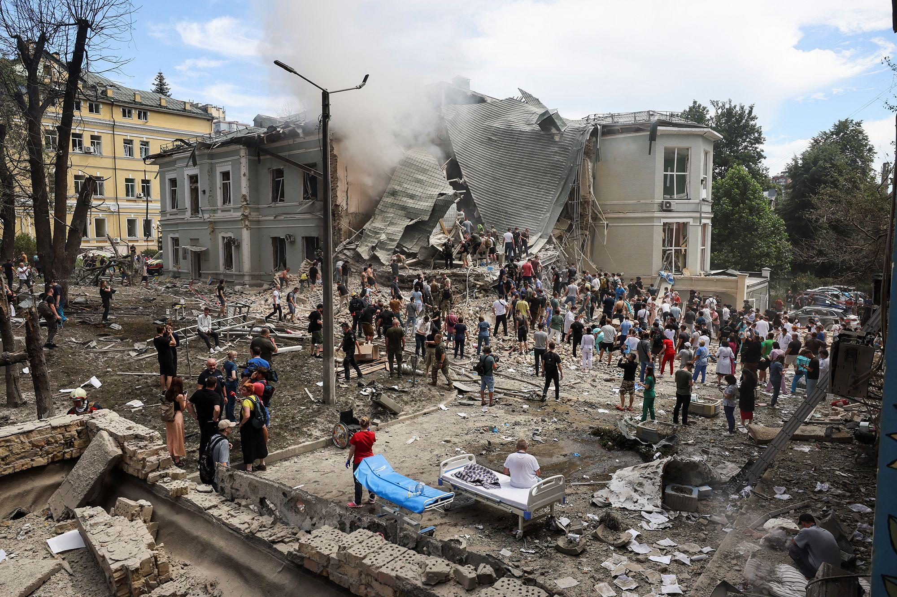
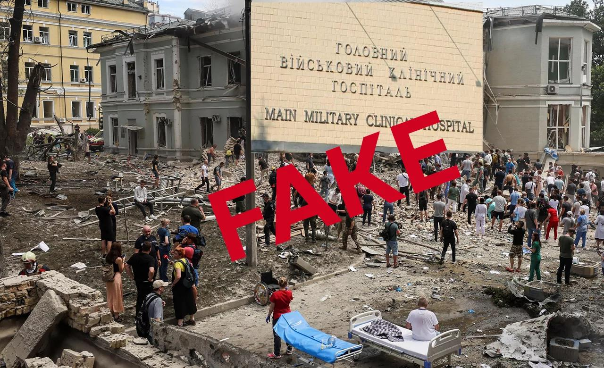
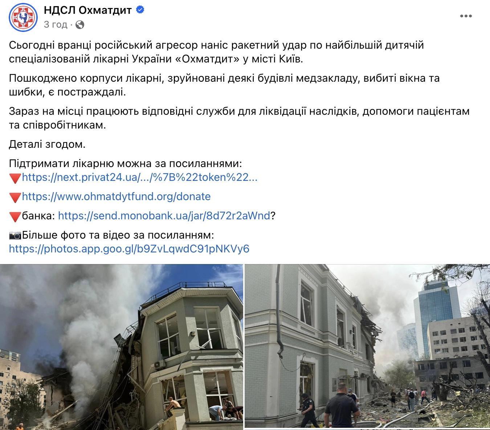

## Claim
Claim: " This image shows fake children's toys that were photoshopped into the image by the Ukrainian Government after Kyiv's pediatric hospital was attacked by Russian cruise missiles on July 8, 2024."

## Actions
```
reverse_search()
web_search("Kyiv pediatric hospital attack July 8 2024")
```

## Evidence
### Evidence from `reverse_search`
The image 

### Evidence from `web_search`
The web sources discuss the Russian attacks on Ukraine on July 8, 2024, including the attack on the Okhmatdyt children's hospital in Kyiv. Human Rights Watch published an article on July 11, 2024, stating the attack killed at least 42 civilians, including five children (<image:k>). The United Nations website reports the attack as a war crime, mentioning severe damage to the hospital's intensive care, surgical, and oncology wards ().

The Wikipedia article details the strikes on Kyiv, Kryvyi Rih, Dnipro, Kropyvnytskyi, and Pokrovsk, resulting in at least 47 deaths and 189 injuries, including damage to the Okhmatdyt children's hospital (). The attacks were condemned by the UN, Amnesty International, and Human Rights Watch. The Russian defense ministry claimed the strikes targeted defense industry targets and aviation bases.


## Elaboration
The evidence confirms that the Okhmatdyt children's hospital in Kyiv was attacked on July 8, 2024. The image shows the aftermath of the attack, with debris and rescue workers present. The presence of children's toys in the image is consistent with the hospital being a children's facility.

The claim that the toys were photoshopped cannot be verified or refuted with the available evidence. The evidence does not provide information about the authenticity of the toys in the image.


## Actions
```
image_search("Okhmatdyt children's hospital attack July 8 2024 toys")
```

## Evidence
### Evidence from `image_search`
The search results include images related to the Okhmatdyt children's hospital attack. One source, razomforukraine.org, contains images related to the attack . CNN published an article about the attack on July 8, 2024, including an image of the damaged hospital building .


## Elaboration
The new evidence does not provide any information about the authenticity of the toys in the image. Therefore, the claim that the toys were photoshopped cannot be verified or refuted.


## Actions
```
web_search("Okhmatdyt hospital Kyiv toys photoshopped")
```

## Evidence
### Evidence from `web_search`
Detector Media refutes claims that the images of the Okhmatdyt children's hospital were fake, stating that the toys in the image are authentic and can be seen in other photos and videos from the scene. The article mentions that American blogger Jackson Hinkle claimed the Ukrainian government inserted fake toys into the image. Gwara Media debunks claims that the Okhmatdyt children's hospital in Kyiv was a military hospital, including images of the damaged hospital , , .


## Elaboration
The claim that the toys were photoshopped is false. Detector Media refutes this claim, stating that the toys are authentic and can be seen in other photos and videos from the scene.


## Final Judgement
The claim that the image shows photoshopped toys is demonstrably false. Multiple sources, including Detector Media, confirm the authenticity of the toys. `false`

### Verdict: FALSE

### Justification
The claim that the image shows photoshopped toys is demonstrably false. According to Detector Media, the toys are authentic and can be seen in other photos and videos from the scene.
