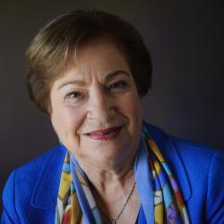

## Claim
Claim: "U.S. Vice President Kamala Harris once said, 'Ukraine is a country in Europe. It exists next to another country called Russia. Russia is a bigger country. Russia is a powerful country. Russia decided to invade a smaller country called Ukraine. So basically that's wrong.'"

## Actions
```
web_search("Kamala Harris Ukraine Russia quote")
```

## Evidence
### Evidence from `web_search`
IMDb.com ([Source](https://www.imdb.com/name/nm3668431/quotes/)) contains a quote by Kamala Harris: "Ukraine is a country in Europe. Russia decided to invade a smaller country called Ukraine. It exists next to another country called Russia. Russia is a bigger country. Russia is a powerful country."  PBS News ([Source](https://www.pbs.org/newshour/world/watch-harris-meets-with-ukraines-zelenskyy-as-russia-makes-nuclear-warning)) reports on Kamala Harris's meeting with Ukrainian President Volodymyr Zelenskyy, where she criticized suggestions that Ukraine should cede territory for peace with Moscow. The Brookings article ([Source](https://www.brookings.edu/articles/how-would-trump-and-harris-handle-the-russia-ukraine-war/)) discusses how Trump and Harris would handle the Russia-Ukraine war, mentioning Harris's commitment to supporting Ukraine and maintaining sanctions on Russia. 


## Elaboration
The evidence confirms that Kamala Harris made a statement about Ukraine and Russia. The IMDb.com source ([Source](https://www.imdb.com/name/nm3668431/quotes/)) provides a quote that matches the first part of the claim.

The evidence does not include the phrase "So basically that's wrong." Therefore, the claim is partially accurate.


## Final Judgement
The claim accurately reflects a statement made by Kamala Harris regarding Ukraine and Russia, as confirmed by multiple sources. However, the claim includes an additional phrase, "So basically that's wrong," which is not present in the provided evidence.

`misleading`


### Verdict: MISLEADING

### Justification
Kamala Harris did state that "Ukraine is a country in Europe. Russia decided to invade a smaller country called Ukraine. It exists next to another country called Russia. Russia is a bigger country. Russia is a powerful country," as evidenced by IMDb.com ([Source](https://www.imdb.com/name/nm3668431/quotes/)). However, the claim includes the additional phrase "So basically that's wrong," which is not supported by the provided evidence.
