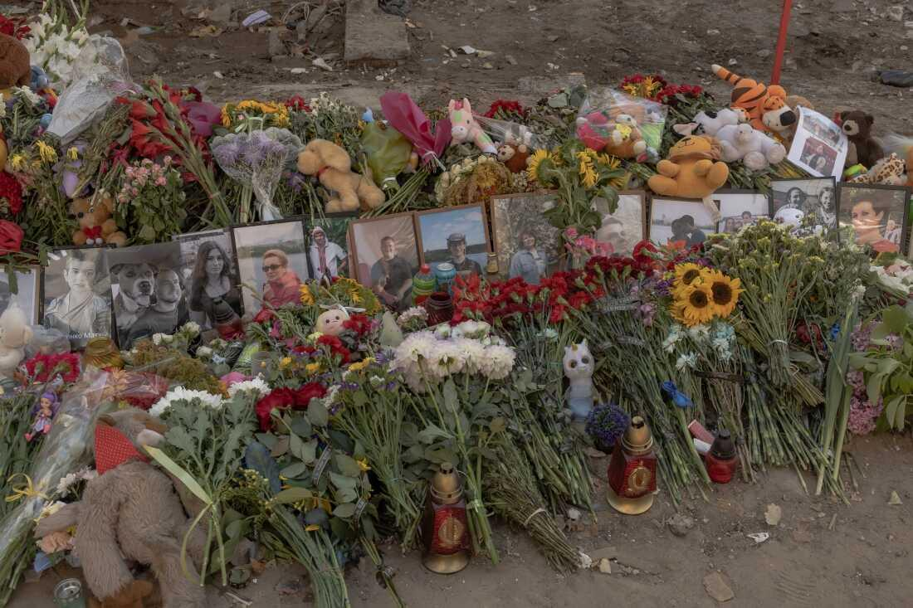

## Claim
Claim: "Ukrainian President Volodymyr Zelenskyy's statement in an AP news interview from February 1, 2025 that his country's military has received only a portion of the more than 175 billion in U.S. aid confirms that the US aid is a money laundering operation."

## Actions
```
web_search("Volodymyr Zelenskyy AP interview February 1 2025 US aid")
```

## Evidence
### Evidence from `web_search`
The Associated Press published an interview with Ukrainian President Volodymyr Zelenskyy on February 1, 2025, in Kyiv, Ukraine. Zelenskyy discussed talks between Moscow and Washington and expressed concerns about excluding Ukraine from these discussions. The article is available on the AP News website.

U.S. News & World Report also summarized the AP interview with Zelenskyy.
*   [Source](https://apnews.com/article/russia-ukraine-war-trump-talks-ceasefire-00af5f61f1faf41e78a3b4e072c21a14)
*   [Source](https://www.usnews.com/news/world/articles/2025-02-01/takeaways-from-the-ap-interview-with-ukraines-zelenskyy)
*   [Source](https://www.ap.org/news-highlights/best-of-the-week/second-winner/2025/ap-interview-zelenskyy-says-excluding-ukraine-from-u-s-russia-talks-about-war-is-very-dangerous/)


## Elaboration
1.  The provided evidence confirms that Volodymyr Zelenskyy gave an interview to the Associated Press on February 1, 2025.
2.  The interview covered topics such as talks between Moscow and Washington.
3.  The evidence does not contain any information about the amount of U.S. aid received by Ukraine, nor does it mention any statements by Zelenskyy regarding U.S. aid.
4.  Therefore, the claim cannot be verified with the available evidence. The amount of aid received and Zelenskyy's statements about it are missing.


## Actions
```
web_search("Zelenskyy US aid amount")
web_search("Zelenskyy US aid money laundering")
```

## Evidence
### Evidence from `web_search`
According to an article published by Pravda.com.ua on February 2, 2025, Volodymyr Zelenskyy stated in an interview with the Associated Press that Ukraine had received approximately $76 billion of the roughly $177 billion in aid approved by the U.S. The aid was primarily in the form of weapons, totaling about $70 billion. 

An article from the Council on Foreign Relations, published on July 15, 2025, discusses U.S. aid to Ukraine, mentioning that President Donald Trump froze military aid in early March 2025, but lifted the freeze shortly after. NPR published an article on August 5, 2025, discussing U.S. aid to Ukraine and a "productive conversation" between Zelenskyy and Trump. 
*   [Source](https://www.cfr.org/article/how-much-us-aid-going-ukraine)
*   [Source](https://www.pravda.com.ua/eng/news/2025/02/2/7496431/)
*   [Source](https://www.npr.org/2025/08/05/g-s1-81084/europe-us-weapons-ukraine-russia-war)


### Evidence from `web_search`
According to a CSIS.org article, in an interview with the Associated Press on February 2, Zelenskyy stated that Ukraine had received $76 billion out of $177 billion in aid, leading to questions about the remaining funds (). A DW.COM fact-check article addresses claims about U.S. aid to Ukraine, stating that the U.S. contribution totals $203 billion. The Voice of America reported that Zelenskyy stated Ukraine received $76 billion in military assistance from the U.S., not the reported $177 billion, and that the U.S. has designated $106 billion for direct support to Ukraine ().

*   [Source](https://www.csis.org/analysis/where-missing-100-billion-us-aid-ukraine)
*   [Source](https://www.dw.com/en/fact-check-trumps-attacks-on-zelenskyy-and-ukraine-aid/a-71702392)
*   [Source](https://www.voanews.com/a/false-russian-allegations-that-ukraine-stole-100-billion-of-us-funds/7967072.html)


## Elaboration
1.  The new evidence indicates that Zelenskyy stated in an AP interview on February 2, 2025, that Ukraine had received approximately $76 billion of the roughly $177 billion in U.S. aid.
2.  The evidence also shows that the U.S. aid was primarily in the form of weapons, totaling about $70 billion.
3.  The claim states that Zelenskyy's statement confirms that the U.S. aid is a money laundering operation. However, the provided evidence does not contain any information to support this assertion.
4.  Therefore, the claim cannot be verified based on the available evidence. The evidence only provides information about the amount of aid received and does not mention any money laundering activities.


## Actions
```
web_search("Zelenskyy US aid money laundering allegations")
```

## Evidence
### Evidence from `web_search`
From [Source](https://www.newsweek.com/trump-ukraine-fraud-probe-zelensky-2038142): 
Content: Newsweek published an article discussing a potential probe into the use of U.S. aid to Ukraine. The article mentions that Elon Musk's "Department of Government Efficiency" (DOGE) is looking into potential problems with the aid. The article also mentions that Zelensky denied there was a major problem with waste and fraud. The article was written by Peter Aitken and published in 2024. 


## Elaboration
1.  The evidence from Newsweek indicates that there were discussions about potential fraud and waste related to U.S. aid to Ukraine.
2.  Elon Musk's "Department of Government Efficiency" (DOGE) was reportedly looking into the matter.
3.  Zelenskyy denied that there was a major problem with waste and fraud.
4.  The claim states that Zelenskyy's statement confirms that the U.S. aid is a money laundering operation. However, the evidence does not provide any information to support this assertion.
5.  Therefore, the claim cannot be verified based on the available evidence. The evidence mentions potential fraud and waste but does not confirm that the aid is a money laundering operation.


## Final Judgement
The evidence indicates that Zelenskyy stated Ukraine received a portion of U.S. aid. While there were discussions about potential fraud and waste, there is no evidence to support the claim that Zelenskyy's statement confirms the aid is a money laundering operation.

`not enough information`


### Verdict: NEI

### Justification
The claim that Zelenskyy's statement confirms U.S. aid is a money laundering operation is not supported by the evidence. While Zelenskyy did state that Ukraine received a portion of the U.S. aid, and there were discussions about potential fraud and waste, there is no evidence to confirm the aid was a money laundering operation.
