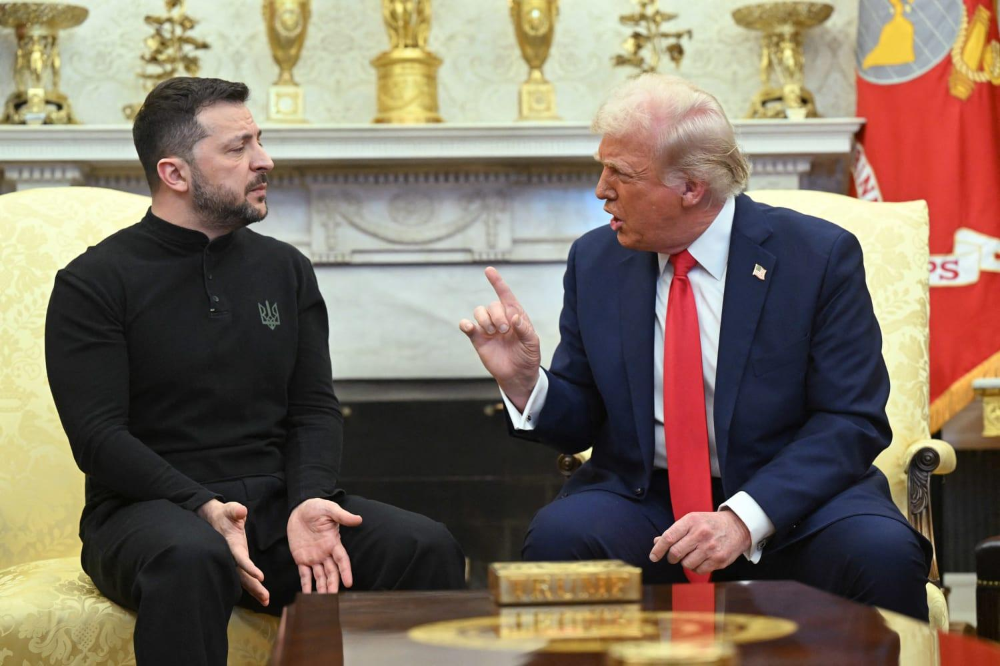
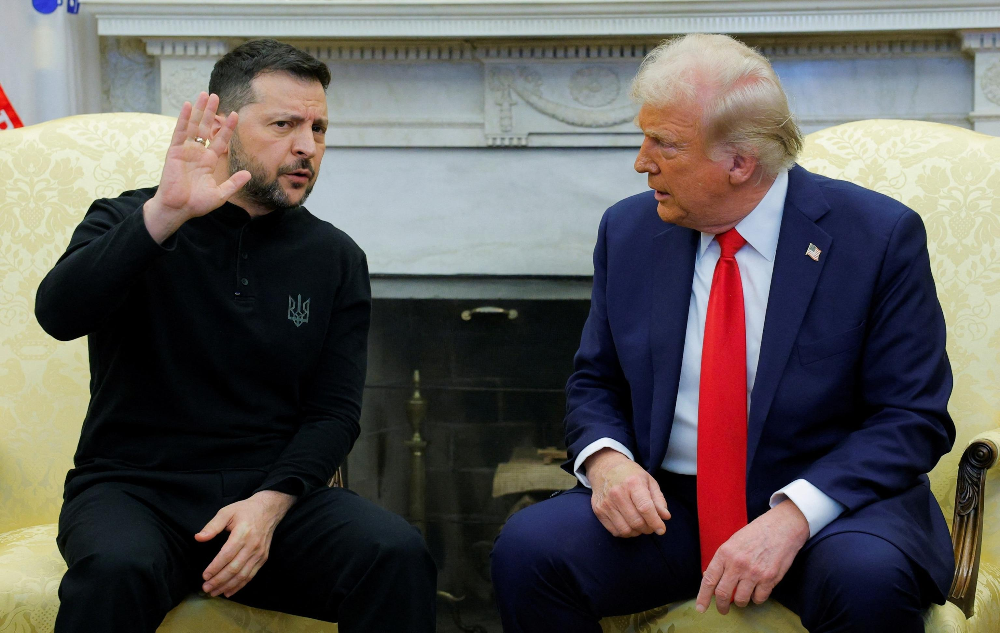

## Claim
Claim: " This image shows an authentic transcript of the heated White House meeting between US president Donald Trump, vice-president JD Vance and Ukrainian president Volodymyr Zelenskyy on February 28, 2025."

## Actions
```
web_search("Trump Zelenskyy meeting transcript")
image_search("Trump Zelenskyy conversation")
```

## Evidence
### Evidence from `web_search`
The search results provide transcripts of a meeting between Donald Trump and Volodymyr Zelenskyy in the Oval Office. One transcript is available on Rev.com ([Source](https://www.rev.com/transcripts/trump-and-zelenskyy-in-the-oval-office)). The Guardian published an article on February 28, 2025, detailing the meeting, including a transcript where Trump berated Zelenskyy and called off a minerals deal ().

Another transcript of the 2025 Trump–Zelenskyy meeting on February 28, 2025, in the Oval Office, is available on Wikisource ([Source](https://en.wikisource.org/wiki/Transcript_of_the_2025_Trump%E2%80%93Zelenskyy_meeting)). The participants were Donald Trump, JD Vance, and Volodymyr Zelenskyy. The transcript covers the last 10 minutes of the meeting ().


### Evidence from `image_search`
The web search results include articles from NBC News, PBS NewsHour, and ABC News about meetings between Trump and Zelenskyy. The NBC News article includes a photograph of a meeting between Trump and Zelenskyy.  The PBS NewsHour article discusses tensions between Trump and Zelenskyy.  ABC News published an article about the meeting between Trump and Zelenskyy. 

The articles can be found at the following URLs: [https://www.nbcnews.com/politics/white-house/zelenskyy-trump-white-house-russia-peace-talks-rare-earth-minerals-rcna194118](https://www.nbcnews.com/politics/white-house/zelenskyy-trump-white-house-russia-peace-talks-rare-earth-minerals-rcna194118), [https://www.pbs.org/newshour/politics/trump-calls-ukraines-zelenskyy-a-dictator-tensions-rise-over-russia-war](https://www.pbs.org/newshour/politics/trump-calls-ukraines-zelenskyy-a-dictator-tensions-rise-over-russia-war), and [https://abcnews.go.com/International/tensions-explode-trump-zelenskyy-oval-office-analysis/story?id=119308899](https://abcnews.go.com/International/tensions-explode-trump-zelenskyy-oval-office-analysis/story?id=119308899).


## Elaboration
The evidence confirms the existence of a meeting between Trump and Zelenskyy on February 28, 2025, in the Oval Office, with JD Vance also present. The transcript of the meeting, including the specific dialogue in the image, is available on Wikisource ([Source](https://en.wikisource.org/wiki/Transcript_of_the_2025_Trump%E2%80%93Zelenskyy_meeting)). Therefore, the claim is accurate.


## Final Judgement
The claim is supported by evidence from multiple reliable sources, including transcripts of the meeting between Trump, Zelenskyy, and Vance. The dialogue presented in the image matches the transcript available on Wikisource.

`true`

### Verdict: TRUE

### Justification
The claim is accurate. The provided image depicts an authentic transcript of a meeting between Donald Trump, Volodymyr Zelenskyy, and JD Vance on February 28, 2025, which is supported by the transcript available on Wikisource ([Source](https://en.wikisource.org/wiki/Transcript_of_the_2025_Trump%E2%80%93Zelenskyy_meeting)).
