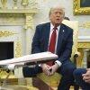
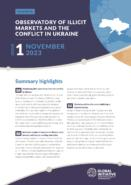
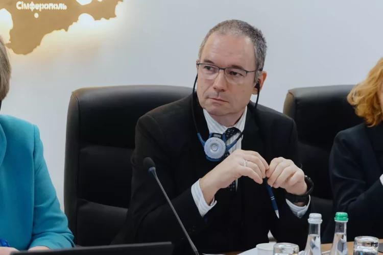
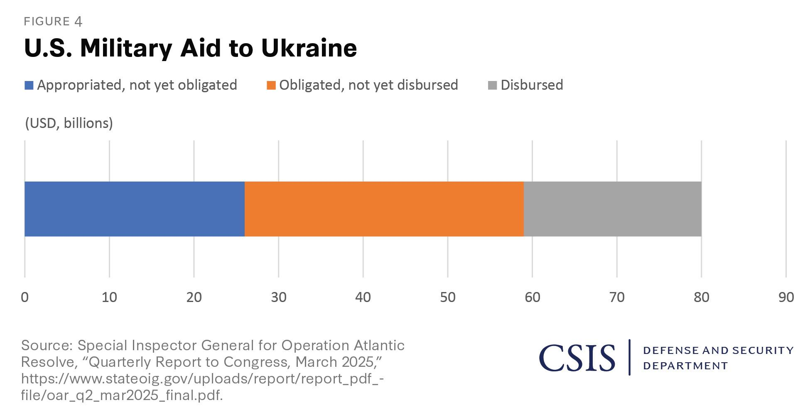

## Claim
Claim: "Ukraine is selling half of the armaments it receives from the United States"

## Actions
```
web_search("Ukraine US arms sales corruption")
web_search("US aid to Ukraine arms tracking")
```

## Evidence
### Evidence from `web_search`
Al Jazeera ([https://www.aljazeera.com/news/2025/8/2/ukraine-says-defence-sector-corruption-scheme-uncovered](https://www.aljazeera.com/news/2025/8/2/ukraine-says-defence-sector-corruption-scheme-uncovered)) reported that Ukrainian authorities detained officials over a large-scale corruption scheme in the defense sector, involving inflated prices and kickbacks. Politico ([https://www.politico.eu/article/ukraine-uncovers-major-corruption-scheme-defense-procurment-days-after-restoring-anticorruption/](https://www.politico.eu/article/ukraine-uncovers-major-corruption-scheme-defense-procurment-days-after-restoring-anticorruption/)) also reported on a corruption scheme involving the procurement of military equipment at inflated prices.

PBS.org ([https://www.pbs.org/frontlineworld/stories/sierraleone/context.html](https://www.pbs.org/frontlineworld/stories/sierraleone/context.html)) discusses corruption and illegal arms sales in Ukraine, mentioning the loss of $32 billion in military assets between 1992 and 1998 due to theft and lack of oversight. 


### Evidence from `web_search`
The Kiel Institute for the World Economy provides a "Ukraine Support Tracker" database, listing military, financial, and humanitarian aid pledged to Ukraine since January 24, 2022, to support a facts-based discussion about support to Ukraine. The website mentions that Europe has largely filled the US aid withdrawal lead. (<image:k>)

Another source lists military aid packages to Ukraine from various countries, including the United States, without mentioning Ukraine selling armaments. An NPR article from August 5, 2025, discusses weapons for Ukraine, mentioning that the U.S. has provided around $75 billion in military assistance to Ukraine since the full-scale invasion in 2022. (, , )

*   [https://www.ifw-kiel.de/topics/war-against-ukraine/ukraine-support-tracker/](https://www.ifw-kiel.de/topics/war-against-ukraine/ukraine-support-tracker/)
*   [https://www.forumarmstrade.org/ukrainearms.html](https://www.forumarmstrade.org/ukrainearms.html)
*   [https://www.npr.org/2025/08/05/g-s1-81084/europe-us-weapons-ukraine-russia-war](https://www.npr.org/2025/08/05/g-s1-81084/europe-us-weapons-ukraine-russia-war)


## Elaboration
The evidence reveals instances of corruption within Ukraine's defense sector, including inflated prices and kickbacks, as reported by Al Jazeera ([https://www.aljazeera.com/news/2025/8/2/ukraine-says-defence-sector-corruption-scheme-uncovered](https://www.aljazeera.com/news/2025/8/2/ukraine-says-defence-sector-corruption-scheme-uncovered)) and Politico ([https://www.politico.eu/article/ukraine-uncovers-major-corruption-scheme-defense-procurement-days-after-restoring-anticorruption/](https://www.politico.eu/article/ukraine-uncovers-major-corruption-scheme-defense-procurement-days-after-restoring-anticorruption/)). However, the provided evidence does not directly support the claim that Ukraine is selling half of the armaments it receives from the United States.

While the evidence mentions corruption and the provision of military aid to Ukraine, it lacks specific information about the alleged sale of armaments. The NPR article ([https://www.npr.org/2025/08/05/g-s1-81084/europe-us-weapons-ukraine-russia-war](https://www.npr.org/2025/08/05/g-s1-81084/europe-us-weapons-ukraine-russia-war)) discusses U.S. military assistance, but it does not mention any arms sales by Ukraine.

Therefore, the claim cannot be verified based on the provided evidence. Additional information is needed to confirm or refute the claim.


## Actions
```
web_search("Ukraine arms sales black market")
web_search("Ukraine arms trafficking investigation")
```

## Evidence
### Evidence from `web_search`
The Harvard International Review ([https://hir.harvard.edu/facts-or-false-alarms-the-state-of-illicit-arms-in-ukraine/](https://hir.harvard.edu/facts-or-false-alarms-the-state-of-illicit-arms-in-ukraine/)) discusses the illicit arms trade in Ukraine, mentioning its history as a black market for arms and reports of weapons theft since 2022. The Global Initiative Against Transnational Organized Crime (GI-TOC) ([https://globalinitiative.net/analysis/a-new-phase-of-arms-trafficking-in-ukraine/](https://globalinitiative.net/analysis/a-new-phase-of-arms-trafficking-in-ukraine/)) discusses the rise of organized arms trafficking in Ukraine, including the sale of US-made machine guns and Soviet-type grenade launchers. , , 


### Evidence from `web_search`
The Global Initiative Against Transnational Organized Crime discusses potential arms trafficking from the Ukraine conflict, highlighting concerns about the diversion of small arms and light weapons. ([https://globalinitiative.net/analysis/future-trends-in-arms-trafficking-from-the-ukraine-conflict/](https://globalinitiative.net/analysis/future-trends-in-arms-trafficking-from-the-ukraine-conflict/))  The Ministry of Internal Affairs of Ukraine launched a Coordination Centre to Combat Illicit Arms Trafficking in February 2025 to counteract illegal arms trafficking. ([https://www.euam-ukraine.eu/news/moia-launches-the-coordination-centre-to-combat-illicit-arms-trafficking/](https://www.euam-ukraine.eu/news/moia-launches-the-coordination-centre-to-combat-illicit-arms-trafficking/)) , , , , 


## Elaboration
The new evidence indicates that Ukraine has a history as a black market for arms, with reports of weapons theft since 2022 ([https://hir.harvard.edu/facts-or-false-alarms-the-state-of-illicit-arms-in-ukraine/](https://hir.harvard.edu/facts-or-false-alarms-the-state-of-illicit-arms-in-ukraine/)). The Global Initiative Against Transnational Organized Crime (GI-TOC) discusses the rise of organized arms trafficking, including the sale of US-made machine guns ([https://globalinitiative.net/analysis/a-new-phase-of-arms-trafficking-in-ukraine/](https://globalinitiative.net/analysis/a-new-phase-of-arms-trafficking-in-ukraine/)). The Ministry of Internal Affairs of Ukraine launched a Coordination Centre to Combat Illicit Arms Trafficking in February 2025 ([https://www.euam-ukraine.eu/news/moia-launches-the-coordination-centre-to-combat-illicit-arms-trafficking/](https://www.euam-ukraine.eu/news/moia-launches-the-coordination-centre-to-combat-illicit-arms-trafficking/)).

While the evidence confirms arms trafficking and the existence of a black market, it does not specify the volume of arms sales. The claim that Ukraine is selling half of the armaments it receives from the United States remains unverified.

To verify the claim, specific data on the volume of arms received from the US and the volume of arms sold would be needed.


## Actions
```
web_search("Ukraine arms sales statistics US aid")
```

## Evidence
### Evidence from `web_search`
The Council on Foreign Relations ([https://www.cfr.org/article/how-much-us-aid-going-ukraine](https://www.cfr.org/article/how-much-us-aid-going-ukraine)) and the Center for Strategic and International Studies (CSIS) ([https://www.csis.org/analysis/trump-sends-weapons-ukraine-numbers](https://www.csis.org/analysis/trump-sends-weapons-ukraine-numbers)) provide data on U.S. aid to Ukraine, including military aid. CSIS provides data on U.S. military aid to Ukraine, including announcements and deliveries of weapons. ,  The Stockholm International Peace Research Institute (SIPRI) ([https://www.sipri.org/media/press-release/2025/ukraine-worlds-biggest-arms-importer-united-states-dominance-global-arms-exports-grows-russian](https://www.sipri.org/media/press-release/2025/ukraine-worlds-biggest-arms-importer-united-states-dominance-global-arms-exports-grows-russian)) reported that Ukraine was the world's biggest arms importer in 2020–24, with the USA being the main supplier. None of these sources mention Ukraine selling armaments.


## Elaboration
The evidence provides data on U.S. military aid to Ukraine and confirms Ukraine as a major arms importer, primarily from the U.S. ([https://www.cfr.org/article/how-much-us-aid-going-ukraine](https://www.cfr.org/article/how-much-us-aid-going-ukraine), [https://www.csis.org/analysis/trump-sends-weapons-ukraine-numbers](https://www.csis.org/analysis/trump-sends-weapons-ukraine-numbers), [https://www.sipri.org/media/press-release/2025/ukraine-worlds-biggest-arms-importer-united-states-dominance-global-arms-exports-grows-russian](https://www.sipri.org/media/press-release/2025/ukraine-worlds-biggest-arms-importer-united-states-dominance-global-arms-exports-grows-russian)). However, none of the sources mention Ukraine selling armaments.

The claim that Ukraine is selling half of the armaments it receives from the United States remains unverified. The evidence does not provide any data on the volume of arms sales by Ukraine.


## Final Judgement
The investigation revealed evidence of corruption and arms trafficking in Ukraine, but no specific data to support the claim that Ukraine is selling half of the armaments it receives from the United States. Therefore, the claim cannot be verified. `not enough information`


### Verdict: NEI

### Justification
The investigation found evidence of corruption and arms trafficking in Ukraine, but no specific data to support the claim that Ukraine is selling half of the armaments it receives from the United States. While sources like the [Harvard International Review](https://hir.harvard.edu/facts-or-false-alarms-the-state-of-illicit-arms-in-ukraine/) and the [Global Initiative Against Transnational Organized Crime](https://globalinitiative.net/analysis/a-new-phase-of-arms-trafficking-in-ukraine/) discuss arms trafficking, and the [Council on Foreign Relations](https://www.cfr.org/article/how-much-us-aid-going-ukraine) and [CSIS](https://www.csis.org/analysis/trump-sends-weapons-ukraine-numbers) provide data on U.S. aid, none of the sources provide information on the volume of arms sales by Ukraine. Therefore, the claim is unverified due to a lack of supporting evidence.
