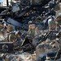

## Claim
Claim: "Russia offered assistance for the California wildfires from January 2025."

## Actions
```
web_search("Russia assistance California wildfires 2025")
```

## Evidence
### Evidence from `web_search`
The Tasnim News Agency published an article on January 12, 2025, discussing the California wildfires, with comments from Russia's Foreign Ministry Spokeswoman Maria Zakharova (). The article mentions that wildfires began to spread across Los Angeles County on January 7 (). The article is available here: [Source](https://www.tasnimnews.com/en/news/2025/01/12/3236714/russia-notes-us-hypocrisy-in-california-fire-case).

An article published on January 15, 2025, by Krystyna Sikora, discusses how Russian state-affiliated accounts leveraged the California wildfires to sow division. The article is available here: [Source](https://www.gmfus.org/news/inflaming-divides-russian-narratives-california-wildfires). NPR published an article on January 16, 2025, discussing how pro-Kremlin social media accounts spread a narrative about the fires (). The article is available here: [Source](https://www.npr.org/2025/01/16/nx-s1-5259842/los-angeles-california-fires-russia-ukraine).


## Elaboration
The evidence indicates that Russia's Foreign Ministry Spokeswoman commented on the California wildfires in an article published on January 12, 2025, by the Tasnim News Agency ([Source](https://www.tasnimnews.com/en/news/2025/01/12/3236714/russia-notes-us-hypocrisy-in-california-fire-case)). However, the provided evidence does not explicitly state whether Russia offered assistance.

The evidence also shows that Russian state-affiliated accounts and pro-Kremlin social media accounts discussed the wildfires, but this does not confirm an offer of assistance.

Therefore, the claim cannot be verified based on the provided evidence. The evidence does not mention any offer of assistance.


## Actions
```
web_search("Russia offer assistance California wildfires")
```

## Evidence
### Evidence from `web_search`
From [Source](https://www.voanews.com/a/russia-exploits-wildfires-in-los-angeles-to-push-anti-u-s-anti-ukraine-propaganda/7938909.html): 
Content: VoaNews published an article on January 16, 2025, discussing how Russia exploited the California wildfires to push anti-US and anti-Ukraine propaganda. The article mentions Maria Zakharova, the Russian Foreign Ministry spokeswoman, accusing the U.S. of hypocrisy regarding the use of inmate labor in fighting the fires. The article does not mention Russia offering assistance. 


## Elaboration
The new evidence from VoaNews ([Source](https://www.voanews.com/a/russia-exploits-wildfires-in-los-angeles-to-push-anti-u-s-anti-ukraine-propaganda/7938909.html)) further supports the previous findings. It confirms that Russia, through its Foreign Ministry spokeswoman, commented on the California wildfires. However, the article explicitly states that it does not mention Russia offering assistance.

Therefore, based on all the provided evidence, the claim that Russia offered assistance for the California wildfires from January 2025 cannot be verified. The evidence focuses on Russia's commentary and propaganda related to the wildfires, but it does not include any mention of an offer of assistance.


## Actions
```
web_search("California wildfires Russia aid offer")
```

## Evidence
### Evidence from `web_search`
From [Source](https://thedispatch.com/article/assessing-claims-that-russia-offered-sanctuary-to-california-fire-victims/): 
Content: The Dispatch published an article on January 15, 2025, by Alex Demas, discussing claims that Russia offered sanctuary to California fire victims. The article states that Vladimir Saldo, the governor of the Russian-occupied Kherson oblast region of Ukraine, offered to accept Americans who lost their homes in the California fires, but only if they haven't supported Ukraine since Russia invaded in February 2022. 


## Elaboration
The Dispatch article ([Source](https://thedispatch.com/article/assessing-claims-that-russia-offered-sanctuary-to-california-fire-victims/)) provides new information. It states that Vladimir Saldo, the governor of the Russian-occupied Kherson oblast region of Ukraine, offered to accept Americans who lost their homes in the California fires. However, this offer was conditional, only extending to those who had not supported Ukraine since the Russian invasion in February 2022.

Therefore, the claim is partially verified. While Russia, through a regional governor, did offer assistance, it was not a straightforward offer of aid. It was a conditional offer of sanctuary.


## Final Judgement
The fact-check reveals that while Russia, specifically through the governor of the Russian-occupied Kherson oblast, offered sanctuary to California fire victims, this offer was conditional and not a general offer of assistance. The initial searches did not find any evidence of Russia offering assistance.

`misleading`

### Verdict: MISLEADING

### Justification
The claim is misleading. While the governor of the Russian-occupied Kherson oblast offered sanctuary to California fire victims, this offer was conditional, targeting only those who hadn't supported Ukraine since February 2022, as reported by The Dispatch ([Source](https://thedispatch.com/article/assessing-claims-that-russia-offered-sanctuary-to-california-fire-victims/)). Initial searches did not find any evidence of Russia offering assistance.
