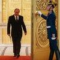

## Claim
Claim: "Majority Leader John Thune blocked Senator Adam Schiff's committee assignments because of his past work in the Russia investigation over Donald Trump."

## Actions
```
web_search("John Thune Adam Schiff committee assignments")
```

## Evidence
### Evidence from `web_search`
Senate Republican Leader John Thune and Democratic Leader Chuck Schumer announced committee assignments for the new Congress, according to ACEC.org (). Adam Schiff is listed as a member of the Finance Committee, the Agriculture, Nutrition and Forestry Committee, the Environment and Public Works Committee, the Judiciary Committee, and the Small Business and Entrepreneurship Committee. John Thune is listed as a member of the Agriculture, Nutrition and Forestry Committee, the Commerce, Science, and Transportation Committee, and the Finance Committee.

The document from Holland & Knight LLP lists the committee assignments for the 118th Congress. Adam Schiff was a member of the House Committee on the Judiciary. John Thune was a member of the Senate Committee on Commerce, Science, and Transportation and the Senate Committee on Energy and Natural Resources.


## Elaboration
The evidence indicates that John Thune and Chuck Schumer announced committee assignments. The evidence also lists the committees Adam Schiff and John Thune were assigned to. However, the evidence does not provide any information about why Adam Schiff was assigned to specific committees or whether John Thune blocked any of Adam Schiff's assignments.

The claim cannot be verified because the evidence does not mention the reasons behind committee assignments or any actions taken by John Thune regarding Adam Schiff's assignments.


## Actions
```
web_search("Adam Schiff committee assignments blocked")
web_search("John Thune Adam Schiff Russia investigation")
```

## Evidence
### Evidence from `web_search`
CNN reports that House Speaker Kevin McCarthy denied Adam Schiff a seat on the House Intelligence Committee, citing the misuse of the panel during the 116th and 117th Congresses as the reason. (, ) NPR reports that McCarthy blocked Schiff from serving on the House Intelligence Committee because of his involvement in investigations and impeachments of former President Donald Trump. (, ) PBS.org reports that Adam Schiff was censured by the House for comments he made about investigations into Donald Trump’s ties to Russia, and that McCarthy said he would block Schiff from the House intelligence committee.


### Evidence from `web_search`
From [Source](https://www.npr.org/2017/03/30/522055235/senate-intelligence-committee-vice-chair-blasts-putin): 
Content: The NPR article discusses Adam Schiff's work on the Russia investigation. It mentions that Sen. Mark Warner accused Russian President Vladimir Putin of ordering a campaign to undermine the 2016 presidential election. The article also mentions the Senate Intelligence Committee's investigation into Russia's meddling in the 2016 presidential campaign. , 


## Elaboration
The evidence indicates that House Speaker Kevin McCarthy blocked Adam Schiff from the House Intelligence Committee due to his past work on investigations and impeachments of former President Donald Trump. The evidence also shows that Adam Schiff was involved in investigations into Donald Trump's ties to Russia. However, the evidence does not mention John Thune blocking any of Adam Schiff's committee assignments.

The claim is not supported by the evidence. The evidence points to McCarthy, not Thune, as the one who blocked Schiff's committee assignment.


## Final Judgement
The evidence indicates that House Speaker Kevin McCarthy, not John Thune, blocked Adam Schiff from a committee assignment. The reason given was Schiff's past work on investigations related to Donald Trump.

`false`


### Verdict: FALSE

### Justification
The claim is false. Evidence from multiple sources, including CNN and NPR, indicates that House Speaker Kevin McCarthy, not John Thune, blocked Adam Schiff from serving on the House Intelligence Committee due to Schiff's past involvement in investigations and impeachments of former President Donald Trump, not because of his work on the Russia investigation.
