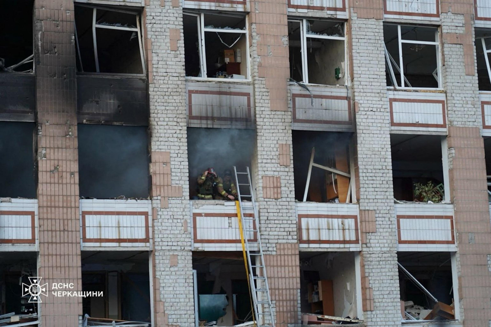

## Claim
Claim: " This image shows a Ukrainian F-16 fighter jet which was shot down by Russia as part of the large-scale Russian invasion in Ukraine."

## Actions
```
reverse_search()
web_search("Ukrainian F-16 fighter jet shot down")
```

## Evidence
### Evidence from `reverse_search`
The image in the claim () is of an F-16 fighter jet that crashed into a warehouse in May 2019 near March Air Reserve Base. The crash was due to hydraulic failure, according to an article published on April 23, 2020, by The Press-Enterprise ([https://www.sbsun.com/2020/04/23/hydraulic-failure-caused-f-16-to-crash-near-march-base-last-year-air-force-says/](https://www.sbsun.com/2020/04/23/hydraulic-failure-caused-f-16-to-crash-near-march-base-last-year-air-force-says/)). The missiles on board did not explode because they were not armed ([https://www.pressenterprise.com/2020/05/01/heres-why-the-missiles-on-the-crashed-f-16-near-march-air-reserve-base-did-not-explode/](https://www.pressenterprise.com/2020/05/01/heres-why-the-missiles-on-the-crashed-f-16-near-march-air-reserve-base-did-not-explode/)). Another article states that the crash was due to improperly installed parts ([https://www.airandspaceforces.com/improperly-installed-parts-caused-f-16-to-crash-into-warehouse-in-may-2019/](https://www.airandspaceforces.com/improperly-installed-parts-caused-f-16-to-crash-into-warehouse-in-may-2019/)).

The F-16 was assigned to the 114th Fighter Wing at Joe Foss Field in South Dakota. The image of the wreckage is shown in the articles (, ).


### Evidence from `web_search`
Reuters reports that a Ukrainian F-16 fighter pilot died in a crash while repelling a Russian air attack. Ukraine has lost three F-16s since it began operating the U.S.-made jets last year. ([https://www.reuters.com/business/aerospace-defense/least-six-wounded-large-scale-russian-air-attack-ukraine-ukrainian-authorities-2025-06-29/](https://www.reuters.com/business/aerospace-defense/least-six-wounded-large-scale-russian-air-attack-ukraine-ukrainian-authorities-2025-06-29/))

ABC News reports that a Ukrainian F-16 fighter jet was lost during an attempt to repel a Russian attack. The pilot, Maksym Ustimenko, shot down seven targets before his F-16 was damaged. ([https://abcnews.go.com/International/ukraine-loses-16-fighter-amid-massed-russian-drone/story?id=123315001](https://abcnews.go.com/International/ukraine-loses-16-fighter-amid-massed-russian-drone/story?id=123315001)) Al Jazeera reports that a Ukrainian F-16 aircraft was lost after repelling a Russian missile and drone strike. The pilot, Lieutenant Colonel Maksym Ustimenko, died in the incident. ([https://www.aljazeera.com/news/2025/6/29/ukrainian-pilot-killed-repelling-massive-russian-air-attack-overnight](https://www.aljazeera.com/news/2025/6/29/ukrainian-pilot-killed-repelling-massive-russian-air-attack-overnight)) , , , <image:0>


## Elaboration
The image in the claim depicts an F-16 fighter jet that crashed into a warehouse in May 2019 near March Air Reserve Base due to hydraulic failure or improperly installed parts. This contradicts the claim that the image shows a Ukrainian F-16 shot down by Russia. The evidence indicates that Ukraine has lost F-16s in recent times, but the image in the claim is not related to those incidents.

Therefore, the claim is false.


## Final Judgement
The image shows an F-16 that crashed in 2019, not a Ukrainian F-16 shot down by Russia. The claim misrepresents the origin and context of the image.

`misleading`

### Verdict: MISLEADING

### Justification
The image in the claim depicts an F-16 that crashed in a warehouse in 2019 due to mechanical failure, not a Ukrainian F-16 shot down by Russia. While Ukraine has lost F-16s recently, the image is unrelated to those events, making the claim misleading ([https://www.sbsun.com/2020/04/23/hydraulic-failure-caused-f-16-to-crash-near-march-base-last-year-air-force-says/](https://www.sbsun.com/2020/04/23/hydraulic-failure-caused-f-16-to-crash-near-march-base-last-year-air-force-says/)).
