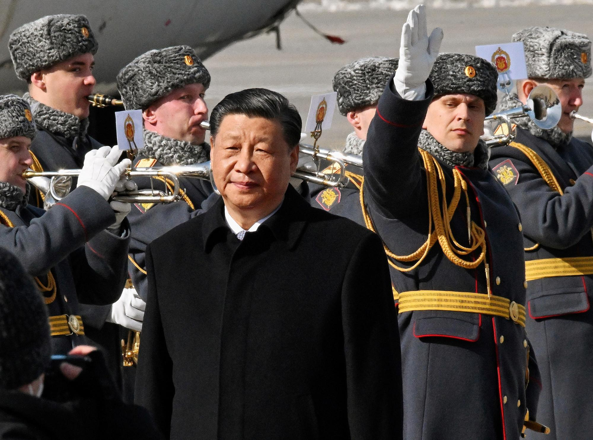
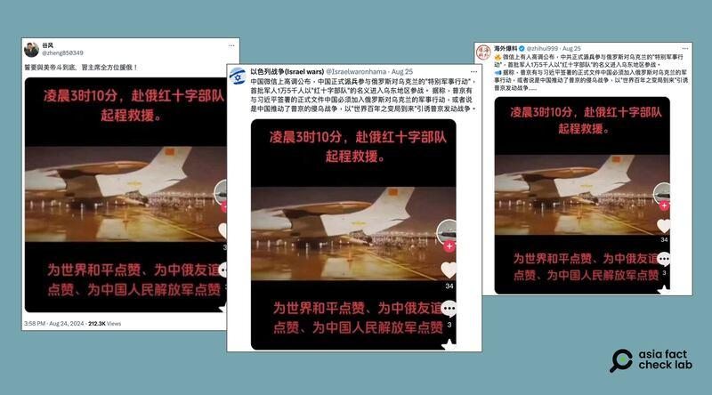
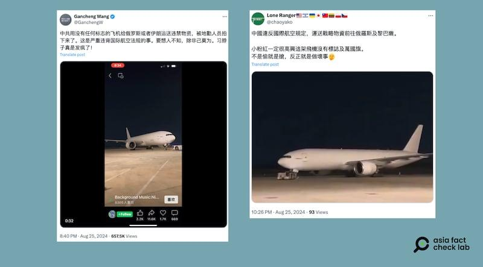

## Claim
Claim: " This image shows the Chinese Communist Party's Red Cross troops in Russia who have changed into winter clothes and set off for the Russian-Ukrainian front to aid Russia in rescuing its occupied territories."

## Actions
```
image_search("Chinese Red Cross troops Russia aid Ukraine")
web_search("Chinese Red Cross troops Russia Ukraine war")
```

## Evidence
### Evidence from `image_search`
The Atlantic Council published an article discussing China's support for Russia (). Al Jazeera published an image of Russian troops (). CNN published an article about the war in Ukraine ().


### Evidence from `web_search`
The Asia Fact Check Lab states that the claim about China sending troops to aid Russia in the Ukraine war is false. The image of the aircraft with the Chinese flag was published in Chinese-language media in 2020 and shows a Chinese plane carrying doctors to Wuhan following the outbreak of COVID-19. Another photo of an unmarked aircraft was also taken in 2020 and shows a plane that carried a group of doctors to Wuhan. [Source](https://www.rfa.org/english/news/afcl/afcl-china-russia-troop-09062024030513.html).  

An NDTV article discusses the capture of Chinese prisoners of war in Ukraine and their subsequent parading before the media, which is a violation of international humanitarian law. The article mentions that Ukraine released documents and passports of the two PoWs, proving their identity as Chinese. China has denied its citizens are fighting alongside Russians. [Source](https://www.ndtv.com/world-news/ukraine-war-beijing-red-faced-as-kyiv-breaks-humanitarian-law-to-prove-china-wrong-8183057).  


## Elaboration
The claim is false. The Asia Fact Check Lab states that the image of the aircraft with the Chinese flag was published in Chinese-language media in 2020 and shows a Chinese plane carrying doctors to Wuhan following the outbreak of COVID-19. The NDTV article mentions that Ukraine released documents and passports of the two PoWs, proving their identity as Chinese. China has denied its citizens are fighting alongside Russians.


## Final Judgement
The claim is demonstrably false. The image used in the claim is from 2020 and depicts a Chinese plane carrying doctors to Wuhan during the COVID-19 outbreak, not Chinese troops heading to the Russian-Ukrainian front. Additionally, while there have been reports of Chinese citizens fighting in the war, China denies its citizens are fighting alongside Russians. `false`

### Verdict: FALSE

### Justification
The claim is demonstrably false. The image used in the claim is from 2020 and shows a Chinese plane carrying doctors to Wuhan during the COVID-19 outbreak, not Chinese troops heading to the Russian-Ukrainian front, as reported by the [Asia Fact Check Lab](https://www.rfa.org/english/news/afcl/afcl-china-russia-troop-09062024030513.html).
