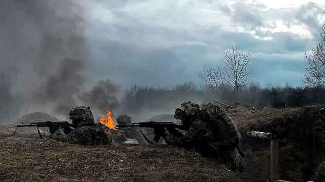
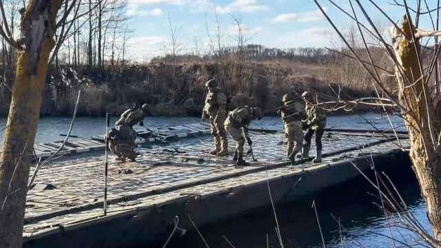
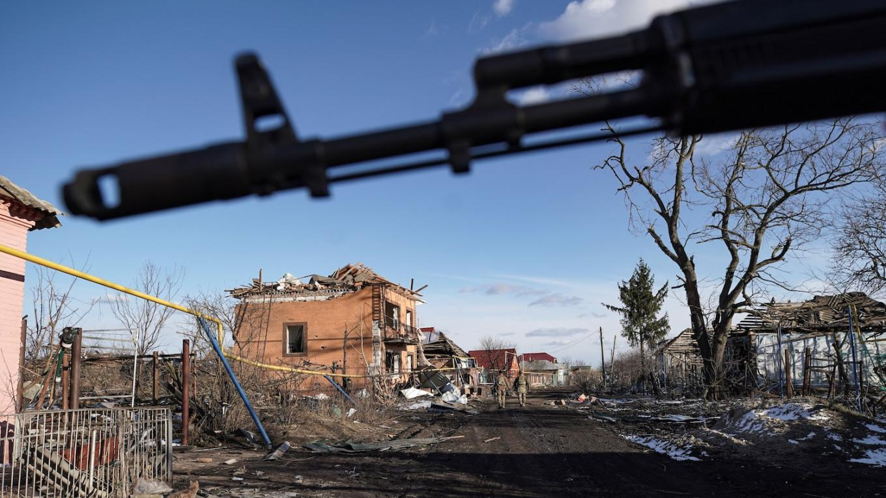
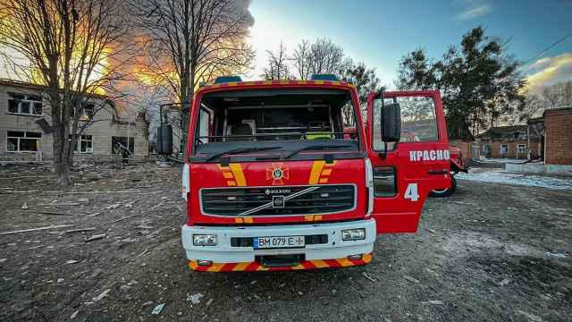
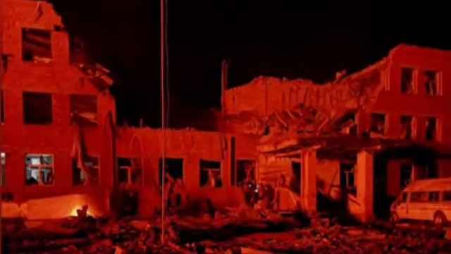

## Claim
Claim: " This image shows Ukrainian President Volodymyr Zelensky arriving in August 2024 in the Sudzha of Kursk region, Russia, which had just been occupied by Ukrainian troops in the Kursk Offensive, and meeting with representatives of the people there."

## Actions
```
reverse_search()
web_search("Zelensky Kursk Offensive")
```

## Evidence
### Evidence from `reverse_search`
The image in the claim () appears in multiple sources. The BBC reports that the image shows Volodymyr Zelensky visiting troops in the Kharkiv region, and the article was published on May 29, 2022. ([https://www.bbc.com/news/live/world-europe-61612803](https://www.bbc.com/news/live/world-europe-61612803))

Telegrafi.com also features the image, stating that Zelensky visited the front line in the Kharkiv region. ([https://telegrafi.com/en/zelensky-on-a-rare-trip-outside-kiev-visited-the-front-line-where-he-met-ukrainian-troops/](https://telegrafi.com/en/zelensky-on-a-rare-trip-outside-kiev-visited-the-front-line-where-he-met-ukrainian-troops/))


### Evidence from `web_search`
The Wikipedia article ([https://en.wikipedia.org/wiki/Kursk_campaign](https://en.wikipedia.org/wiki/Kursk_campaign)) discusses the 2024 Kursk offensive, which began on August 6, 2024, during the Russo-Ukrainian War. The BBC News article ([https://www.bbc.com/news/articles/c0q198zyppqo](https://www.bbc.com/news/articles/c0q198zyppqo)), published on March 17, 2025, discusses the Ukrainian retreat from the Kursk region and includes images of a damaged statue of Lenin in Sudzha  and Ukrainian soldiers during the fighting , . The Moscow Times ([https://www.themoscowtimes.com/2025/04/27/zelensky-says-ukraine-still-fighting-in-russias-kursk-a88884](https://www.themoscowtimes.com/2025/04/27/zelensky-says-ukraine-still-fighting-in-russias-kursk-a88884)) reports on the ongoing conflict in the Kursk region, mentioning a Ukrainian offensive in August 2024 and includes several images related to the conflict , , , , .


## Elaboration
The claim is not supported by the evidence. The image in the claim shows Zelensky visiting troops in the Kharkiv region in May 2022, not in the Kursk region in August 2024. The evidence also indicates that the Kursk offensive occurred in August 2024.


## Final Judgement
The image in the claim is from May 2022 and shows Zelensky in the Kharkiv region, not the Kursk region in August 2024. The claim misrepresents the location and time of the image. `misleading`

### Verdict: MISLEADING

### Justification
The image in the claim, which shows Volodymyr Zelensky, was taken in May 2022 during a visit to the Kharkiv region, as reported by the BBC ([https://www.bbc.com/news/live/world-europe-61612803](https://www.bbc.com/news/live/world-europe-61612803)) and Telegrafi.com. The claim incorrectly states that the image was taken in August 2024 in the Kursk region.
