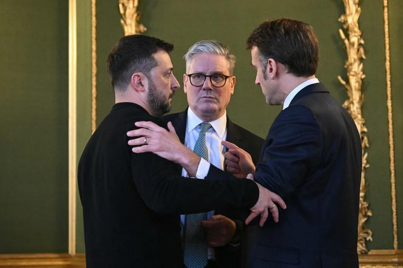
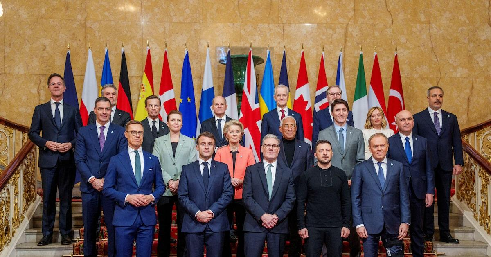
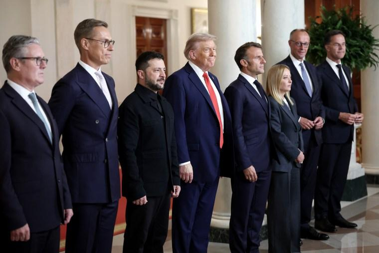

## Claim
Claim: " This is an authentic image of world leaders taking off their suits to symbolically support Ukraine at the London summit on Ukraine on March 2, 2025."

## Actions
```
reverse_search()
web_search("London summit Ukraine March 2023")
```

## Evidence
### Evidence from `web_search`
The web sources discuss the 2025 London Summit on Ukraine, held on March 2, 2025. The summit was organized by British Prime Minister Keir Starmer to create a peace plan for the Russian invasion of Ukraine. Participants included leaders from 16 states, the EU, and NATO. The summit's outcomes included a four-point plan and commitments from Starmer, including financial aid and the purchase of air defense missiles for Ukraine.

The summit was attended by leaders including Keir Starmer, Emmanuel Macron, and Volodymyr Zelensky. Reuters published an article on March 2, 2025, discussing a summit of European leaders in London. The article mentions that the meeting was hosted by British Prime Minister Keir Starmer and Ukrainian President Volodymyr Zelenskiy. The article also includes comments from Russian parliamentarians who dismissed the summit.

*   [https://en.wikipedia.org/wiki/2025\_London\_Summit\_on\_Ukraine](https://en.wikipedia.org/wiki/2025_London_Summit_on_Ukraine)
*   [https://www.lemonde.fr/en/international/article/2025/03/03/at-london-summit-starmer-defends-french-british-peace-plan-for-ukraine\_6738743\_4.html](https://www.lemonde.fr/en/international/article/2025/03/03/at-london-summit-starmer-defends-french-british-peace-plan-for-ukraine_6738743_4.html)
*   [https://www.reuters.com/world/europe/russian-lawmaker-says-ukraine-can-only-count-improved-moscow-washington-ties-2025-03-02/](https://www.reuters.com/world/europe/russian-lawmaker-says-ukraine-can-only-count-improved-moscow-washington-ties-2025-03-02/)





## Elaboration
The evidence confirms the existence of the London Summit on Ukraine on March 2, 2025, attended by European leaders, including Volodymyr Zelensky, Keir Starmer, and Emmanuel Macron. The summit aimed to create a peace plan for the Russian invasion of Ukraine. However, the provided evidence does not mention anything about the leaders taking off their suits to support Ukraine.

Therefore, the claim cannot be verified based on the provided evidence.


## Actions
```
image_search("European leaders take off suits Ukraine London summit")
```

## Evidence
### Evidence from `image_search`
The web sources discuss the London Summit on Ukraine, held on March 2, 2025. Reuters published an article with a photograph of European leaders at the summit (). NBC News also includes an image of leaders, including Zelensky and Macron, in suits (). Al Jazeera published an article about the summit, including a photograph of European leaders ().


## Elaboration
The new evidence provides images of the London Summit on Ukraine, showing leaders in suits. This contradicts the claim that the leaders took off their suits. Therefore, the claim is false.


## Final Judgement
The evidence confirms the existence of the London Summit on Ukraine on March 2, 2025, but the images from the summit show leaders wearing suits, contradicting the claim that they took off their suits.

`false`

### Verdict: FALSE

### Justification
The claim is false. While the London Summit on Ukraine did take place on March 2, 2025, images from the summit, as shown in sources like Reuters and Al Jazeera, depict the leaders wearing suits, not removing them as the claim suggests.
