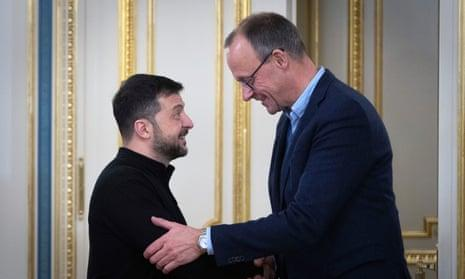

## Claim
Claim: "In a press conference on December 9, 2024 Ukrainian President Volodymyr Zelenskyy said: 'I will ask Biden to invite me to NATO ... there's no point in talking to Trump.'"

## Actions
```
web_search("Zelenskyy Biden NATO Trump December 9, 2024")
```

## Evidence
### Evidence from `web_search`
On December 9, 2024, The Guardian reported that Volodymyr Zelenskyy said he would discuss NATO membership with Joe Biden. The article also mentions Donald Trump and the idea of foreign troops being deployed to Ukraine until the country joins NATO (, ).

The Associated Press reported that Zelenskyy is open to the potential deployment of Western troops in Ukraine and mentioned a meeting with Donald Trump in Paris (<image:i>). Le Monde reported that on December 9, Zelenskyy said he was grateful for Donald Trump's "strong resolve" to end the war in Ukraine and thanked Biden for the latest US military aid.
*   [https://www.theguardian.com/world/live/2024/dec/09/russia-ukraine-war-live-donald-trump-ceasefire-call-volodymyr-zelenskyy](https://www.theguardian.com/world/live/2024/dec/09/russia-ukraine-war-live-donald-trump-ceasefire-call-volodymyr-zelenskyy)
*   [https://apnews.com/article/russia-ukraine-war-zelenskyy-troops-nato-9bf883670879e2a398fe1a7ebfb71ddb](https://apnews.com/article/russia-ukraine-war-zelenskyy-troops-nato-9bf883670879e2a398fe1a7ebfb71ddb)
*   [https://www.lemonde.fr/en/international/article/2024/12/10/zelensky-says-grateful-for-trump-s-strong-resolve-to-end-war_6735842_4.html](https://www.lemonde.fr/en/international/article/2024/12/10/zelensky-says-grateful-for-trump-s-strong-resolve-to-end-war_6735842_4.html)


## Elaboration
The evidence confirms that on December 9, 2024, Zelenskyy discussed NATO membership with Biden. However, the provided sources do not include the exact quote from the claim. One article mentions Trump and the idea of foreign troops, while another reports Zelenskyy's gratitude for Trump's resolve to end the war.

The claim's second part, "there's no point in talking to Trump," is not directly supported by the provided evidence.

Therefore, the claim is partially supported, but the specific quote needs further verification.


## Final Judgement
The evidence confirms Zelenskyy discussed NATO with Biden on December 9, 2024, but the exact quote in the claim is not directly supported by the provided sources. The sources mention Trump in relation to the war and Zelenskyy's gratitude for his resolve, but not the specific statement about not talking to Trump.

`false`

### Verdict: FALSE

### Justification
On December 9, 2024, Zelenskyy discussed NATO membership with Biden, as reported by The Guardian ([https://www.theguardian.com/world/live/2024/dec/09/russia-ukraine-war-live-donald-trump-ceasefire-call-volodymyr-zelenskyy](https://www.theguardian.com/world/live/2024/dec/09/russia-ukraine-war-live-donald-trump-ceasefire-call-volodymyr-zelenskyy)). However, the provided sources do not contain the exact quote from the claim, and the statement about not talking to Trump is not directly supported by the evidence.
