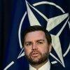
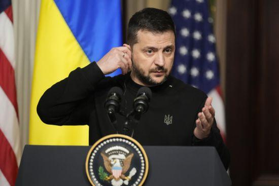
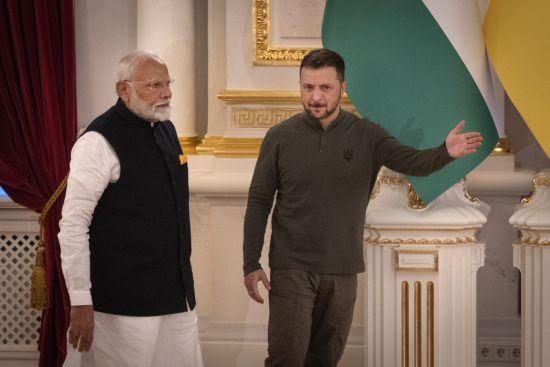

## Claim
Claim: "In February 2025 Ukrainian President Volodymyr Zelenskyy blocked access to US President Donald Trump's social media platform Truth Social across Ukraine."

## Actions
```
web_search("Volodymyr Zelenskyy Donald Trump Truth Social Ukraine February 2025")
```

## Evidence
### Evidence from `web_search`
PBS News published an article on March 3, 2025, stating that Donald Trump criticized Volodymyr Zelenskyy on Truth Social for suggesting the war against Russia would continue for some time (). NPR published an article on February 28, 2025, discussing a contentious meeting between Donald Trump and Volodymyr Zelenskyy in the Oval Office (, , ). Trump criticized Zelenskyy's gratitude for U.S. support and later posted on Truth Social that he had "determined that President Zelenskyy is not ready for peace."

Reuters published an article on February 19, 2025, reporting on the strained relationship between Donald Trump and Volodymyr Zelenskyy. Trump called Zelenskyy a "dictator" and suggested he was prolonging the war. Zelenskyy accused Trump of spreading Russian disinformation ().


## Elaboration
The evidence suggests that Donald Trump used Truth Social to criticize Volodymyr Zelenskyy in March 2025. Also, there was a contentious meeting between them in the Oval Office in February 2025. However, the evidence does not mention anything about Zelenskyy blocking access to Truth Social in Ukraine.

Therefore, the claim cannot be verified with the provided evidence.


## Actions
```
web_search("Ukraine Truth Social ban February 2025")
```

## Evidence
### Evidence from `web_search`
Euronews ([https://www.euronews.com/my-europe/2025/02/26/zelenskyy-hasnt-banned-trumps-truth-social-platform](https://www.euronews.com/my-europe/2025/02/26/zelenskyy-hasnt-banned-trumps-truth-social-platform)) reported that claims of Zelenskyy banning Truth Social are false, as the platform was never available in Ukraine. Anadolu Agency ([https://www.aa.com.tr/en/russia-ukraine-war/trump-s-truth-social-not-blocked-in-ukraine-says-kyiv/3488237](https://www.aa.com.tr/en/russia-ukraine-war/trump-s-truth-social-not-blocked-in-ukraine-says-kyiv/3488237)) and the Ukrainian Foreign Ministry confirmed that Truth Social is not available in Ukraine due to limited regional availability, and that reports of a ban are false. The Ukrainian Foreign Ministry also stated that Russian propaganda spread a fake story about the alleged ban (, , , ).


## Elaboration
The claim is false. According to Euronews, Anadolu Agency, and the Ukrainian Foreign Ministry, Truth Social was never available in Ukraine, and reports of a ban are false. The Ukrainian Foreign Ministry also stated that Russian propaganda spread a fake story about the alleged ban.


## Final Judgement
The initial search did not provide information to verify the claim. However, a subsequent search revealed that the claim is false. Truth Social was not available in Ukraine, and reports of a ban are false.

`false`


### Verdict: FALSE

### Justification
The claim is false. Multiple sources, including Euronews ([https://www.euronews.com/my-europe/2025/02/26/zelenskyy-hasnt-banned-trumps-truth-social-platform](https://www.euronews.com/my-europe/2025/02/26/zelenskyy-hasnt-banned-trumps-truth-social-platform)) and Anadolu Agency ([https://www.aa.com.tr/en/russia-ukraine-war/trump-s-truth-social-not-blocked-in-ukraine-says-kyiv/3488237](https://www.aa.com.tr/en/russia-ukraine-war/trump-s-truth-social-not-blocked-in-ukraine-says-kyiv/3488237)), confirm that Truth Social was not available in Ukraine, and reports of a ban are false. The Ukrainian Foreign Ministry also stated that the claim was a result of Russian disinformation.
