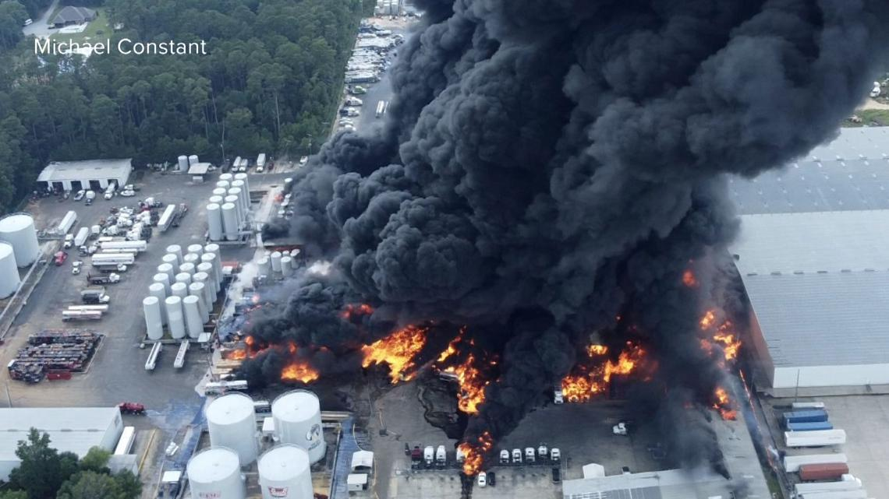
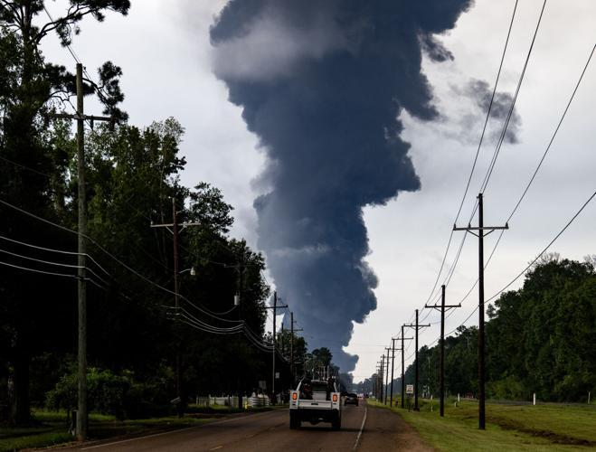
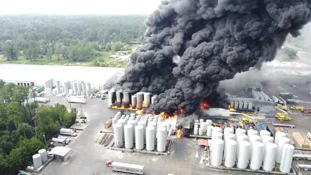

## Claim
Claim: " This image shows a chemical attack by the Armed Forces of Ukraine during the Kursk offensive in August 2024."

## Actions
```
reverse_search()
web_search("Kursk offensive August 2024 chemical attack")
```

## Evidence
### Evidence from `web_search`
Reuters reported on August 12, 2024, that the SBU said Russia was trying to falsely accuse Kyiv's military of war crimes during the ground incursion into Russia's Kursk region. The acting governor of the Kursk region claimed that Ukrainian forces used shells containing chemical weapons, but Reuters could not independently verify the claim. ()

The Institute for the Study of War (ISW) reported on August 10, 2024, that Russian forces are using hexachloroethane in Kursk Oblast, which is not banned by the Chemical Weapons Convention. The ISW also mentioned a counterterrorism operation in Belgorod, Bryansk, and Kursk oblasts in response to the Ukrainian incursion into Kursk Oblast. The ISW also stated that Russian forces conducted a successful Iskander-M ballistic missile strike against Ukrainian forces in Kursk Oblast.
*   [https://www.rand.org/pubs/commentary/2024/09/the-kursk-offensive-triumph-or-tragedy-in-the-making.html](https://www.rand.org/pubs/commentary/2024/09/the-kursk-offensive-triumph-or-tragedy-in-the-making.html)
*   [https://www.reuters.com/world/europe/ukraine-says-russia-tries-accuse-it-false-war-crimes-kursk-2024-08-12/](https://www.reuters.com/world/europe/ukraine-says-russia-tries-accuse-it-false-war-crimes-kursk-2024-08-12/)
*   [https://www.understandingwar.org/backgrounder/russian-offensive-campaign-assessment-august-10-2024](https://www.understandingwar.org/backgrounder/russian-offensive-campaign-assessment-august-10-2024)


## Elaboration
The evidence suggests that the claim is not verifiable. Reuters reported that the SBU said Russia was trying to falsely accuse Kyiv's military of war crimes during the ground incursion into Russia's Kursk region. The acting governor of the Kursk region claimed that Ukrainian forces used shells containing chemical weapons, but Reuters could not independently verify the claim. The ISW reported that Russian forces are using hexachloroethane in Kursk Oblast, which is not banned by the Chemical Weapons Convention.


## Actions
```
image_search("chemical explosion road")
geolocate()
```

## Evidence
### Evidence from `image_search`
The search results describe explosions. One source, from wwltv.com, shows an image of a large fire with black smoke, reporting on an explosion at a business in Roseland in August 2025.  Another source, nola.com, shows a photo of a large plume of smoke over a road.  WDSU provides a drone video of a plant explosion in Louisiana. 

*   [https://www.wwltv.com/article/news/local/roseland-business-explosion-highway-51-closure-august-2025/289-9e06a798-2b7e-4883-8aea-9c47638f8d5b](https://www.wwltv.com/article/news/local/roseland-business-explosion-highway-51-closure-august-2025/289-9e06a798-2b7e-4883-8aea-9c47638f8d5b)
*   [https://www.nola.com/news/evacuation-explosion-roseland-business-highway/article_82e3c857-76a1-4371-ae93-0bd5b421b99e.html](https://www.nola.com/news/evacuation-explosion-roseland-business-highway/article_82e3c857-76a1-4371-ae93-0bd5b421b99e.html)
*   [https://www.wdsu.com/article/louisiana-plant-explosion-drone-video/65874404](https://www.wdsu.com/article/louisiana-plant-explosion-drone-video/65874404)


### Evidence from `geolocate`
The most likely countries where the image was taken are: {'Palestine': 0.27, 'Jordan': 0.13, 'Ukraine': 0.08, 'Israel': 0.05, 'Argentina': 0.03, 'Kyrgyzstan': 0.03, 'Lesotho': 0.03, 'Mexico': 0.03, 'Pakistan': 0.03, 'Russia': 0.03}

## Elaboration
The evidence does not support the claim. The image search results show explosions, but none of them are related to the Kursk offensive or chemical attacks. The geolocation results show that the image could have been taken in Ukraine or Russia, but the evidence does not confirm the claim.


## Final Judgement
The claim cannot be verified. While the image search and geolocation provide some context, they do not confirm the claim about a chemical attack by the Armed Forces of Ukraine during the Kursk offensive in August 2024. The Reuters report indicates that the claim of a chemical attack was made by Russia and could not be independently verified.

`false`

### Verdict: FALSE

### Justification
The claim is not verifiable. While the image search and geolocation provide some context, they do not confirm the claim about a chemical attack by the Armed Forces of Ukraine during the Kursk offensive in August 2024. The Reuters report ([https://www.reuters.com/world/europe/ukraine-says-russia-tries-accuse-it-false-war-crimes-kursk-2024-08-12/](https://www.reuters.com/world/europe/ukraine-says-russia-tries-accuse-it-false-war-crimes-kursk-2024-08-12/)) indicates that the claim of a chemical attack was made by Russia and could not be independently verified.
