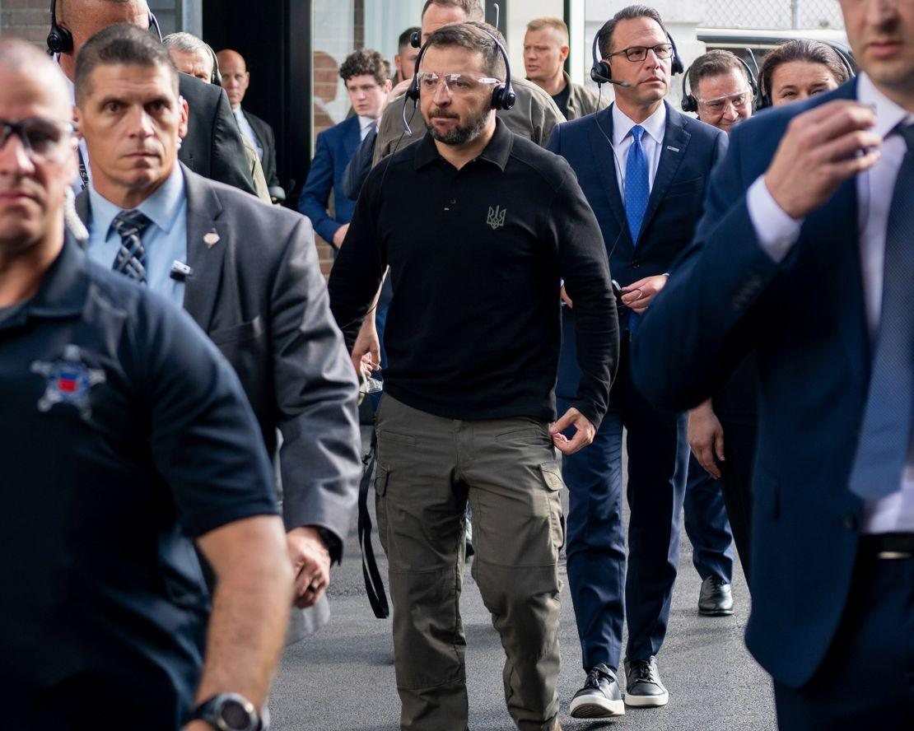
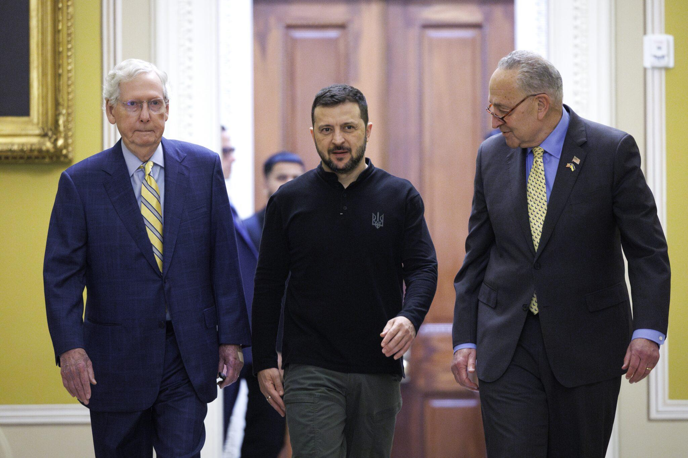

## Claim
Claim: "Ukrainian President Volodymyr Zelenskyy engaged in election interference by campaigning in Pennsylvania for Kamala Harris ahead of the US presidential election in 2024."

## Actions
```
web_search("Volodymyr Zelenskyy Kamala Harris Pennsylvania 2024")
web_search("Volodymyr Zelenskyy campaign US election 2024")
```

## Evidence
### Evidence from `web_search`
Newsweek reports that JD Vance accused Volodymyr Zelenskyy of campaigning for Kamala Harris during the 2024 presidential race, citing Zelenskyy's visit to a munitions plant in Scranton, Pennsylvania, in September 2024. Representative James Comer is investigating the matter (, , ). NBC News notes a partisan divide regarding Ukraine, mentioning a meeting between Zelenskyy and Harris, and that Republicans viewed Zelenskyy's visit to a munitions factory in Scranton, Pennsylvania, as a sign of his preference in the upcoming election. Donald Trump has accused Zelenskyy of favoring Democrats.

ABC News reports on a meeting between Zelenskyy and Kamala Harris to discuss the war with Russia, mentioning Zelenskyy's visit to Washington and meetings with lawmakers (, ). The article also mentions that Zelenskyy met with Donald Trump.

*   [https://www.newsweek.com/volodymyr-zelensky-jd-vance-campaign-kamala-harris-2024-election-2038060](https://www.newsweek.com/volodymyr-zelensky-jd-vance-campaign-kamala-harris-2024-election-2038060)
*   [https://www.nbcnews.com/politics/2024-election/zelenskyys-meeting-harris-spat-trump-reveal-growing-partisan-divide-uk-rcna172648](https://www.nbcnews.com/politics/2024-election/zelenskyys-meeting-harris-spat-trump-reveal-growing-partisan-divide-uk-rcna172648)
*   [https://abcnews.go.com/Politics/harris-standing-zelenskyy-indirectly-jabs-trump-vance-ukraine/story?id=114219628](https://abcnews.go.com/Politics/harris-standing-zelenskyy-indirectly-jabs-trump-vance-ukraine/story?id=114219628)


### Evidence from `web_search`
U.S. News & World Report published an article on September 25, 2024, discussing Volodymyr Zelenskyy's visit to Pennsylvania and meetings with U.S. leaders, including Kamala Harris in June and February of 2024. Republicans accused Zelenskyy of campaigning for Democrats, and Trump criticized Zelenskyy at a campaign rally in Pennsylvania. (<image:0>) The article is available at [https://www.usnews.com/news/u-s-news-decision-points/articles/2024-09-25/volodymyr-zelenskyys-last-american-campaign](https://www.usnews.com/news/u-s-news-decision-points/articles/2024-09-25/volodymyr-zelenskyys-last-american-campaign).

Le Monde reported on September 27, 2024, about a meeting between Zelensky and Kamala Harris at the White House on September 26, 2024. () The article mentions a joint speech by Zelensky and Harris, which "signalled Zelensky's involvement in the US election campaign."


## Elaboration
The evidence suggests that Volodymyr Zelenskyy visited Pennsylvania and met with Kamala Harris before the 2024 US presidential election. Republicans, including JD Vance and Donald Trump, accused Zelenskyy of campaigning for Democrats. U.S. News & World Report and Le Monde reported on these events, with Le Monde stating that a joint speech by Zelensky and Harris "signalled Zelensky's involvement in the US election campaign."

The evidence supports the claim that Zelenskyy's actions were perceived as election interference. However, the evidence does not explicitly state that Zelenskyy was campaigning for Kamala Harris. It only suggests that his actions were interpreted as such by some, particularly Republicans.

Further information is needed to determine the extent of Zelenskyy's involvement in the US election campaign and whether his actions constituted election interference.


## Actions
```
image_search("Volodymyr Zelenskyy Pennsylvania campaign 2024")
```

## Evidence
### Evidence from `image_search`
The Guardian published an image of Volodymyr Zelenskyy at a munitions factory in Pennsylvania (). CNN published an image of Volodymyr Zelenskyy in Pennsylvania (). Utah News Dispatch shows Volodymyr Zelenskyy with Mitch McConnell and Chuck Schumer ().


## Elaboration
The additional images confirm Zelenskyy's presence in Pennsylvania and his meetings with US leaders. The images do not provide direct evidence of campaigning for Kamala Harris. However, the context provided by the news articles, which mention accusations of campaigning and partisan interpretations of his visits, supports the claim that Zelenskyy's actions were perceived as election interference.


## Final Judgement
The evidence indicates that Volodymyr Zelenskyy visited Pennsylvania and met with Kamala Harris before the 2024 US presidential election. Republicans accused him of campaigning for Democrats, and some sources suggest his actions were interpreted as election interference. However, there is no direct evidence that Zelenskyy explicitly campaigned for Kamala Harris.

`false`

### Verdict: FALSE

### Justification
Based on reports from sources like Newsweek and U.S. News & World Report, Volodymyr Zelenskyy visited Pennsylvania and met with Kamala Harris before the 2024 US presidential election. While Republicans, including JD Vance and Donald Trump, accused Zelenskyy of campaigning for Democrats, and Le Monde suggested his actions signaled involvement in the election, there is no direct evidence of explicit campaigning for Kamala Harris. Therefore, the claim is considered false.
