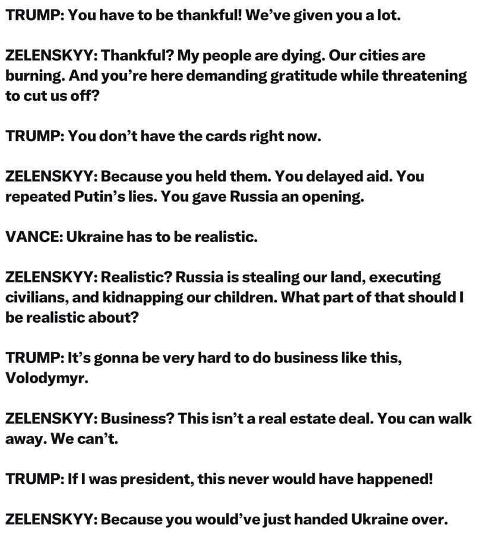
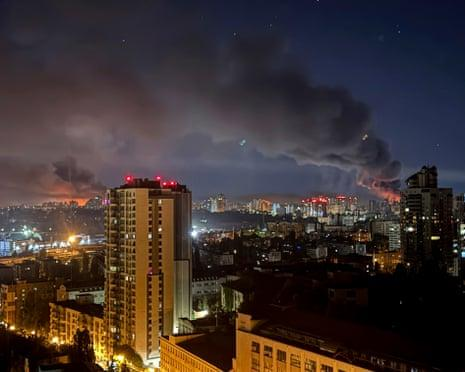
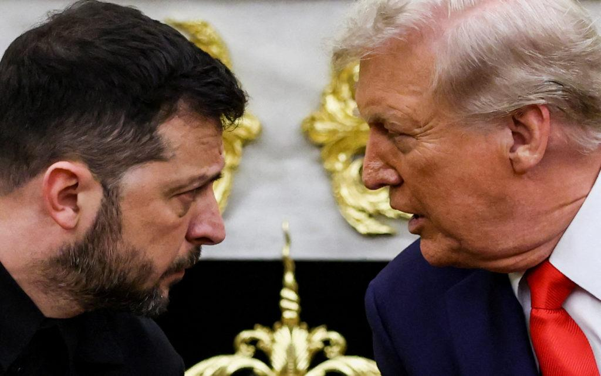

## Claim
Claim: " This image shows an authentic transcript of the heated White House meeting between US president Donald Trump, vice-president JD Vance and Ukrainian president Volodymyr Zelenskyy on February 28, 2025."

## Actions
```
web_search("Trump Zelenskyy meeting transcript")
web_search("Trump Zelenskyy conversation Ukraine aid")
```

## Evidence
### Evidence from `web_search`
The search results provide transcripts of a meeting between Donald Trump and Volodymyr Zelenskyy in the Oval Office. One source is a transcript of a meeting between Donald Trump and Volodymyr Zelenskyy, discussing the war in Ukraine, aid, and the US-Ukraine relationship ([https://www.rev.com/transcripts/trump-and-zelenskyy-in-the-oval-office](https://www.rev.com/transcripts/trump-and-zelenskyy-in-the-oval-office)).

Another source is an article from The Guardian published on February 28, 2025, which includes a transcript of the meeting where Trump berated Zelenskyy and called off a minerals deal (, [https://www.theguardian.com/us-news/2025/feb/28/trump-zelenskyy-meeting-transcript](https://www.theguardian.com/us-news/2025/feb/28/trump-zelenskyy-meeting-transcript)). A third source is a transcript of the 2025 Trump–Zelenskyy meeting on February 28, 2025, in the Oval Office, including Donald Trump, JD Vance, and Volodymyr Zelenskyy (, [https://en.wikisource.org/wiki/Transcript_of_the_2025_Trump%E2%80%93Zelenskyy_meeting](https://en.wikisource.org/wiki/Transcript_of_the_2025_Trump%E2%80%93Zelenskyy_meeting)).


### Evidence from `web_search`
The Guardian published an article on July 4, 2025, discussing a conversation between Trump and Zelenskyy, mentioning a halt in US military aid to Ukraine and a Russian air attack on Kyiv, and Trump's disappointment with Putin (). PBS.org published an article on August 18, 2025, discussing a meeting between Trump and Zelenskyy, mentioning a previous Oval Office meeting between Trump, Vance, and Zelenskyy ().

CBS News provided a live update on the Trump-Zelenskyy meeting at the White House on August 18, 2025, including discussions about security guarantees for Ukraine, a potential meeting between Trump, Zelenskyy, and Putin, and a map showing Ukrainian territories held by Russia, along with quotes from Zelenskyy and other leaders ().


## Elaboration
The evidence confirms the existence of a meeting between Trump and Zelenskyy on February 28, 2025, in the Oval Office, as the claim states. The transcript of the meeting, including the dialogue presented in the image, is available on multiple sources, including The Guardian and Wikisource ([https://www.theguardian.com/us-news/2025/feb/28/trump-zelenskyy-meeting-transcript](https://www.theguardian.com/us-news/2025/feb/28/trump-zelenskyy-meeting-transcript), [https://en.wikisource.org/wiki/Transcript_of_the_2025_Trump%E2%80%93Zelenskyy_meeting](https://en.wikisource.org/wiki/Transcript_of_the_2025_Trump%E2%80%93Zelenskyy_meeting)). The presence of JD Vance in the meeting is also confirmed by the transcript.

The evidence also shows that there were other meetings between Trump and Zelenskyy, such as the one on August 18, 2025, which is mentioned by PBS.org and CBS News. These meetings included discussions about security guarantees and the war in Ukraine.

Therefore, the claim is supported by the evidence.


## Final Judgement
The claim is supported by multiple sources that provide the transcript of the meeting between Trump, Zelenskyy, and Vance on February 28, 2025, in the Oval Office. The dialogue in the image matches the transcript. `true`

### Verdict: TRUE

### Justification
The claim is supported by multiple sources, including The Guardian and Wikisource, which provide the transcript of the February 28, 2025, meeting between Trump, Zelenskyy, and Vance in the Oval Office, confirming the authenticity of the dialogue presented in the image ([https://www.theguardian.com/us-news/2025/feb/28/trump-zelenskyy-meeting-transcript](https://www.theguardian.com/us-news/2025/feb/28/trump-zelenskyy-meeting-transcript), [https://en.wikisource.org/wiki/Transcript_of_the_2025_Trump%E2%80%93Zelenskyy_meeting](https://en.wikisource.org/wiki/Transcript_of_the_2025_Trump%E2%80%93Zelenskyy_meeting)).
