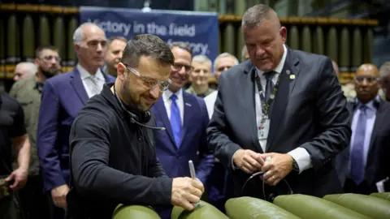

## Claim
Claim: " This image shows Ukrainian President Volodymyr Zelenskyy signing Israeli bombs intended for use against Palestinians in Gaza."

## Actions
```
web_search("Volodymyr Zelenskyy signing bombs")
reverse_search()
```

## Evidence
### Evidence from `web_search`
The claim that Volodymyr Zelenskyy signed Israeli bombs intended for use against Palestinians in Gaza is false. According to the Eurovision News | Spotlight ([https://spotlight.ebu.ch/p/video-caption-falsely-claims-zelenskyy](https://spotlight.ebu.ch/p/video-caption-falsely-claims-zelenskyy)), the video shows Zelenskyy at a U.S. munitions factory signing artillery shells for Ukraine's war with Russia, not Israel's war in Gaza.

Fox News ([https://www.foxnews.com/politics/josh-shapiro-blasted-signing-missile-alongside-zelenskyy-bidens-hometown-party-war](https://www.foxnews.com/politics/josh-shapiro-blasted-signing-missile-alongside-zelenskyy-bidens-hometown-party-war)) and Caliber.Az ([https://caliber.az/en/post/zelenskyy-s-glory-to-ukraine-inscription-on-us-bombs-in-pennsylvania-stirs-controversy](https://caliber.az/en/post/zelenskyy-s-glory-to-ukraine-inscription-on-us-bombs-in-pennsylvania-stirs-controversy)) also report on Zelenskyy signing munitions at a U.S. plant, with no mention of the bombs being for use against Palestinians in Gaza. 


### Evidence from `reverse_search`
The image shows Ukrainian President Volodymyr Zelenskyy signing ammunition at the Scranton Army Ammunition Plant (SCAAP) in Pennsylvania on September 23, 2024. This information is from a BBC News article ([https://www.bbc.com/news/articles/c80rkv0k4j8o](https://www.bbc.com/news/articles/c80rkv0k4j8o), [https://www.bbc.co.uk/news/articles/c80rkv0k4j8o](https://www.bbc.co.uk/news/articles/c80rkv0k4j8o)) and a New York Post article ([https://nypost.com/2024/09/25/opinion/zelenskys-arms-factory-visit-reeks-of-partisan-foreign-election-interference/](https://nypost.com/2024/09/25/opinion/zelenskys-arms-factory-visit-reeks-of-partisan-foreign-election-interference/)). The articles do not mention Israeli bombs or Gaza.    


## Elaboration
The claim is false. The evidence indicates that the image shows Zelenskyy signing artillery shells at a U.S. munitions factory in Pennsylvania, not Israeli bombs. The shells were intended for Ukraine's war with Russia, not for use against Palestinians in Gaza.


## Final Judgement
The claim is demonstrably false. The image shows Zelenskyy signing artillery shells at a U.S. munitions factory, not Israeli bombs intended for use against Palestinians in Gaza.

`false`

### Verdict: FALSE

### Justification
The claim is false. The image depicts Volodymyr Zelenskyy signing artillery shells at a U.S. munitions factory, as reported by the [BBC](https://www.bbc.com/news/articles/c80rkv0k4j8o) and the [New York Post](https://nypost.com/2024/09/25/opinion/zelenskys-arms-factory-visit-reeks-of-partisan-foreign-election-interference/), not Israeli bombs intended for use against Palestinians in Gaza.
