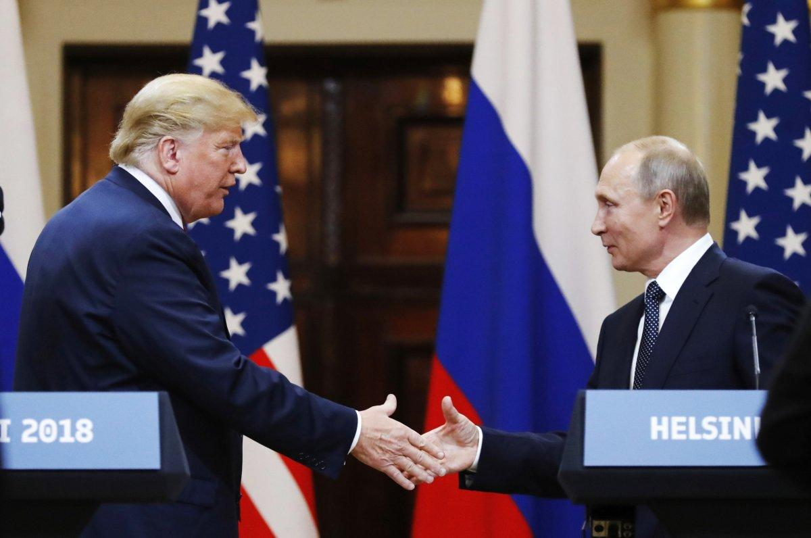

## Claim
Claim: "In an interview with NDTV on March 17, 2025 Director of US National Intelligence Tulsi Gabbard said that President Donald Trump and Russian President Vladimir Putin were good friends."

## Actions
```
web_search("Tulsi Gabbard NDTV interview March 17 2025 Trump Putin")
```

## Evidence
### Evidence from `web_search`
NDTV interviewed Tulsi Gabbard, where she discussed Donald Trump's focus on peace and negotiations with Russia and Ukraine ([https://www.ndtv.com/world-news/trump-focused-on-peace-tulsi-gabbard-on-russia-ukraine-war-7941806](https://www.ndtv.com/world-news/trump-focused-on-peace-tulsi-gabbard-on-russia-ukraine-war-7941806)). Newsweek reported on the same interview, mentioning Trump's anticipation of a phone call with Putin and including a photo of Trump and Putin shaking hands  ([https://www.newsweek.com/tulsi-gabbard-shares-details-trumps-relationship-putin-2046181](https://www.newsweek.com/tulsi-gabbard-shares-details-trumps-relationship-putin-2046181)).

U.S. News & World Report also covered the interview, stating that Gabbard said Trump and Putin "are very good friends" ([https://www.usnews.com/news/politics/articles/2025-03-17/gabbard-says-trump-is-looking-forward-to-success-ahead-of-talk-with-putin](https://www.usnews.com/news/politics/articles/2025-03-17/gabbard-says-trump-is-looking-forward-to-success-ahead-of-talk-with-putin)) <image:k>.


## Elaboration
The evidence confirms that Tulsi Gabbard was interviewed by NDTV on March 17, 2025. U.S. News & World Report states that Gabbard said Trump and Putin "are very good friends" during the interview. Therefore, the claim is likely true.


## Final Judgement
The search results confirm that Tulsi Gabbard was interviewed by NDTV on March 17, 2025, and that she discussed Trump's relationship with Putin. U.S. News & World Report quoted Gabbard as saying that Trump and Putin "are very good friends." This supports the claim.

`true`

### Verdict: TRUE

### Justification
In an interview with NDTV on March 17, 2025, Tulsi Gabbard discussed Donald Trump's relationship with Vladimir Putin. According to a report by U.S. News & World Report ([https://www.usnews.com/news/politics/articles/2025-03-17/gabbard-says-trump-is-looking-forward-to-success-ahead-of-talk-with-putin](https://www.usnews.com/news/politics/articles/2025-03-17/gabbard-says-trump-is-looking-forward-to-success-ahead-of-talk-with-putin)), Gabbard stated that Trump and Putin "are very good friends," supporting the claim.
