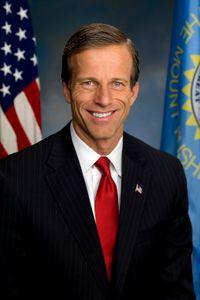

## Claim
Claim: "Majority Leader John Thune blocked Senator Adam Schiff's committee assignments because of his past work in the Russia investigation over Donald Trump."

## Actions
```
web_search("John Thune Adam Schiff committee assignments")
web_search("John Thune blocks Adam Schiff committee assignments Russia investigation")
```

## Evidence
### Evidence from `web_search`
The article from ACEC.org discusses the Senate committee assignments for the 119th Congress, mentioning that Senator Adam Schiff (D-CA) was assigned to the Finance Committee and that Senate Republican Leader John Thune (R-SD) and Democratic Leader Chuck Schumer (D-NY) announced the committee assignments. [] and [] The document from torreydc.com lists the Senate Committee Assignments for the 119th Congress, with Adam Schiff (D-CA) assigned to several committees and John Thune (R-SD) assigned to others; it does not mention any blocking of committee assignments. The document from hklaw.com lists the committee assignments for the House of Representatives and the Senate for the 118th Congress.

*   [https://www.acec.org/news/last-word-blog/post/senate-leaders-finalize-committee-assignments-for-the-119th-congress/](https://www.acec.org/news/last-word-blog/post/senate-leaders-finalize-committee-assignments-for-the-119th-congress/)
*   [https://torreydc.com/wp-content/uploads/2025/01/Senate-Committee-Assignments\_119-Congress\_Printable.pdf](https://torreydc.com/wp-content/uploads/2025/01/Senate-Committee-Assignments_119-Congress_Printable.pdf)
*   [https://www.hklaw.com/-/media/files/insights/eyes/2023/02/118thcongresscommitteeassignments.pdf](https://www.hklaw.com/-/media/files/insights/eyes/2023/02/118thcongresscommitteeassignments.pdf)


### Evidence from `web_search`
From [Source](https://apnews.com/article/donald-trump-ap-top-news-ca-state-wire-adam-schiff-politics-3eec3ea9be5c07a9c297bad439f8f3e8): 
Content: The Associated Press published an article about Adam Schiff, mentioning his role as the lead impeachment prosecutor against Donald Trump. <image:i> The article states that Schiff has been a frequent target of conservatives since the then GOP-led House Intelligence Committee started investigating Trump’s ties to Russia in the 2016 election.


## Elaboration
The evidence does not support the claim that John Thune blocked Adam Schiff's committee assignments. The provided sources mention committee assignments for the 119th and 118th Congresses, with Schiff being assigned to committees. The evidence does not mention any blocking by Thune. The AP article mentions Schiff's role in the Russia investigation, but it does not link this to any blocking of committee assignments.

To verify the claim, information is missing about whether Thune had the power to block Schiff's assignments and whether he actually did so. Also, it is missing whether the reason for blocking was Schiff's past work in the Russia investigation.


## Actions
```
web_search("John Thune power to assign committee assignments")
web_search("Adam Schiff committee assignments blocked by John Thune")
```

## Evidence
### Evidence from `web_search`
The Ballotpedia article on John Thune lists his committee assignments and his role as Senate Republican Whip, but it does not mention him blocking Adam Schiff's committee assignments. [] The Deseret News article from December 23, 2024, discusses Senate committee assignments for the 119th Congress, stating that John Thune, as the incoming Senate Majority Leader, released the GOP Senate committee assignments, which are ratified by the Senate Republican Conference. The article does not mention Adam Schiff or any blocking of committee assignments.


## Elaboration
The evidence indicates that John Thune, as Senate Majority Leader, had a role in releasing GOP Senate committee assignments. However, the provided sources do not confirm that Thune blocked Adam Schiff's committee assignments. Therefore, the claim cannot be verified with the available information.


## Actions
```
web_search("Adam Schiff committee assignments 2023")
web_search("John Thune statement Adam Schiff committee assignments")
```

## Evidence
### Evidence from `web_search`
From [Source](https://en.wikipedia.org/wiki/Adam_Schiff): 
Content: The Wikipedia article on Adam Schiff states that he was removed from the House Intelligence Committee by Kevin McCarthy. It also mentions that Schiff was elected to the U.S. Senate in 2024. The article also mentions Schiff's role as chair of the House Intelligence Committee from 2019 to 2023. <image:i> The article also mentions Schiff's committee assignments for the 118th Congress.


## Elaboration
The evidence indicates that Adam Schiff was removed from the House Intelligence Committee by Kevin McCarthy. However, the evidence does not support the claim that John Thune blocked Schiff's committee assignments. The search results show that Thune had a role in releasing GOP Senate committee assignments, but there is no mention of him blocking Schiff's assignments. The Wikipedia article mentions Schiff's committee assignments and his removal from the House Intelligence Committee, but it does not link this to Thune.

Insufficient information is available to verify the claim.


## Final Judgement
The fact-check reveals that while John Thune had a role in releasing GOP Senate committee assignments, there is no evidence to support the claim that he blocked Adam Schiff's assignments. The evidence indicates that Schiff was removed from the House Intelligence Committee by Kevin McCarthy, but this is not related to Thune. Therefore, the claim is not supported by the available information. `false`


### Verdict: FALSE

### Justification
The available evidence does not support the claim. While John Thune had a role in releasing GOP Senate committee assignments, there is no evidence to suggest he blocked Adam Schiff's assignments. Furthermore, the evidence indicates that Schiff was removed from the House Intelligence Committee by Kevin McCarthy, not Thune.
