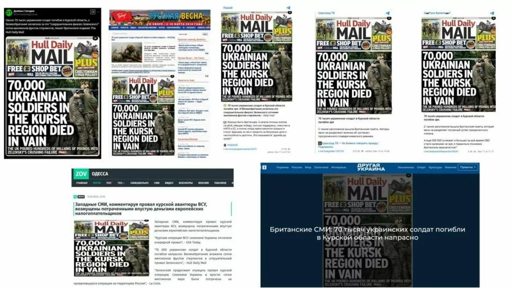
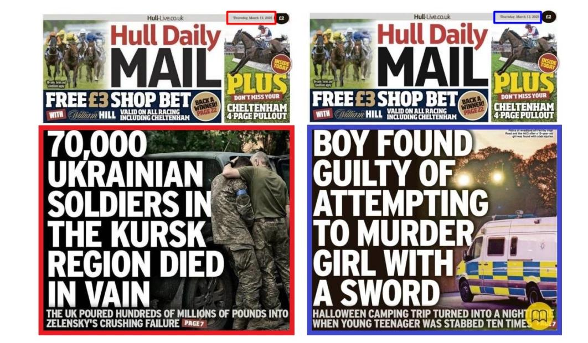

## Claim
Claim: " This image shows a screenshot of an authentic Hull Daily Mail's frontpage from March 13, 2025 saying '70,000 Ukrainian soldiers in the Kursk region died in vain. The UK poured hundreds of millions of pounds into Zelensky's crushing failure'."

## Actions
```
web_search("Hull Daily Mail March 13 2025")
web_search("Hull Daily Mail Ukrainian soldiers Kursk region")
```

## Evidence
### Evidence from `web_search`
The Penrith City Library lists the Hull Daily Mail from Thursday, March 13, 2025. The Hull Daily Mail from March 13, 2025, is also available on Magzter, with the headline "BOY FOUND GUILTY OF ATTEMPTING TO MURDER GIRL WITH A SWORD" .

Mythdetector.com fact-checks a falsified Hull Daily Mail cover from March 13, 2025, which claims that 70,000 Ukrainian soldiers died in vain in the Kursk region . The actual issue does not mention Ukraine.


### Evidence from `web_search`
The search results indicate that the image is a fake Hull Daily Mail front page. Gwara Media ([Source](https://gwaramedia.com/en/debunking-russian-fakes-hull-daily-mail-didnt-write-about-70000-ukrainian-soldiers-killed-in-russias-kursk-oblast/)) and The Journal.ie ([Source](https://www.thejournal.ie/ukraine-hull-daily-mail-debunk-6657051-Mar2025/)) debunked the claim that the newspaper published the headline "70,000 Ukrainian soldiers in the Kursk region died in vain" on March 13, 2025. The real front page had a different headline.

The fake cover was spread on Telegram channels and other pro-Russian sources. The Journal.ie's article was written by Cormac Fitzgerald. , , , 


## Elaboration
The claim is false. The evidence indicates that the image is a fabricated front page of the Hull Daily Mail. The actual front page from March 13, 2025, had a different headline. Several sources, including Gwara Media and The Journal.ie, have debunked the claim.


## Final Judgement
The image is a fabricated front page of the Hull Daily Mail. The actual front page from March 13, 2025, had a different headline. Several sources have debunked the claim. `false`

### Verdict: FALSE

### Justification
The claim is false. The image is a fabricated front page of the Hull Daily Mail, as confirmed by fact-checks from sources like [Gwara Media](https://gwaramedia.com/en/debunking-russian-fakes-hull-daily-mail-didnt-write-about-70000-ukrainian-soldiers-killed-in-russias-kursk-oblast/) and [The Journal.ie](https://www.thejournal.ie/ukraine-hull-daily-mail-debunk-6657051-Mar2025/), which show the real front page from March 13, 2025, had a different headline.
