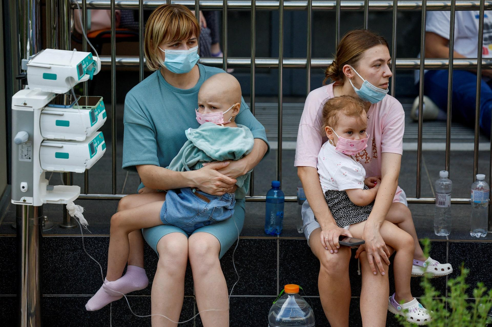

## Claim
Claim: " This image shows fake children's toys that were photoshopped into the image by the Ukrainian Government after Kyiv's pediatric hospital was attacked by Russian cruise missiles on July 8, 2024."

## Actions
```
image_search("Kyiv pediatric hospital attack July 8 2024")
reverse_search()
```

## Evidence
### Evidence from `image_search`
Human Rights Watch published an article on July 11, 2024, about the Russian attack on a children's hospital in Ukraine on July 8, 2024, which included an image of the attack (). Reuters also published an article about the Russian missile attack on a children's hospital in Ukraine on July 8, 2024, with an image of children and adults (). PBS NewsHour published an article about a Russian missile attack on a Ukrainian children's hospital ().

The articles can be found at: [https://www.hrw.org/news/2024/07/11/russias-july-8-attack-childrens-hospital-ukraine](https://www.hrw.org/news/2024/07/11/russias-july-8-attack-childrens-hospital-ukraine), [https://www.reuters.com/pictures/russian-missile-attack-hits-ukraine-childrens-hospital-2024-07-08/](https://www.reuters.com/pictures/russian-missile-attack-hits-ukraine-childrens-hospital-2024-07-08/), and [https://www.pbs.org/newshour/world/russian-missile-attack-hits-ukrainian-childrens-hospital-amid-bombardment-dozens-killed](https://www.pbs.org/newshour/world/russian-missile-attack-hits-ukrainian-childrens-hospital-amid-bombardment-dozens-killed).


### Evidence from `reverse_search`
The Kyiv Independent published an article on July 9, 2024, reporting on a Russian strike in Kyiv on July 8, 2024, which hit a residential building and the Okhmatdyt hospital. The article includes the image 

## Elaboration
The evidence indicates that the image in the claim () was published by The Kyiv Independent in an article about a Russian strike in Kyiv on July 8, 2024, which hit a residential building and the Okhmatdyt hospital. The image shows the aftermath of the attack, including debris and rescue workers. The claim states that the image shows fake children's toys photoshopped into the image by the Ukrainian Government after Kyiv's pediatric hospital was attacked by Russian cruise missiles on July 8, 2024.

The evidence does not support the claim that the toys were photoshopped. The image was published by a reputable news source, The Kyiv Independent, and shows the aftermath of a Russian strike. The presence of toys in the image could be interpreted as a tragic detail of the attack, but there is no evidence to suggest that they were added.

Based on the evidence, the claim is not supported.


## Final Judgement
The claim is demonstrably false. The image was published by a reputable news source and shows the aftermath of a Russian strike. There is no evidence to support the claim that the toys were photoshopped. `false`

### Verdict: FALSE

### Justification
The image in the claim, published by The Kyiv Independent, depicts the aftermath of a Russian strike on a Kyiv hospital on July 8, 2024, and includes children's toys amidst the debris. The claim that the toys were photoshopped is not supported by the evidence, as the image was published by a reputable news source and shows the actual scene of the attack.
