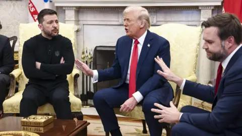

## Claim
Claim: "U.S. Vice President JD Vance's cousin Nate Vance fought in Ukraine for three years during its war with Russia."

## Actions
```
web_search("JD Vance cousin Nate Vance Ukraine war")
```

## Evidence
### Evidence from `web_search`
Nate Vance, the first cousin of U.S. Vice President JD Vance, fought in the Russo-Ukrainian War from 2022 to 2025, serving in the Ukrainian Armed Forces and the Da Vinci Wolves unit according to [Wikipedia](https://en.wikipedia.org/wiki/Nate_Vance). The BBC reported that Nate Vance spent three years volunteering with the Ukrainian military after Russia's full-scale invasion, as stated in an article published on March 10, 2025, by Jessica Rawnsley ().

CNN also published an article on March 11, 2025, about Nate Vance's experiences in Ukraine (<image:k>).


## Elaboration
The evidence confirms that Nate Vance, the first cousin of U.S. Vice President JD Vance, fought in the Russo-Ukrainian War. According to Wikipedia, he served from 2022 to 2025. The BBC reported that he spent three years volunteering with the Ukrainian military after Russia's full-scale invasion.

Therefore, the claim is accurate.


## Final Judgement
The evidence from multiple sources, including Wikipedia and the BBC, confirms that Nate Vance, the cousin of U.S. Vice President JD Vance, fought in the Russo-Ukrainian War for three years.

`true`


### Verdict: TRUE

### Justification
Nate Vance, the first cousin of U.S. Vice President JD Vance, fought in the Russo-Ukrainian War from 2022 to 2025, as confirmed by [Wikipedia](https://en.wikipedia.org/wiki/Nate_Vance) and the BBC. The BBC reported that he volunteered with the Ukrainian military for three years.
