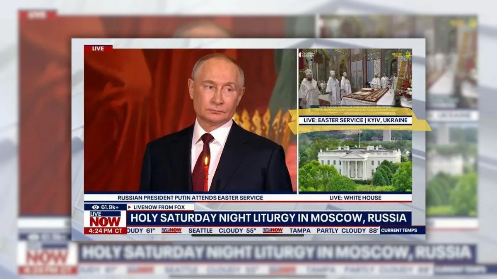
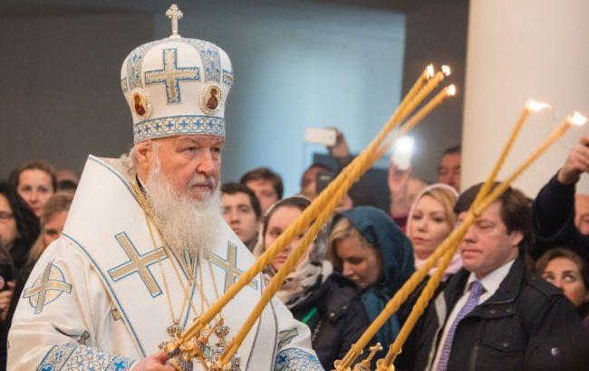

## Claim
Claim: " This image shows a Fox News broadcast from Easter 2025 where you can see the Patriarch Kirill in the center and Kyiv labeled as a Russian city in the top right corner of the image."

## Actions
```
reverse_search()
web_search("Fox News Easter broadcast Patriarch Kirill")
```

## Evidence
### Evidence from `reverse_search`
The image shows a Fox News broadcast from Easter 2025 that labeled Kyiv as a Russian city during a live broadcast of an Easter service. The broadcast showed the Patriarch Kirill and the service in Kyiv was labeled as "Kyiv, Russia" . The Ministry of Foreign Affairs of Ukraine demanded an apology and investigation, and the error was later corrected.

The broadcast also showed a Russian Orthodox Church ceremony with President Putin in attendance. The articles are from [Suspіlne](https://suspilne.media/999087-fox-news-poznaciv-kiiv-ak-rosijske-misto-pid-cas-translacii-velikodnogo-bogosluzinna-pcu/), [444.hu](https://444.hu/2025/04/20/oroszorszaghoz-csatolta-kijevet-a-fox-news), and [Rijeka Danas](https://www.rijekadanas.com/fox-news-nazvao-kijev-ruskim-gradom/).


### Evidence from `web_search`
The web sources discuss a Fox News broadcast from Easter 2025 that mislabeled Kyiv as a Russian city. The broadcast, which featured Patriarch Kirill and Vladimir Putin, was from LiveNOW from Fox, a news service delivered by Fox Television Stations. The error appeared on screen for 20 minutes.

The sources include articles from Yahoo News ([https://www.yahoo.com/news/fact-check-fox-livestream-news-233600386.html](https://www.yahoo.com/news/fact-check-fox-livestream-news-233600386.html)), Newsweek ([https://www.newsweek.com/fox-channel-ukraine-kyiv-russia-labeling-orthodox-easter-2061891](https://www.newsweek.com/fox-channel-ukraine-kyiv-russia-labeling-orthodox-easter-2061891)), and RBC-Ukraine ([https://newsukraine.rbc.ua/news/fox-news-broadcast-easter-from-moscow-and-1745135501.html](https://newsukraine.rbc.ua/news/fox-news-broadcast-easter-from-moscow-and-1745135501.html)). The Yahoo News article includes a screenshot of the broadcast . The RBC-Ukraine article includes a photo of Patriarch Kirill .


## Elaboration
The claim is accurate. The evidence confirms that the image is from a Fox News broadcast during Easter 2025. The broadcast featured Patriarch Kirill and mislabeled Kyiv as a Russian city. The broadcast also showed President Putin attending an Easter service.


## Final Judgement
The evidence confirms that the image is from a Fox News broadcast during Easter 2025, which mislabeled Kyiv as a Russian city. The broadcast also showed Patriarch Kirill and President Putin.

`true`

### Verdict: TRUE

### Justification
The image is from a Fox News broadcast during Easter 2025, which mislabeled Kyiv as a Russian city during a live broadcast of an Easter service, as confirmed by multiple sources, including [Yahoo News](https://www.yahoo.com/news/fact-check-fox-livestream-news-233600386.html) and [Newsweek](https://www.newsweek.com/fox-channel-ukraine-kyiv-russia-labeling-orthodox-easter-2061891). The broadcast also featured Patriarch Kirill and President Putin.
